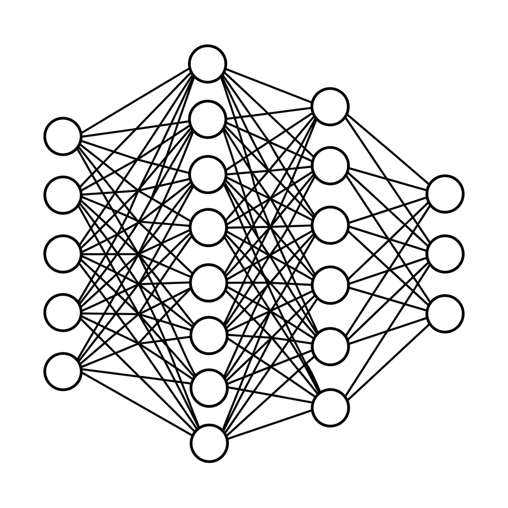

# Unit 10: Neural Networks from Scratch

> [!TIP]
> **Using Google Colab**
> For the deep learning units (Units 10–16), we recommend **enabling a GPU** for faster training. See [Appendix (Learning environment and API keys)](../appendix/index.md#🚀-1-learning-with-google-colaboratory) for setup steps.


## 1. Understanding Neural Networks



To understand neural networks, picture **a company's approval workflow**.

The CEO (final answer) decides "Go or no-go on this project?" Information flows through layers — staff, team leads, directors.

1. **Input layer (staff)**: Receives external data (project documents).
2. **Hidden layers (team leads, directors)**: Evaluate from many angles — "This looks important (weight)," "Not relevant to our team (bias)" — and pass signals upward. Many hidden layers = **deep learning**.
3. **Output layer (CEO)**: Final decision — approve or reject (dog or cat, etc.).

| Network term | Company analogy | Role |
|---|---|---|
| **Node (neuron)** | One employee | Receives input, decides, passes forward |
| **Weight** | Importance of an opinion | Which input to trust |
| **Bias** | Team's default stance | Lean toward yes or no |
| **Activation function** | Stamp threshold | Pass signal only if it clears a bar |

In this unit we'll implement **forward propagation** and **backpropagation** using only **NumPy** — no deep learning framework!

### 💡 Real-World Business Use Cases

- **Churn prediction**: Predict cancellation probability from usage and contract data to target retention offers.
- **Anomaly detection**: Flag unusual sensor patterns (temperature, vibration) that may indicate failure.
- **Loan underwriting**: Auto-assess repayment ability from income, debt, and tenure.

## 2. Implementation Example

We build the simplest network — **one hidden layer** — from scratch and train it on **XOR**, a slightly nonlinear pattern.

First, load libraries and prepare data.

```python
import numpy as np

# Input data (4 patterns)
X = np.array([
    [0, 0],
    [0, 1],
    [1, 0],
    [1, 1]
])

# Target labels (XOR pattern answers)
y = np.array([
    [0],
    [1],
    [1],
    [0]
])
```

This sets up four input patterns (e.g., "Is it raining?" and "Do you have an umbrella?") with binary labels.

Next, initialize the network — random weights and biases.

```python
# Fix random seed for reproducible results
np.random.seed(42)

# Define network architecture
input_size = 2   # input layer size (2 neurons)
hidden_size = 3  # hidden layer size (3 neurons)
output_size = 1  # output layer size (1 neuron)

# Initialize weights (W) and biases (b)
# Weights and biases for the hidden layer
W1 = np.random.randn(input_size, hidden_size) 
b1 = np.zeros((1, hidden_size))

# Weights and biases for the output layer
W2 = np.random.randn(hidden_size, output_size)
b2 = np.zeros((1, output_size))
```

Structure: input (2) → hidden (3) → output (1). `np.random.randn` starts with random values; training adjusts them.

Now the main training loop.

```python
# Sigmoid activation (squashes values into the 0-1 range)
def sigmoid(x):
    return 1 / (1 + np.exp(-x))

# Sigmoid derivative (used when correcting errors during backpropagation)
def sigmoid_derivative(x):
    return x * (1 - x)

# Learning rate (how much to adjust weights per update)
learning_rate = 0.5
epochs = 5000 # number of training iterations

for epoch in range(epochs):
    # -------------------------
    # 1. Forward propagation — pass signals up the network
    # -------------------------
    # Hidden layer
    z1 = np.dot(X, W1) + b1       # input * weights + bias
    a1 = sigmoid(z1)              # apply activation
    
    # Output layer
    z2 = np.dot(a1, W2) + b2      # hidden output * weights + bias
    output = sigmoid(z2)          # final prediction (probability 0-1)
    
    # -------------------------
    # 2. Compute error — gap between prediction and target
    # -------------------------
    error = y - output
    
    # -------------------------
    # 3. Backpropagation — propagate error backward through layers
    # -------------------------
    # Output layer gradient
    d_output = error * sigmoid_derivative(output)
    
    # Hidden layer gradient
    error_hidden_layer = d_output.dot(W2.T)
    d_hidden_layer = error_hidden_layer * sigmoid_derivative(a1)
    
    # -------------------------
    # 4. Update weights and biases
    # -------------------------
    W2 += a1.T.dot(d_output) * learning_rate
    b2 += np.sum(d_output, axis=0, keepdims=True) * learning_rate
    W1 += X.T.dot(d_hidden_layer) * learning_rate
    b1 += np.sum(d_hidden_layer, axis=0, keepdims=True) * learning_rate

print("Predictions after training:")
print(np.round(output, 3))
```

**Walkthrough**
Each epoch repeats four steps:
1. **Forward propagation**: Compute predictions from inputs and current weights (memo goes up the chain).
2. **Error calculation**: Measure gap between prediction and label.
3. **Backpropagation**: Trace blame from output back to hidden layers — who caused the mistake?
4. **Update**: Nudge weights (W) and biases (b) by the computed corrections.

Repeat for 5000 epochs and the network learns XOR.

## 3. Practice

Your turn!
Use a simple **OR gate** dataset (if either input is 1, output is 1) and implement the training loop from scratch.

**Requirements**
- Set input `X` and labels `y`:
  - `X = np.array([[0, 0], [0, 1], [1, 0], [1, 1]])`
  - `y = np.array([[0], [1], [1], [1]])`
- Build a network: 2 inputs, **2 hidden** units, 1 output.
- Use sigmoid activation.
- Train for **3000 epochs** and print predictions — they should be close to 0, 1, 1, 1.

**Hint**
Copy the example code and change the dataset and `hidden_size` — that's enough!

## 4. Answer Key

<details>
<summary>View sample solution (click to expand)</summary>

```python
import numpy as np

# Prepare data (OR gate)
X = np.array([
    [0, 0],
    [0, 1],
    [1, 0],
    [1, 1]
])
y = np.array([
    [0],
    [1],
    [1],
    [1]
])

# Activation function and its derivative
def sigmoid(x):
    return 1 / (1 + np.exp(-x))

def sigmoid_derivative(x):
    return x * (1 - x)

# Build the network
np.random.seed(42)
input_size = 2
hidden_size = 2  # hidden layer with 2 neurons
output_size = 1

W1 = np.random.randn(input_size, hidden_size)
b1 = np.zeros((1, hidden_size))
W2 = np.random.randn(hidden_size, output_size)
b2 = np.zeros((1, output_size))

# Training loop
learning_rate = 0.5
epochs = 3000

for epoch in range(epochs):
    # 1. Forward propagation
    z1 = np.dot(X, W1) + b1
    a1 = sigmoid(z1)
    z2 = np.dot(a1, W2) + b2
    output = sigmoid(z2)
    
    # 2. Compute error
    error = y - output
    
    # 3. Backpropagation
    d_output = error * sigmoid_derivative(output)
    error_hidden_layer = d_output.dot(W2.T)
    d_hidden_layer = error_hidden_layer * sigmoid_derivative(a1)
    
    # 4. Update weights and biases
    W2 += a1.T.dot(d_output) * learning_rate
    b2 += np.sum(d_output, axis=0, keepdims=True) * learning_rate
    W1 += X.T.dot(d_hidden_layer) * learning_rate
    b1 += np.sum(d_hidden_layer, axis=0, keepdims=True) * learning_rate

print("Predictions after training (success if close to 0, 1, 1, 1):")
print(np.round(output, 3))
```

</details>
