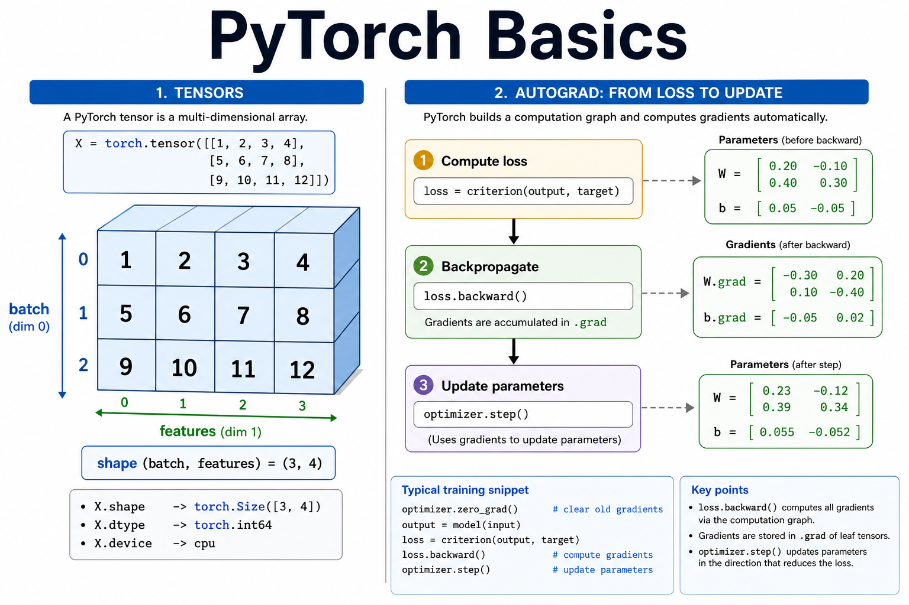
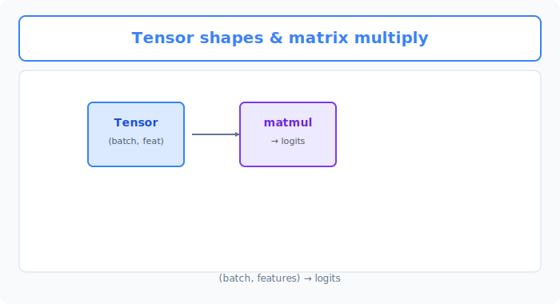
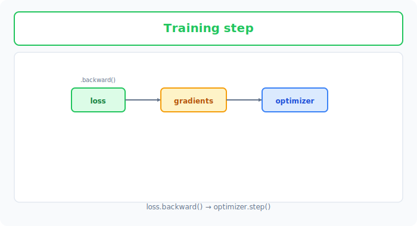

# Unit 11: PyTorch Basics & Simple MLP

<p class="unit-hero">
  
</p>

> [!TIP]
> **For learners using Google Colab**
> To speed up PyTorch computations, we recommend enabling **GPU (T4 GPU)** in the runtime. For detailed setup steps, see [Appendix (Learning Environment and API Setup)](../appendix/index.md#🚀-1-learning-with-google-colaboratory).


## 1. Understanding PyTorch Basics & Simple MLP




In Unit 10, you implemented everything from scratch with NumPy to understand how neural networks work. But writing those complex formulas (backpropagation, and so on) every time is tedious, right?

That is where **PyTorch** comes in—a powerful deep learning framework.

**PyTorch is like "magic LEGO blocks"**

If last unit's "from-scratch implementation" was DIY—cutting wood, planing it, hammering nails to build furniture—PyTorch is **"magic LEGO blocks with instructions."**

| NumPy (hand-built) | PyTorch (LEGO blocks) | Explanation |
|---|---|---|
| Arrays (`np.ndarray`) | Tensors (`torch.Tensor`) | Containers for data. PyTorch tensors can also run on a GPU (a super-fast computer). |
| Manual differentiation | `autograd` (automatic differentiation) | A magical feature that automatically computes what went wrong (gradients). |
| Writing your own functions | `torch.nn` modules | Building blocks like "hidden layers" and "activation functions" are already prepared. |

With PyTorch, you can leave tedious computation to the framework and focus on **what shape of network to build (how to assemble the blocks)**. In this unit, you will use PyTorch to build a simple **multilayer perceptron (MLP)—the most basic kind of neural network**!

### 💡 Concrete Business Use Cases

- **Demand forecasting systems**: Combine multi-faceted data such as past sales, weather, day of week, and campaign flags to predict next-day product sales.
- **Automated customer support routing**: Analyze customer inquiry content (text converted to numbers) and automatically route it to the right department (technical, billing, returns, etc.).
- **Real estate price estimation**: Input conditions such as floor area, building age, and distance from the station to predict rent or sale price with high accuracy.



## 2. Implementation Example

Here you will learn PyTorch's basic syntax while training a network on simple dummy data.

First, load PyTorch and the tools you need, and prepare the data.

```python
import torch
import torch.nn as nn
import torch.optim as optim

# 1. Prepare data (dummy data)
# Input data (e.g., study hours, sleep hours)
X = torch.tensor([[2.0, 7.0], [3.0, 6.0], [5.0, 8.0], [1.0, 5.0]], dtype=torch.float32)

# Ground-truth labels (e.g., test pass=1, fail=0)
y = torch.tensor([[0.0], [0.0], [1.0], [0.0]], dtype=torch.float32)
```

`torch.tensor` is PyTorch's dedicated data format (a tensor). It looks almost the same as NumPy, but it is a special container that enables PyTorch's magic (automatic differentiation).

Next, define the shape of the network (how the LEGO blocks fit together).

```python
# 2. Define the network
class SimpleMLP(nn.Module):
    def __init__(self):
        super(SimpleMLP, self).__init__()
        # Prepare layers
        self.hidden = nn.Linear(in_features=2, out_features=4) # Hidden layer (2 inputs -> 4 outputs)
        self.output = nn.Linear(in_features=4, out_features=1) # Output layer (4 inputs -> 1 output)
        self.sigmoid = nn.Sigmoid()                            # Activation (squash to 0-1)

    def forward(self, x):
        # Assembly (how data flows)
        x = self.hidden(x)
        x = self.sigmoid(x)
        x = self.output(x)
        x = self.sigmoid(x)
        return x

# Instantiate the model
model = SimpleMLP()
```

Here you build your own network following the `nn.Module` "blueprint" pattern.
- `__init__`: Where you prepare which parts to use.
- `forward`: Where you decide how to connect those parts (the path data takes).

Once preparation is done, define the rules for evaluating mistakes and correcting them.

```python
# 3. Define loss function and optimizer
criterion = nn.BCELoss() # Loss: scoring criterion for binary classification
optimizer = optim.SGD(model.parameters(), lr=0.1) # Optimizer: how to update parameters from the loss (SGD)
```

Finally, run the main training loop.

```python
# 4. Training loop
epochs = 1000

for epoch in range(epochs):
    # 1. Predict (forward pass)
    predictions = model(X)
    
    # 2. Compute error
    loss = criterion(predictions, y)
    
    # 3. Reset previous gradients (PyTorch convention)
    optimizer.zero_grad()
    
    # 4. Backpropagation (automatic gradient computation)
    loss.backward()
    
    # 5. Update weights
    optimizer.step()

    if (epoch+1) % 200 == 0:
        print(f"Epoch {epoch+1}/{epochs}, Loss: {loss.item():.4f}")

# Check predictions after training
print("\nPredictions after training:")
print(model(X).detach().numpy())
```

**Explanation:**
PyTorch's training loop follows this **five-step pattern** almost every time:
1. Predict with `model(X)`.
2. Compute the gap from the correct answer (loss) with `criterion`.
3. Clear leftover gradients from the previous step with `optimizer.zero_grad()`.
4. Automatically compute "who to fix and by how much (gradients)" with `loss.backward()`—PyTorch's greatest magic!
5. Actually update the weights with `optimizer.step()`.

Once you memorize this template, the basic flow is the same no matter how complex the AI model becomes.

## 3. Practice

To get comfortable with PyTorch syntax, try writing a network with a slightly different shape yourself!

**Requirements:**
- Based on the implementation example above, create a new model called `PracticeMLP`.
- Change the network structure as follows:
  - Input layer: 2
  - **Hidden layer 1**: 8 (activation: ReLU `nn.ReLU()`)
  - **Hidden layer 2**: 4 (activation: ReLU `nn.ReLU()`)
  - Output layer: 1 (activation: Sigmoid `nn.Sigmoid()`)
- Use `nn.MSELoss()` (mean squared error) as the loss function. (Common for regression and simple prediction tasks.)
- Copy the training loop as-is and train for 500 epochs.

**Hints:**
- In `__init__`, add parts such as `self.hidden1 = nn.Linear(2, 8)` and `self.hidden2 = nn.Linear(8, 4)`.
- In `forward`, pass data `x` through those parts in order. Do not forget to apply ReLU!

## 4. Answer Key

<details>
<summary>View sample solution (click to expand)</summary>

```python
import torch
import torch.nn as nn
import torch.optim as optim

# 1. Prepare data
X = torch.tensor([[2.0, 7.0], [3.0, 6.0], [5.0, 8.0], [1.0, 5.0]], dtype=torch.float32)
y = torch.tensor([[0.0], [0.0], [1.0], [0.0]], dtype=torch.float32)

# 2. Define the network (two hidden layers, ReLU activations)
class PracticeMLP(nn.Module):
    def __init__(self):
        super(PracticeMLP, self).__init__()
        self.hidden1 = nn.Linear(in_features=2, out_features=8)
        self.relu1 = nn.ReLU()
        self.hidden2 = nn.Linear(in_features=8, out_features=4)
        self.relu2 = nn.ReLU()
        self.output = nn.Linear(in_features=4, out_features=1)
        self.sigmoid = nn.Sigmoid()

    def forward(self, x):
        x = self.hidden1(x)
        x = self.relu1(x)
        x = self.hidden2(x)
        x = self.relu2(x)
        x = self.output(x)
        x = self.sigmoid(x)
        return x

model = PracticeMLP()

# 3. Define loss function and optimizer (MSELoss)
criterion = nn.MSELoss()
optimizer = optim.SGD(model.parameters(), lr=0.1)

# 4. Training loop
epochs = 500

for epoch in range(epochs):
    predictions = model(X)
    loss = criterion(predictions, y)
    
    optimizer.zero_grad()
    loss.backward()
    optimizer.step()

    if (epoch+1) % 100 == 0:
        print(f"Epoch {epoch+1}/{epochs}, Loss: {loss.item():.4f}")

print("\nPredictions after training:")
print(model(X).detach().numpy())
```

</details>
