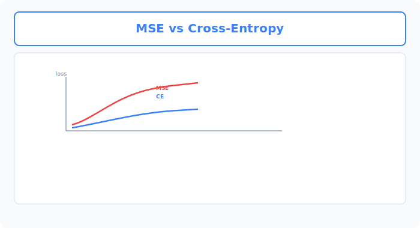
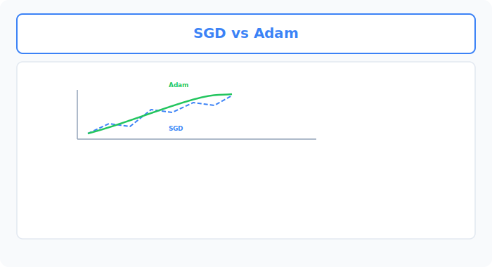

# Unit 12: Optimizers & Loss Functions

<p class="unit-hero">
  
</p>

> [!TIP]
> **For learners using Google Colab**
> For the deep learning section (Units 10–16), we recommend **enabling a GPU** to speed up computation. See [Appendix (Learning Environment and API Setup)](../appendix/index.md#🚀-1-learning-with-google-colaboratory) for setup steps first.

## 1. Understanding Optimizers & Loss Functions




In AI training, **loss functions** and **optimizers** work together like a car's **navigation system** and **engine**. When these two cooperate well, the AI can reach its goal (the correct answer).

**Loss function = the navigation system's "remaining distance to the destination"**
This is the formula that measures how far the AI's current prediction is from the actual correct answer. The goal is to drive this gap (loss) toward zero.
- **MSE (mean squared error)**: Used when predicting numbers (e.g., tomorrow's temperature).
- **Cross Entropy**: Used for classification (e.g., dog or cat).

**Optimizer = the "vehicle (strategy)" for reaching the destination**
This is the strategy for how to adjust the network's weights (W) to reduce loss. Imagine descending from a mountain peak toward the valley floor (loss = 0) while blindfolded.

| Optimizer type | Hiking analogy (characteristics) | Pros and cons |
|---|---|---|
| **SGD (stochastic gradient descent)** | Descending carefully one step at a time with a walking stick | Reliable, but slow and prone to getting stuck in dips (local minima). |
| **Momentum** | Rolling a ball down a slope | Momentum helps escape dips, but you can overshoot. |
| **Adam** | A smart self-driving car with GPS | **The most popular choice in AI today.** It adjusts speed intelligently and heads for the valley fast! |

In this unit, you will use code to see how switching these "vehicles" changes training speed!

### 💡 Concrete Business Use Cases

- **Recommendation engine optimization**: Train quickly with optimizers like Adam to minimize whether users clicked a product (Cross Entropy Loss) or the gap in rating scores (MSE), maximizing revenue.
- **Ad click-through rate (CTR) prediction**: In models that predict click probability, choose the best optimizer for large daily log volumes and improve prediction accuracy quickly.
- **Dynamic pricing**: When adjusting airline tickets or hotel rates in real time, compute prices while continuously correcting and optimizing the gap between revenue and demand (loss).



## 2. Implementation Example

Here you will use the exact same network and data to compare how differently **SGD (walking)** and **Adam (smart car)** learn.

First, setup. This time you will train on a slightly complex function (a sine wave).

```python
import torch
import torch.nn as nn
import torch.optim as optim

# 1. Prepare data (approximate a sine wave)
torch.manual_seed(42)
X = torch.linspace(-5, 5, 100).view(-1, 1) # 100 values from -5 to 5
y = torch.sin(X) + torch.randn(X.size()) * 0.1 # Target is sine wave (with a little noise)

# 2. Network blueprint (shared by both models)
class SimpleNet(nn.Module):
    def __init__(self):
        super(SimpleNet, self).__init__()
        self.net = nn.Sequential(
            nn.Linear(1, 16),
            nn.ReLU(),
            nn.Linear(16, 16),
            nn.ReLU(),
            nn.Linear(16, 1)
        )
    def forward(self, x):
        return self.net(x)
```

`nn.Sequential` is a convenient PyTorch feature that makes it easy to chain layers in order.

Next, prepare two models and assign each a different "vehicle (optimizer)."

```python
# Prepare separate models for SGD and Adam
model_sgd = SimpleNet()
model_adam = SimpleNet()

# Shared loss function (MSE for numeric prediction)
criterion = nn.MSELoss()

# Optimizer settings
# SGD step size (learning rate lr) set to 0.01
optimizer_sgd = optim.SGD(model_sgd.parameters(), lr=0.01)

# Adam adapts step sizes, so it feels faster at the same lr
optimizer_adam = optim.Adam(model_adam.parameters(), lr=0.01)
```

Now run both "cars" at the same time (train them) and compare.

```python
epochs = 300

print("--- Training start ---")
for epoch in range(epochs):
    # --- SGD training ---
    pred_sgd = model_sgd(X)
    loss_sgd = criterion(pred_sgd, y)
    optimizer_sgd.zero_grad()
    loss_sgd.backward()
    optimizer_sgd.step()

    # --- Adam training ---
    pred_adam = model_adam(X)
    loss_adam = criterion(pred_adam, y)
    optimizer_adam.zero_grad()
    loss_adam.backward()
    optimizer_adam.step()

    # Report every 50 epochs
    if (epoch + 1) % 50 == 0:
        print(f"Epoch {epoch+1:3d} | SGD Loss: {loss_sgd.item():.4f} | Adam Loss: {loss_adam.item():.4f}")
```

**Explanation:**
In the output, you should see Adam's loss (gap) shrink much faster than SGD's in the first few epochs.
Adam automatically adjusts—"this is a steep slope, take a big step" or "this is flat, take small steps"—so it is especially powerful on complex data. That is why **"when in doubt, use Adam"** is a common rule in deep learning today.

## 3. Practice

This time, set up loss and optimizer for a classification problem.

**Requirements:**
- Use the dummy data below, assuming **3-class classification** as in iris flower classification.
- Use `nn.CrossEntropyLoss()` as the loss function because this is classification.
- Use `optim.Adam` as the optimizer with learning rate (`lr`) set to `0.05`.
- Complete a training loop for 100 epochs and confirm that loss decreases.

**Hints:**
When using `nn.CrossEntropyLoss`, labels `y` must be of type `torch.long` (integers). You do not need Softmax on the network's final output—the loss function computes it internally!

```python
# Prepare data (hint)
# 4 samples, 3 features each
X_class = torch.randn(4, 3) 
# Ground-truth class is 0, 1, or 2
y_class = torch.tensor([0, 2, 1, 0], dtype=torch.long) 
```

## 4. Answer Key

<details>
<summary>View sample solution (click to expand)</summary>

```python
import torch
import torch.nn as nn
import torch.optim as optim

# 1. Prepare data
torch.manual_seed(42)
X_class = torch.randn(4, 3) # 4 samples, 3 input features
y_class = torch.tensor([0, 2, 1, 0], dtype=torch.long) # 3 classes (0, 1, 2)

# 2. Define the network
class ClassificationNet(nn.Module):
    def __init__(self):
        super(ClassificationNet, self).__init__()
        # 3 inputs -> 5 hidden units -> 3 outputs (score per class)
        self.net = nn.Sequential(
            nn.Linear(3, 5),
            nn.ReLU(),
            nn.Linear(5, 3)
        )
    def forward(self, x):
        return self.net(x)

model = ClassificationNet()

# 3. Loss function and optimizer
# CrossEntropyLoss for classification
criterion = nn.CrossEntropyLoss()
# Adam optimizer
optimizer = optim.Adam(model.parameters(), lr=0.05)

# 4. Training loop
epochs = 100

print("--- Classification task: training start ---")
for epoch in range(epochs):
    # 1. Predict
    predictions = model(X_class)
    
    # 2. Compute loss
    loss = criterion(predictions, y_class)
    
    # 3-5. Update
    optimizer.zero_grad()
    loss.backward()
    optimizer.step()

    if (epoch + 1) % 20 == 0:
        print(f"Epoch {epoch+1:3d} | Loss: {loss.item():.4f}")

# Predictions after training (highest score index is the predicted class)
final_preds = model(X_class).argmax(dim=1)
print(f"Ground-truth labels: {y_class.tolist()}")
print(f"Model predictions:   {final_preds.tolist()}")
```

</details>
