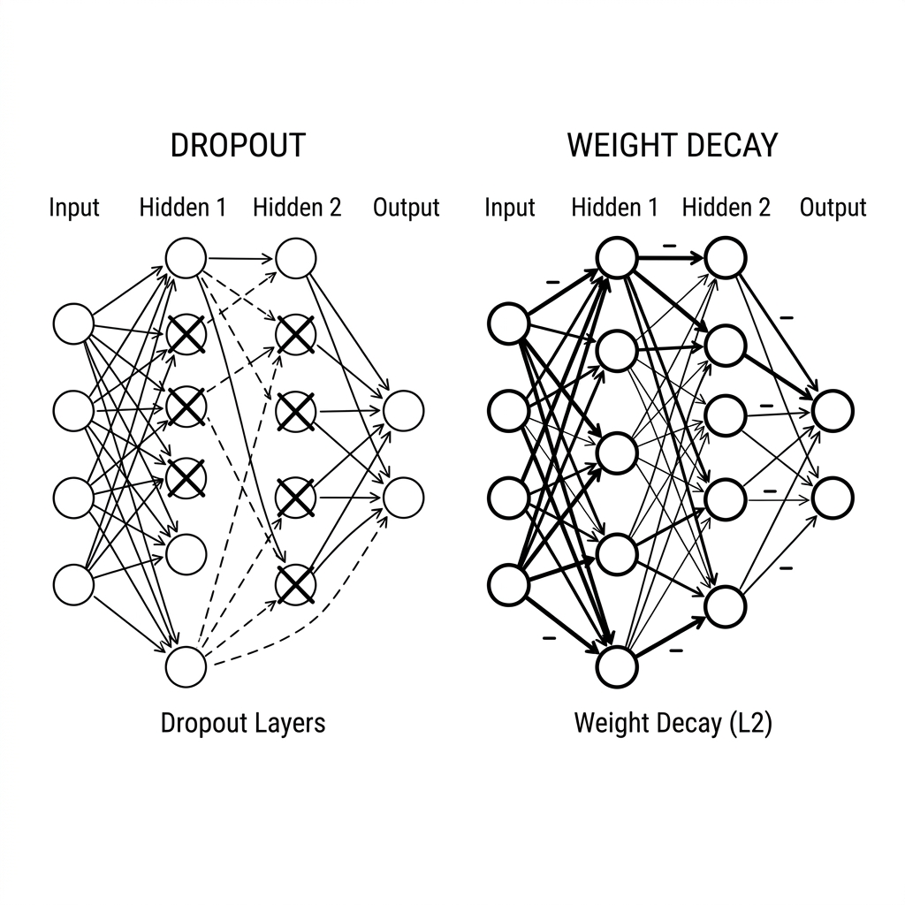

# Unit 13: Overfitting Prevention in Deep Learning

> [!TIP]
> **For learners using Google Colab**
> For the deep learning section (Units 10–16), we recommend **enabling a GPU** to speed up computation. See [Appendix (Learning Environment and API Setup)](../appendix/index.md#🚀-1-learning-with-google-colaboratory) for setup steps first.

## 1. Understanding Regularization in DL



Deep learning has a dangerous trap called **overfitting**.

**What is overfitting? = "Memorizing past exam questions"**
Imagine studying for a test by memorizing past answers in order—"A, C, B, A…"—and scoring 100. On the real exam, slightly different questions appear and you score zero because you never learned the underlying concepts.
AI does the same thing: it fits the training data too closely and fails on unseen data. That is **overfitting**.

**Regularization** is the technique to prevent this. Think of it as **"strict training that stops the AI from cheating and forces it to learn the essence."**

Here are three representative techniques.

| Technique | Analogy | Mechanism |
|---|---|---|
| **Dropout** | Randomly sending study-group members home | During each training step, randomly deactivate part of the network (neurons). This stops the model from relying on a few "star neurons" and makes everyone contribute. |
| **Weight Decay (L2 regularization)** | Penalizing employees who dominate the conversation | Prevents some weights from becoming extremely large and keeps the network balanced. Easy to enable in optimizer settings. |
| **Early Stopping** | Banning all-nighters | As training continues, if validation performance starts to drop, that is a sign overfitting has begun—stop training there. |
| **BatchNorm (batch normalization)** | Aligning average test scores each class | Normalize each layer's outputs (mean 0, variance 1) to stabilize and speed up training. Also has a mild regularizing effect and is often used with Dropout. |

> [!NOTE]
> **📌 BatchNorm supplement**
>
> **Batch Normalization (BatchNorm)** normalizes each layer's outputs to stabilize and speed up training.
> It is like standardizing grading criteria (mean and variance) for every class so deep networks are less likely to run out of control.
>
> - **Also regularizes**: Statistics are computed per mini-batch, adding noise that acts as light regularization. Can be combined with Dropout.
> - **In PyTorch**: Use `nn.BatchNorm2d(channels)` for images (CNN) and `nn.BatchNorm1d(features)` for fully connected layers.
> - **In this unit**: We focus on Dropout and Weight Decay. You will actually use BatchNorm in a CNN in [Unit 16 (Capstone)](../unit16_deep_learning_capstone/index.md)—stay tuned!

In this unit, you will learn how to add **Dropout** and **Weight Decay** to a network with PyTorch!

### 💡 Concrete Business Use Cases

- **Medical image diagnosis support**: Prevent overfitting to images from one hospital's equipment and build a general model that detects abnormalities reliably across hospitals.
- **Credit card fraud detection**: Use Dropout and other regularization so the model does not memorize limited past fraud patterns and can adapt to new scam tactics.
- **Stock and FX forecasting**: Financial time series are noisy; use Weight Decay and similar methods to build robust models that do not overreact to noise.

## 2. Implementation Example

Here you will apply Dropout and Weight Decay to an overfitting-prone "overly complex network."

First, PyTorch setup.

```python
import torch
import torch.nn as nn
import torch.optim as optim

# ダミーデータ（今回は構造を見るだけなので適当なデータ）
X = torch.randn(10, 5) # 10件のデータ、5つの特徴量
y = torch.randn(10, 1)
```

Next, design a network with Dropout.

```python
class RegularizedNet(nn.Module):
    def __init__(self):
        super(RegularizedNet, self).__init__()
        self.fc1 = nn.Linear(5, 50)
        # ここがDropout！ 引数の 0.5 は「毎回50%のニューロンをランダムにお休みさせる」という意味です
        self.dropout = nn.Dropout(p=0.5) 
        self.fc2 = nn.Linear(50, 1)

    def forward(self, x):
        x = self.fc1(x)
        x = torch.relu(x)
        
        # 隠れ層の後にDropoutを通します
        x = self.dropout(x) 
        
        x = self.fc2(x)
        return x

model = RegularizedNet()
```

Just adding `nn.Dropout(p=0.5)` makes PyTorch automatically turn off a different 50% of neurons each training step.

Next, Weight Decay settings. This is configured in the optimizer, not inside the network.

```python
criterion = nn.MSELoss()

# weight_decay=1e-4 (0.0001) を追加するだけで、L2正則化が適用されます！
optimizer = optim.Adam(model.parameters(), lr=0.01, weight_decay=1e-4)
```

Finally, the training loop—but with Dropout there is a **critical rule**.

```python
# 【超重要】学習モードに切り替える（DropoutがONになる）
model.train() 

for epoch in range(100):
    optimizer.zero_grad()
    predictions = model(X)
    loss = criterion(predictions, y)
    loss.backward()
    optimizer.step()

# 【超重要】評価（本番）モードに切り替える（DropoutがOFFになる）
model.eval() 

with torch.no_grad(): # 評価時は勾配計算（反省）をストップしてメモリを節約
    test_predictions = model(X)
    print("本番モードでの予測完了！")
```

**Explanation:**
Dropout is "strict training during practice," so you **cannot have neurons resting during the real test.**
In PyTorch:
- Call `model.train()` during training to enable Dropout.
- Call `model.eval()` during prediction (testing) so everyone is "at work" at full power.
Forgetting this switch means only 50% capacity at inference and accuracy collapses—be careful!

## 3. Practice

Get comfortable writing Dropout and Weight Decay.

**Requirements:**
- Build a network `MyRobustNet` with input(10) → hidden1(64) → hidden2(32) → output(1).
- After each hidden layer, add **Dropout with probability 0.3** (right after ReLU activation).
- Use `Adam` as the optimizer with learning rate `0.005` and **Weight Decay 0.001**.
- Mind the `model.train()` and `model.eval()` switch: run 10 epochs of training, then predict on dummy data in evaluation mode.

**Hints:**
- Define `nn.Dropout(p=0.3)` once in `__init__` and reuse it multiple times in `forward`.

## 4. Answer Key

<details>
<summary>View sample solution (click to expand)</summary>

```python
import torch
import torch.nn as nn
import torch.optim as optim

# 1. データ準備
torch.manual_seed(42)
X_train = torch.randn(20, 10)
y_train = torch.randn(20, 1)

# 2. ネットワーク定義
class MyRobustNet(nn.Module):
    def __init__(self):
        super(MyRobustNet, self).__init__()
        self.fc1 = nn.Linear(10, 64)
        self.fc2 = nn.Linear(64, 32)
        self.fc3 = nn.Linear(32, 1)
        
        # Dropoutの定義 (p=0.3)
        self.dropout = nn.Dropout(p=0.3)
        self.relu = nn.ReLU()

    def forward(self, x):
        # 1層目
        x = self.fc1(x)
        x = self.relu(x)
        x = self.dropout(x) # スパルタ教育
        
        # 2層目
        x = self.fc2(x)
        x = self.relu(x)
        x = self.dropout(x) # スパルタ教育
        
        # 出力層
        x = self.fc3(x)
        return x

model = MyRobustNet()

# 3. 損失関数とOptimizer
criterion = nn.MSELoss()
# weight_decayでL2正則化を適用
optimizer = optim.Adam(model.parameters(), lr=0.005, weight_decay=0.001)

# 4. 学習ループ
epochs = 10

print("--- 学習（訓練モード） ---")
model.train() # 【重要】DropoutをON

for epoch in range(epochs):
    optimizer.zero_grad()
    predictions = model(X_train)
    loss = criterion(predictions, y_train)
    loss.backward()
    optimizer.step()
    print(f"Epoch {epoch+1:2d} | Loss: {loss.item():.4f}")

# 5. 評価
print("\n--- 評価（本番モード） ---")
model.eval() # 【重要】DropoutをOFF（全員出社）

# 本番の予測では no_grad を使うのがベストプラクティス
with torch.no_grad():
    final_pred = model(X_train)
    print("テストデータの予測が完了しました（最初の3件の予測値）:")
    print(final_pred[:3].flatten().numpy())
```

</details>
