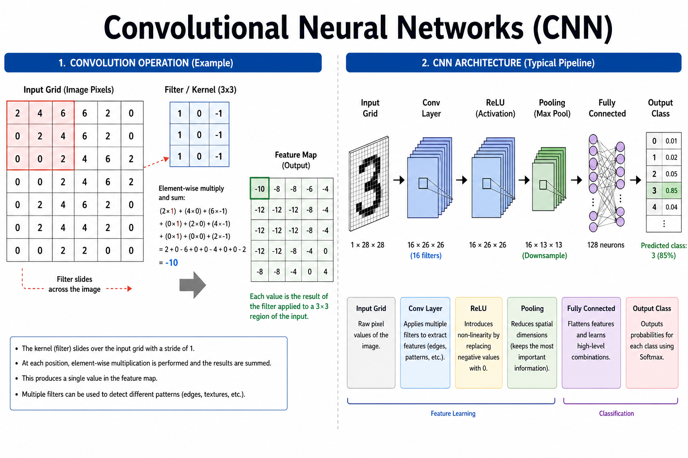
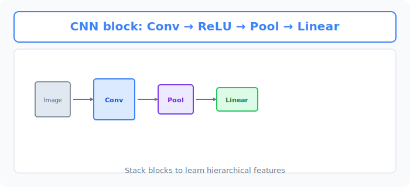
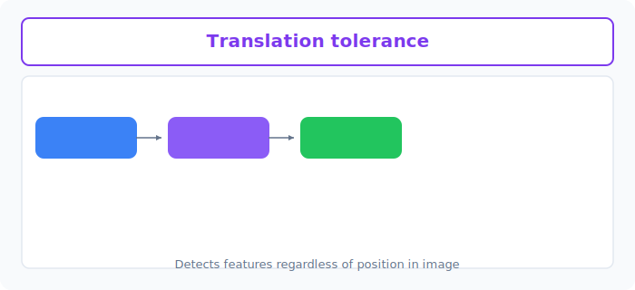

# Unit 14: Convolutional Neural Network Basics

<p class="unit-hero">
  
</p>

> [!TIP]
> **For learners using Google Colab**
> For the deep learning section (Units 10–16), we recommend **enabling a GPU** to speed up computation. See [Appendix (Learning Environment and API Setup)](../appendix/index.md#🚀-1-learning-with-google-colaboratory) for setup steps first.

## 1. Understanding CNN Basics




The neural networks (MLPs) you have learned so far are poor at handling images. Stretching an image into "one long row of data" destroys important spatial structure—vertical and horizontal relationships such as shape and edges.

That is where **CNN (Convolutional Neural Network)** comes in—the revolution in image recognition!

**CNN is like "a detective with a magnifying glass"**

A CNN works like carefully scanning an entire picture with a small magnifying glass, edge to edge.

| CNN component | Detective analogy | Role |
|---|---|---|
| **Convolution layer (Conv2d)** | Searching for specific features with a magnifying glass | Extracts features such as "there is a vertical line here" or "there is a round shape here" (edges and patterns). |
| **Pooling layer (MaxPool2d)** | Summarizing and shrinking information | Keeps only the strongest evidence—"there was a round shape in this area!"—and compresses the image. Becomes robust to small shifts. |
| **Fully connected layer (Linear)** | Laying out evidence to identify the culprit | Looks at collected features—"ears," "whiskers," "tail"—and makes the final call: "This is a cat!" |

A CNN repeats **"convolution (find features) → pooling (summarize)"** several times, then finishes with **"fully connected (reasoning)."** This pattern is the foundation of modern AI image recognition.

### 💡 Concrete Business Use Cases

- **Manufacturing defect detection**: Cameras on the production line capture scratches and stains and automatically reject defective products.
- **Autonomous driving object recognition**: Instantly recognize pedestrians, other vehicles, traffic lights, and road signs from onboard camera feeds for safe control.
- **Medical cancer cell detection**: Capture subtle tumor shapes (roundness and contours) in CT or MRI scans that human eyes might miss and support physician diagnosis.



## 2. Implementation Example

Here you will build a very basic CNN in PyTorch—the kind often used for handwritten digit recognition (MNIST).

First, setup. Assume dummy image data: **1 channel (grayscale), 28×28 pixels**.

```python
import torch
import torch.nn as nn
import torch.nn.functional as F

# Dummy image data (batch size: 10, channels: 1 grayscale, height: 28, width: 28)
# PyTorch image tensors are always [batch, channels, height, width]!
dummy_images = torch.randn(10, 1, 28, 28)
```

Next, draw the magnifying-glass (CNN) blueprint.

```python
class SimpleCNN(nn.Module):
    def __init__(self):
        super(SimpleCNN, self).__init__()
        # 1. First convolution layer
        # 1 input channel (grayscale) -> 16 filters -> 3x3 kernel
        self.conv1 = nn.Conv2d(in_channels=1, out_channels=16, kernel_size=3, padding=1)
        
        # 2. Second convolution layer
        # 16 channels -> 32 filters for richer features
        self.conv2 = nn.Conv2d(in_channels=16, out_channels=32, kernel_size=3, padding=1)
        
        # 3. Pooling layer (downsampling)
        # Keep strongest feature in each 2x2 region (halves height and width)
        self.pool = nn.MaxPool2d(kernel_size=2, stride=2)
        
        # 4. Fully connected layers (classification head)
        # Image halved twice (28->14->7), so features = 32 * 7 * 7 = 1568
        self.fc1 = nn.Linear(32 * 7 * 7, 128) # Summarize 1568 features into 128
        self.fc2 = nn.Linear(128, 10)         # Classify into 10 digit classes (0-9)

    def forward(self, x):
        # --- Feature extraction (conv + pool) ---
        # Conv1 -> ReLU -> pool [28x28 -> 14x14]
        x = self.pool(F.relu(self.conv1(x)))
        
        # Conv2 -> ReLU -> pool [14x14 -> 7x7]
        x = self.pool(F.relu(self.conv2(x)))
        
        # --- Classification head (fully connected) ---
        # Flatten spatial dimensions into a vector
        x = x.view(-1, 32 * 7 * 7)
        
        # Final classification
        x = F.relu(self.fc1(x))
        x = self.fc2(x)
        return x

model = SimpleCNN()
```

Finally, pass dummy images through the model and confirm inference runs without errors.

```python
# Run inference on dummy images
output = model(dummy_images)

# Check output shape
print("Output shape:", output.shape)
# Result: torch.Size([10, 10])
# (10 images, each with 10 class scores for digits 0-9)
```

**Explanation:**
The trickiest part for CNN beginners is **computing the size passed into the fully connected (Linear) layer**.
- Starting image: `28x28`.
- After one `MaxPool2d(2)`, height and width halve to `14x14`.
- After another pass: `7x7`.
- With 32 channels at the end, total features = `32 × 7 × 7 = 1568`.
Flatten with `x.view(-1, 1568)` before the fully connected layer—this is the standard CNN pattern.

## 3. Practice

Build a slightly different network to get comfortable with CNN structure!

**Requirements:**
- Assume color images. Create dummy color images `color_images` with shape `(batch size: 5, channels: 3, height: 32, width: 32)`.
- Create a `ColorCNN` class with this structure:
  - **Conv layer 1**: input channels 3 → output channels 8, kernel size 3, padding 1
  - **Pooling layer**: MaxPool size 2
  - **Conv layer 2**: input channels 8 → output channels 16, kernel size 3, padding 1
  - (Pass through the same pooling layer again)
  - **FC layer 1**: (work out the size—32 halved twice…) → output 64
  - **FC layer 2**: input 64 → output 5 (classify into 5 animal types)
- In `forward`, apply `relu` as data flows, then pass dummy images and confirm output shape is `[5, 5]`.

**Hints:**
A 32×32 image halved twice becomes 16×16 → 8×8. With 16 channels, the flattened size is `16 * 8 * 8`.

## 4. Answer Key

<details>
<summary>View sample solution (click to expand)</summary>

```python
import torch
import torch.nn as nn
import torch.nn.functional as F

# 1. Create dummy color image data
# (batch: 5, channels: 3 RGB, height: 32, width: 32)
color_images = torch.randn(5, 3, 32, 32)

# 2. Define the model
class ColorCNN(nn.Module):
    def __init__(self):
        super(ColorCNN, self).__init__()
        # First conv layer (3 input channels for color)
        self.conv1 = nn.Conv2d(in_channels=3, out_channels=8, kernel_size=3, padding=1)
        # Second conv layer
        self.conv2 = nn.Conv2d(in_channels=8, out_channels=16, kernel_size=3, padding=1)
        
        # Pooling layer
        self.pool = nn.MaxPool2d(kernel_size=2, stride=2)
        
        # Fully connected layers
        # Image size: 32 -> (pool) -> 16 -> (pool) -> 8
        # Channels: 16
        # Flattened size: 16 * 8 * 8 = 1024
        self.fc1 = nn.Linear(16 * 8 * 8, 64)
        self.fc2 = nn.Linear(64, 5) # 5-class classification

    def forward(self, x):
        # First convolution
        x = self.pool(F.relu(self.conv1(x)))
        # Second convolution
        x = self.pool(F.relu(self.conv2(x)))
        
        # Flatten
        x = x.view(-1, 16 * 8 * 8)
        
        # Classification head
        x = F.relu(self.fc1(x))
        x = self.fc2(x)
        return x

model = ColorCNN()

# 3. Test run
output = model(color_images)
print("Output shape:", output.shape)
# Expected: torch.Size([5, 5]) 
# (5 images, each with 5 class scores)
```

</details>
