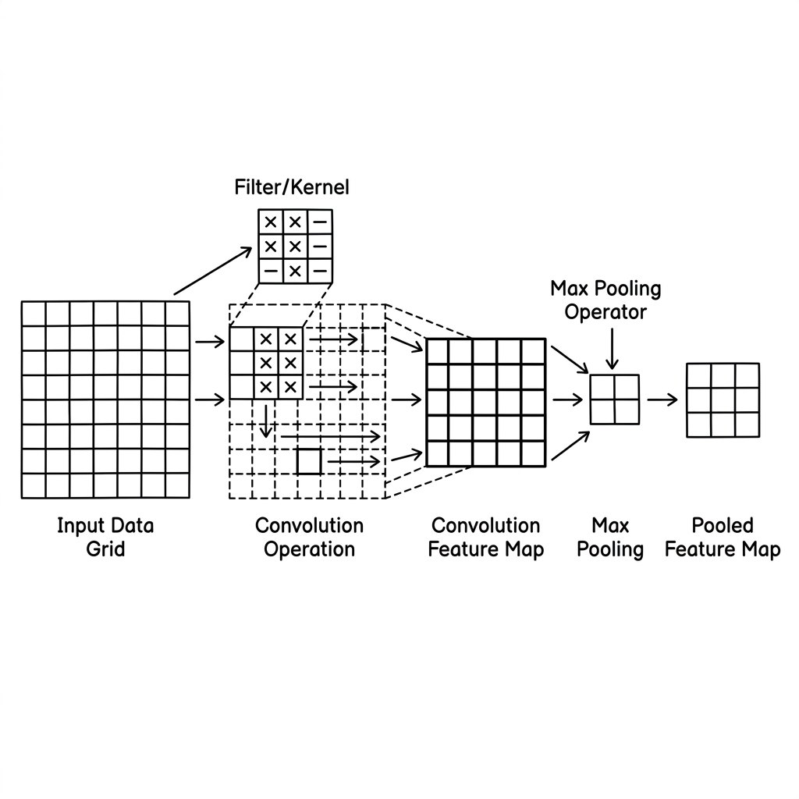

# Unit 14: Convolutional Neural Network Basics

> [!TIP]
> **For learners using Google Colab**
> For the deep learning section (Units 10–16), we recommend **enabling a GPU** to speed up computation. See [Appendix (Learning Environment and API Setup)](../appendix/index.md#🚀-1-learning-with-google-colaboratory) for setup steps first.

## 1. Understanding CNN Basics



The neural networks (MLPs) you have learned so far are poor at handling images. Stretching an image into "one long row of data" destroys important spatial structure—vertical and horizontal relationships such as shape and edges.

That is where **CNN (Convolutional Neural Network)** comes in—the revolution in image recognition!

**CNN is like "a detective with a magnifying glass"**

A CNN works like carefully scanning an entire picture with a small magnifying glass, edge to edge.

| CNN component | Detective analogy | Role |
|---|---|---|
| **Convolution layer (Conv2d)** | Searching for specific features with a magnifying glass | Extracts features such as "there is a vertical line here" or "there is a round shape here" (edges and patterns). |
| **Pooling layer (MaxPool2d)** | Summarizing and shrinking information | Keeps only the strongest evidence—"there was a round shape in this area!"—and compresses the image. Becomes robust to small shifts. |
| **Fully connected layer (Linear)** | Laying out evidence to identify the culprit | Looks at collected features—"ears," "whiskers," "tail"—and makes the final call: "This is a cat!" |

A CNN repeats **"convolution (find features) → pooling (summarize)"** several times, then finishes with **"fully connected (reasoning)."** This pattern is the foundation of modern AI image recognition.

### 💡 Concrete Business Use Cases

- **Manufacturing defect detection**: Cameras on the production line capture scratches and stains and automatically reject defective products.
- **Autonomous driving object recognition**: Instantly recognize pedestrians, other vehicles, traffic lights, and road signs from onboard camera feeds for safe control.
- **Medical cancer cell detection**: Capture subtle tumor shapes (roundness and contours) in CT or MRI scans that human eyes might miss and support physician diagnosis.

## 2. Implementation Example

Here you will build a very basic CNN in PyTorch—the kind often used for handwritten digit recognition (MNIST).

First, setup. Assume dummy image data: **1 channel (grayscale), 28×28 pixels**.

```python
import torch
import torch.nn as nn
import torch.nn.functional as F

# ダミーの画像データ (バッチサイズ:10, チャンネル数:1(白黒), 縦:28, 横:28)
# PyTorchの画像データは必ず [バッチ数, チャンネル数, 縦, 横] の順番になります！
dummy_images = torch.randn(10, 1, 28, 28)
```

Next, draw the magnifying-glass (CNN) blueprint.

```python
class SimpleCNN(nn.Module):
    def __init__(self):
        super(SimpleCNN, self).__init__()
        # 1. 最初の虫眼鏡（畳み込み層）
        # 入力1チャンネル(白黒) -> 出力16種類の虫眼鏡を使う -> 3x3のサイズの虫眼鏡
        self.conv1 = nn.Conv2d(in_channels=1, out_channels=16, kernel_size=3, padding=1)
        
        # 2. 次の虫眼鏡
        # 入力16種類 -> 出力32種類のさらに複雑な特徴を探す虫眼鏡
        self.conv2 = nn.Conv2d(in_channels=16, out_channels=32, kernel_size=3, padding=1)
        
        # 3. プーリング層（要約ツール）
        # 2x2の範囲の中で一番強い特徴だけを残す（画像サイズが縦横半分になります）
        self.pool = nn.MaxPool2d(kernel_size=2, stride=2)
        
        # 4. 全結合層（推理パート）
        # 画像が2回半分(28->14->7)になるので、最終的な特徴の数は 32(種類) * 7(縦) * 7(横) = 1568個
        self.fc1 = nn.Linear(32 * 7 * 7, 128) # 1568個の証拠から128個のまとめを作る
        self.fc2 = nn.Linear(128, 10)         # 最後に「0〜9の数字」の10クラスに分類する

    def forward(self, x):
        # --- 特徴抽出パート (虫眼鏡 & 要約) ---
        # 1回目の虫眼鏡 -> 活性化(ReLU) -> 要約(半分に) [28x28 -> 14x14]
        x = self.pool(F.relu(self.conv1(x)))
        
        # 2回目の虫眼鏡 -> 活性化(ReLU) -> 要約(半分に) [14x14 -> 7x7]
        x = self.pool(F.relu(self.conv2(x)))
        
        # --- 推理パート (全結合) ---
        # 画像(縦横の箱)の状態から、1列の長いリストに引き延ばす！ (Flatten)
        x = x.view(-1, 32 * 7 * 7)
        
        # リストをもとに最終推理
        x = F.relu(self.fc1(x))
        x = self.fc2(x)
        return x

model = SimpleCNN()
```

Finally, pass dummy images through the model and confirm inference runs without errors.

```python
# ダミー画像をモデルに推論させる
output = model(dummy_images)

# 出力の形を確認
print("出力のサイズ:", output.shape)
# 出力結果: torch.Size([10, 10])
# (10枚の画像それぞれに対して、0〜9の10種類の確率スコアが出力されている)
```

**Explanation:**
The trickiest part for CNN beginners is **computing the size passed into the fully connected (Linear) layer**.
- Starting image: `28x28`.
- After one `MaxPool2d(2)`, height and width halve to `14x14`.
- After another pass: `7x7`.
- With 32 channels at the end, total features = `32 × 7 × 7 = 1568`.
Flatten with `x.view(-1, 1568)` before the fully connected layer—this is the standard CNN pattern.

## 3. Practice

Build a slightly different network to get comfortable with CNN structure!

**Requirements:**
- Assume color images. Create dummy color images `color_images` with shape `(batch size: 5, channels: 3, height: 32, width: 32)`.
- Create a `ColorCNN` class with this structure:
  - **Conv layer 1**: input channels 3 → output channels 8, kernel size 3, padding 1
  - **Pooling layer**: MaxPool size 2
  - **Conv layer 2**: input channels 8 → output channels 16, kernel size 3, padding 1
  - (Pass through the same pooling layer again)
  - **FC layer 1**: (work out the size—32 halved twice…) → output 64
  - **FC layer 2**: input 64 → output 5 (classify into 5 animal types)
- In `forward`, apply `relu` as data flows, then pass dummy images and confirm output shape is `[5, 5]`.

**Hints:**
A 32×32 image halved twice becomes 16×16 → 8×8. With 16 channels, the flattened size is `16 * 8 * 8`.

## 4. Answer Key

<details>
<summary>View sample solution (click to expand)</summary>

```python
import torch
import torch.nn as nn
import torch.nn.functional as F

# 1. カラー画像のダミーデータ作成
# (バッチ数:5, チャンネル:3(RGB), 縦:32, 横:32)
color_images = torch.randn(5, 3, 32, 32)

# 2. モデルの定義
class ColorCNN(nn.Module):
    def __init__(self):
        super(ColorCNN, self).__init__()
        # 最初の虫眼鏡 (カラー画像なので入力チャンネルは3)
        self.conv1 = nn.Conv2d(in_channels=3, out_channels=8, kernel_size=3, padding=1)
        # 次の虫眼鏡
        self.conv2 = nn.Conv2d(in_channels=8, out_channels=16, kernel_size=3, padding=1)
        
        # プーリング層
        self.pool = nn.MaxPool2d(kernel_size=2, stride=2)
        
        # 全結合層
        # 画像サイズ: 32 -> (pool) -> 16 -> (pool) -> 8
        # チャンネル数: 16
        # 引き延ばした後のサイズ: 16 * 8 * 8 = 1024
        self.fc1 = nn.Linear(16 * 8 * 8, 64)
        self.fc2 = nn.Linear(64, 5) # 5クラス分類

    def forward(self, x):
        # 畳み込み 1回目
        x = self.pool(F.relu(self.conv1(x)))
        # 畳み込み 2回目
        x = self.pool(F.relu(self.conv2(x)))
        
        # 1列に引き延ばす (Flatten)
        x = x.view(-1, 16 * 8 * 8)
        
        # 推理パート
        x = F.relu(self.fc1(x))
        x = self.fc2(x)
        return x

model = ColorCNN()

# 3. テスト実行
output = model(color_images)
print("出力のサイズ:", output.shape)
# 期待される出力: torch.Size([5, 5]) 
# (5枚の画像それぞれに5クラスのスコアが出力されている)
```

</details>
