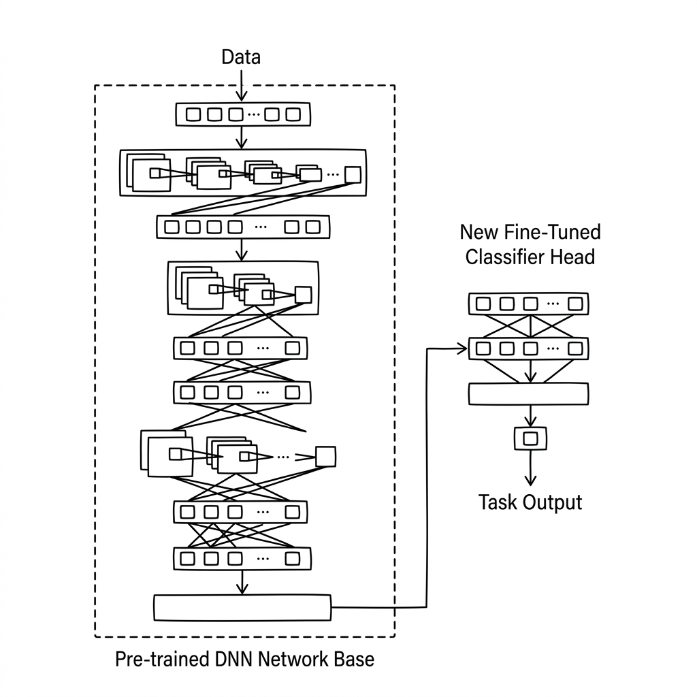

# Unit 15: Transfer Learning with ResNet

> [!TIP]
> **For learners using Google Colab**
> For the deep learning section (Units 10–16), we recommend **enabling a GPU** to speed up computation. See [Appendix (Learning Environment and API Setup)](../appendix/index.md#🚀-1-learning-with-google-colaboratory) for setup steps first.

## 1. Understanding Transfer Learning with ResNet



Building and training a CNN from scratch is admirable, but it requires **massive data** and **enormous time (compute)**.

The cheat technique most used in modern AI development is **transfer learning**.

**Transfer learning is like "hiring a top chef"**

Suppose you want to open the ultimate omurice specialty restaurant.
1. **Train from scratch**: Hire a beginner and teach knife skills, fire control, and how to crack eggs over several years. (What you did through Unit 14.)
2. **Transfer learning**: Poach a Michelin three-star French chef and teach only "how to make omurice" in one week.

In transfer learning, you download a **pretrained model (top chef)** that big companies like Google and Microsoft trained on supercomputers with "every kind of image in the world." They already detect round shapes, edges, and animal fur—so with a little extra training, they classify your images perfectly.

**One top chef: ResNet**
Among pretrained models, **ResNet** was a historic breakthrough.
People assumed deeper networks were smarter, but too much depth made information get lost and performance collapsed.
ResNet introduced **skip connections**—"if this layer makes you get lost, just skip it and take a shortcut!"—enabling 100+ layer networks that actually work.

### 💡 Concrete Business Use Cases

- **Custom image search**: Fine-tune a pretrained model so an e-commerce site can distinguish thousands of proprietary apparel SKUs for "search by image."
- **Face authentication**: Start from a model trained on huge face datasets and add a few samples of your employees for a fast, secure gate.
- **Drone infrastructure inspection**: Transfer general vision ability to cracks in bridges or rust on towers and build accurate inspection AI from few samples.

## 2. Implementation Example

Here you will use PyTorch to hire **ResNet18**, a top chef, and customize it for **binary dog-vs-cat classification**.

First, call the chef from the internet.

```python
import torch
import torch.nn as nn
import torchvision.models as models

# 1. 一流シェフ（学習済みのResNet18）をダウンロードして呼んでくる
# weights=models.ResNet18_Weights.DEFAULT と指定することで、知識が詰まった状態のモデルをダウンロードできます。
resnet = models.resnet18(weights=models.ResNet18_Weights.DEFAULT)

print(resnet) # 中身を見ると、膨大な量の層（虫眼鏡）が連なっているのがわかります
```

This chef was trained on ImageNet and can distinguish **1000** object classes. You only need **2**—dog or cat.

So replace only the "final decision layer (fully connected layer)" in the chef's head.

```python
# 2. シェフの今までの知識（虫眼鏡の部分）を「凍結（Freeze）」する
# 「今まで培った包丁の使い方はそのままでいいよ、変えないでね」という指示です。
for param in resnet.parameters():
    param.requires_grad = False # 勾配計算（学習）をストップする

# 3. 最後の全結合層（推理パート）だけを、2クラス分類用に新しく付け替える
# resnetの最後の層は「fc (Fully Connected)」という名前がついています。
# そこで、元のfc層に入力されるはずだった特徴量の数（in_features）を調べます。
num_features = resnet.fc.in_features 

# 古い1000クラス用の層を捨てて、新しい2クラス用の層をくっつけます！
# 新しく作ったこの層だけは requires_grad = True (学習する) になります。
resnet.fc = nn.Linear(num_features, 2)

print("最後の層が2クラス分類用にすり替わりました！")
print(resnet.fc)
```

That is all the setup! Now run a training loop with this model.

```python
import torch.optim as optim

# 4. 学習の準備
criterion = nn.CrossEntropyLoss()

# ここがポイント！
# Optimizer（乗り物）には、「新しく付け替えた最後の層 (resnet.fc.parameters())」だけを渡します。
# 凍結した部分は学習させる必要がないためです。
optimizer = optim.Adam(resnet.fc.parameters(), lr=0.001)

# ダミーの画像データ (バッチ:4, カラー3色, 縦:224, 横:224) 
# ※ResNetなどの有名モデルは基本的に 224x224 サイズの画像を前提にしています。
dummy_images = torch.randn(4, 3, 224, 224)
dummy_labels = torch.tensor([0, 1, 0, 1])

# 5. 学習ループ（1回だけ回してみるテスト）
resnet.train()

optimizer.zero_grad()
predictions = resnet(dummy_images) # シェフに予測させる！
loss = criterion(predictions, dummy_labels)
loss.backward()
optimizer.step()

print("\n1回分の学習が完了しました！Loss:", loss.item())
```

**Explanation:**
With just this much code, you can adapt world-class image recognition AI to your task!
The three key steps:
1. Load a pretrained model.
2. **Freeze** existing layers (`requires_grad = False`).
3. Replace the final layer (`fc` or `classifier`) to match your number of classes.

That lets you build highly accurate AI from hundreds of images in minutes—not tens of thousands of images and days of training.

## 3. Practice

Prepare transfer learning with another famous model: **MobileNet V2**.
MobileNet is lightweight so it runs smoothly on phones and other low-power devices.

**Requirements:**
- Load a pretrained model with `models.mobilenet_v2(weights=models.MobileNet_V2_Weights.DEFAULT)`.
- Freeze all model parameters (`requires_grad = False`).
- You want an AI that distinguishes **10 types of flowers**.
- MobileNet V2's final layer is not `fc` but **`classifier[1]`**.
- Get the original layer's `in_features` and replace it with a new `nn.Linear` with output size `10`.
- (No training loop needed—just the model preparation!)

**Hints:**
```python
mobilenet = models.mobilenet_v2(weights=models.MobileNet_V2_Weights.DEFAULT)
# mobilenetの最後はこうなっています
# mobilenet.classifier = nn.Sequential(
#     nn.Dropout(p=0.2),
#     nn.Linear(in_features=1280, out_features=1000) <- これが classifier[1]
# )
```

## 4. Answer Key

<details>
<summary>View sample solution (click to expand)</summary>

```python
import torch
import torch.nn as nn
import torchvision.models as models

# 1. 一流シェフ（軽量級のMobileNet V2）をダウンロード
mobilenet = models.mobilenet_v2(weights=models.MobileNet_V2_Weights.DEFAULT)

# 2. 既存の知識（パラメータ）をすべて凍結する
for param in mobilenet.parameters():
    param.requires_grad = False

# 3. 最後の層の入力数を調べる
# MobileNet V2では classifier[1] が最後のLinear層です
num_features = mobilenet.classifier[1].in_features

# 4. 10クラス分類用に最後の層をすり替える
mobilenet.classifier[1] = nn.Linear(num_features, 10)

print("転移学習の準備が完了しました！")
print("新しい分類層:", mobilenet.classifier[1])

# --- （おまけ）Optimizerの設定 ---
# 付け替えた層だけを最適化の対象にします
import torch.optim as optim
optimizer = optim.Adam(mobilenet.classifier[1].parameters(), lr=0.001)
```

</details>
