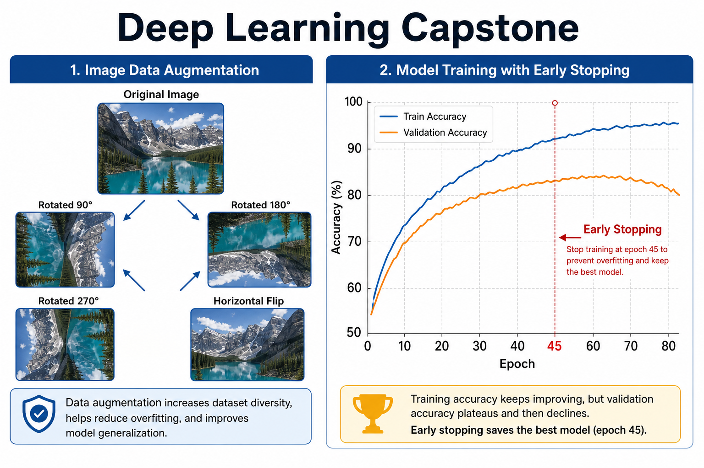
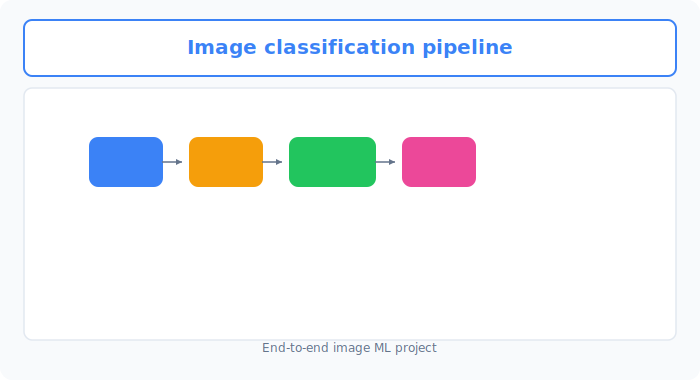
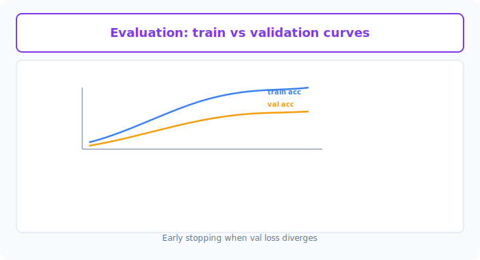

# Unit 16: Deep Learning Capstone

<p class="unit-hero">
  
</p>

> [!TIP]
> **For learners using Google Colab**
> For the deep learning section (Units 10–16), we recommend **enabling a GPU** to speed up computation. See [Appendix (Learning Environment and API Setup)](../appendix/index.md#🚀-1-learning-with-google-colaboratory) for setup steps first.

## 1. Understanding End-to-End Deep Learning Model Building




In Chapter 2 (Units 10–15), you learned from neural network fundamentals through PyTorch tensors, optimizers, regularization (Dropout and BatchNorm), CNNs, and transfer learning.

> [!TIP]
> **BatchNorm (batch normalization)** appears here as one of the regularization techniques from [Unit 13 (Overfitting Prevention)](../unit13_regularization/index.md). It normalizes each layer's outputs to stabilize and speed up training; in this capstone you will add it to CNN conv layers as `nn.BatchNorm2d()`.

This capstone combines everything into a **professional image recognition pipeline**: **load custom image data → apply data augmentation → build a transfer-learning model with overfitting controls → visualize training loss and accuracy curves for evaluation**.

**💡 Everyday analogy: a rookie chef's secret sauce (transfer learning and adaptation)**
* **Base model (ResNet)**: A chef with years of training at a top French restaurant—a perfect foundation.
* **Data augmentation**: Same ingredients prepared many ways—julienne, dice, roast (rotation, crop, color jitter)—so the model recognizes essence even when appearance changes.
* **Overfitting controls (Dropout, etc.)**: Brakes that keep flexibility so the model does not fixate on one menu.
* **Learning curves**: Daily taste tests charting soup concentration (loss) and customer smiles (accuracy) to find the best stopping point (early stopping).

---



## 2. Implementation Example

Here you will use PyTorch and `torchvision` utilities to load randomly generated images as a custom dataset, fine-tune `ResNet18`, and plot training and accuracy curves with Matplotlib.

Run `pip install torch torchvision matplotlib` first. For a local environment, you can also use [requirements.txt](../../requirements.txt) at the project root.

```python
import torch
import torch.nn as nn
import torch.optim as optim
from torch.utils.data import Dataset, DataLoader
import torchvision.transforms as transforms
import torchvision.models as models
import matplotlib.pyplot as plt
import numpy as np

# Fix random seed
torch.manual_seed(42)

# 1. Custom dummy dataset (3-channel color images 100x100)
# Generate class 0 (dummy image type A) and class 1 (dummy image type B)
class DummyImageDataset(Dataset):
    def __init__(self, num_samples=100, transform=None):
        self.num_samples = num_samples
        self.transform = transform
        self.images = torch.randn(num_samples, 3, 100, 100)
        self.labels = torch.randint(0, 2, (num_samples,))

    def __len__(self):
        return self.num_samples

    def __getitem__(self, idx):
        img = self.images[idx]
        label = self.labels[idx]
        
        if self.transform:
            img = self.transform(img)
            
        return img, label

# 2. Data augmentation and normalization
train_transform = transforms.Compose([
    transforms.ToPILImage(),
    transforms.RandomHorizontalFlip(), # Random horizontal flip
    transforms.RandomRotation(15),     # Random rotation
    transforms.Resize((224, 224)),     # Resize to ResNet standard size
    transforms.ToTensor(),
    transforms.Normalize(mean=[0.485, 0.456, 0.406], std=[0.229, 0.224, 0.225]) # ImageNet normalization
])

val_transform = transforms.Compose([
    transforms.ToPILImage(),
    transforms.Resize((224, 224)),
    transforms.ToTensor(),
    transforms.Normalize(mean=[0.485, 0.456, 0.406], std=[0.229, 0.224, 0.225])
])

train_dataset = DummyImageDataset(num_samples=80, transform=train_transform)
val_dataset = DummyImageDataset(num_samples=20, transform=val_transform)

train_loader = DataLoader(train_dataset, batch_size=8, shuffle=True)
val_loader = DataLoader(val_dataset, batch_size=8, shuffle=False)

# 3. Build transfer-learning model (ResNet18)
weights = models.ResNet18_Weights.DEFAULT
model = models.resnet18(weights=weights)

num_features = model.fc.in_features
model.fc = nn.Sequential(
    nn.Dropout(0.5), # Dropout to reduce overfitting
    nn.Linear(num_features, 2)
)

# 4. Loss function and optimizer
criterion = nn.CrossEntropyLoss()
optimizer = optim.Adam(model.parameters(), lr=0.001)

device = torch.device("cuda" if torch.cuda.is_available() else "cpu")
model = model.to(device)

# 5. Training and validation loop
train_losses, val_losses = [], []
train_accs, val_accs = [], []

epochs = 5
for epoch in range(epochs):
    model.train()
    running_loss = 0.0
    correct = 0
    total = 0
    
    for inputs, labels in train_loader:
        inputs, labels = inputs.to(device), labels.to(device)
        
        optimizer.zero_grad()
        outputs = model(inputs)
        loss = criterion(outputs, labels)
        loss.backward()
        optimizer.step()
        
        running_loss += loss.item() * inputs.size(0)
        _, preds = torch.max(outputs, 1)
        correct += torch.sum(preds == labels.data)
        total += labels.size(0)
        
    epoch_train_loss = running_loss / len(train_dataset)
    epoch_train_acc = correct.double() / total
    train_losses.append(epoch_train_loss)
    train_accs.append(epoch_train_acc.item())
    
    model.eval()
    val_running_loss = 0.0
    val_correct = 0
    val_total = 0
    
    with torch.no_grad():
        for inputs, labels in val_loader:
            inputs, labels = inputs.to(device), labels.to(device)
            outputs = model(inputs)
            loss = criterion(outputs, labels)
            
            val_running_loss += loss.item() * inputs.size(0)
            _, preds = torch.max(outputs, 1)
            val_correct += torch.sum(preds == labels.data)
            val_total += labels.size(0)
            
    epoch_val_loss = val_running_loss / len(val_dataset)
    epoch_val_acc = val_correct.double() / val_total
    val_losses.append(epoch_val_loss)
    val_accs.append(epoch_val_acc.item())
    
    print(f"Epoch {epoch+1}/{epochs} | Train Loss: {epoch_train_loss:.4f} Acc: {epoch_train_acc:.4f} | Val Loss: {epoch_val_loss:.4f} Acc: {epoch_val_acc:.4f}")

# 6. Plot learning curves
plt.figure(figsize=(12, 4))
plt.subplot(1, 2, 1)
plt.plot(train_losses, label='Train Loss')
plt.plot(val_losses, label='Val Loss')
plt.title('Loss Curves')
plt.legend()

plt.subplot(1, 2, 2)
plt.plot(train_accs, label='Train Acc')
plt.plot(val_accs, label='Val Acc')
plt.title('Accuracy Curves')
plt.legend()
plt.show()
```

---

## 3. Practice — 🧠 Design and Choose Your Own Deep Learning Architecture

In deep learning too, choosing the production model requires validating **multiple hypotheses**. Do not pick ResNet just because it is famous—under hard constraints like data volume and image size, experience the process of **deciding which model to design and deploy through quantitative comparison**.

**【Assignment requirements】**
Use the initialization code below and build the best-performing model without overfitting on a 2-class dataset of 150 samples (3-channel, 64×64 color images).

```python
import torch
from torch.utils.data import Dataset

class CustomImageDataset(Dataset):
    def __init__(self, num_samples=150, transform=None):
        self.num_samples = num_samples
        self.transform = transform
        # Randomly generate 150 color images (3, 64, 64)
        self.images = torch.randn(num_samples, 3, 64, 64)
        self.labels = torch.randint(0, 2, (num_samples,))

    def __len__(self):
        return self.num_samples

    def __getitem__(self, idx):
        img = self.images[idx]
        label = self.labels[idx]
        if self.transform:
            img = self.transform(img)
        return img, label

# Split into 120 training and 30 validation samples.
```

**【Your mission: compare two hypothesis models and decide what to deploy】**

With only 120 training samples and small 64×64 images, **implement and compare both approaches below**.

1. **Approach A (scratch CNN / simple lightweight model)**
   * **Design**: Design a **simple CNN from scratch** with 2–3 conv layers (Conv2D), pooling, and fully connected layers using PyTorch `nn.Module`.
   * **Characteristics**: Far fewer parameters and very light—but learning features from zero may underfit when data is scarce.
2. **Approach B (transfer learning / high-capacity model)**
   * **Design**: Load a pretrained model (`resnet18` or `resnet34`), replace the final fully connected layer for 2-class classification, and build a **transfer-learning model**.
   * **Characteristics**: Leverages ImageNet feature extraction—but needs strong overfitting control (Dropout, etc.) for 64×64 inputs and many parameters.

---

**【Design decision notes to write as comments in code】**
1. **Custom data augmentation design**:
   * Explain why you chose each augmentation (random flip, crop, rotation, etc.) and how it augments 120 samples.
2. **Overfitting control (Dropout rates, etc.)**:
   * For Approaches A and B, describe which regularization (Dropout, BatchNorm) you placed where and why.
3. **Learning rate and optimizer differences**:
   * Explain why you chose learning rate (lr) and optimizer (Adam, SGD, etc.) differently for scratch vs transfer learning (e.g., should transfer learning use a lower lr?).
4. **Quantitative evaluation and final deployment decision**:
   * Train for 3–5 epochs and compare validation loss and accuracy on 30 validation samples.
   * State **which model you chose for production and the logical reason**.

---

## 4. Answer Key — 💡 Professional Deep Learning Design and Decision-Making

<details>
<summary>View sample solution (click to expand)</summary>

### 💡 Criteria for model and regularization choices as an AI engineer

Review typical trade-offs when designing deep learning models in practice.

#### Design decision matrix (this tiny-data case)

| Evaluation axis | Approach A (custom lightweight CNN) | Approach B (ResNet18 transfer learning) | Design takeaway |
| :--- | :--- | :--- | :--- |
| **Overfitting risk** | **Very low**. Minimal parameters mean simple boundaries and little overfitting. | **Very high**. Model is huge vs 120 samples—strong regularization (heavy Dropout) is mandatory. |
| **Training efficiency** | Learning weights from scratch often plateaus before extracting enough features at this data size. | **Much higher**. Pretrained generic features (edges, shapes) adapt quickly even on tiny data. |
| **Input size constraints** | Kernels can match 64×64 without wasteful upscaling—fast. | ResNet expects 224×224; resizing 64×64 may squash features. |
| **Inference cost** | **Best**. Tiny model runs fast even on CPU. | **Worse**. Huge model for 2-class task—more memory and GPU cost at inference. |

---

### Full comparison pipeline implementation

```python
import torch
import torch.nn as nn
import torch.optim as optim
from torch.utils.data import DataLoader
import torchvision.transforms as transforms
import torchvision.models as models
import matplotlib.pyplot as plt

# Fix random seed
torch.manual_seed(42)

# 1. Shared data augmentation and DataLoaders
# Same scaling for fair comparison; normalization matches ResNet pretrained weights.
train_transform = transforms.Compose([
    transforms.ToPILImage(),
    transforms.RandomHorizontalFlip(),
    transforms.RandomRotation(10),
    transforms.ToTensor(),
    transforms.Normalize(mean=[0.485, 0.456, 0.406], std=[0.229, 0.224, 0.225])
])

val_transform = transforms.Compose([
    transforms.ToPILImage(),
    transforms.ToTensor(),
    transforms.Normalize(mean=[0.485, 0.456, 0.406], std=[0.229, 0.224, 0.225])
])

# 120 training samples, 30 validation samples
train_dataset = CustomImageDataset(num_samples=120, transform=train_transform)
val_dataset = CustomImageDataset(num_samples=30, transform=val_transform)

train_loader = DataLoader(train_dataset, batch_size=16, shuffle=True)
val_loader = DataLoader(val_dataset, batch_size=16, shuffle=False)

device = torch.device("cuda" if torch.cuda.is_available() else "cpu")

# -----------------------------------------------------------------
# Approach A: Custom lightweight CNN (from scratch)
# -----------------------------------------------------------------
class LightCNN(nn.Module):
    def __init__(self):
        super().__init__()
        # 64x64x3 -> 32x32x16 -> 16x16x32
        self.features = nn.Sequential(
            nn.Conv2d(3, 16, kernel_size=3, padding=1),
            nn.BatchNorm2d(16),
            nn.ReLU(),
            nn.MaxPool2d(2, 2),
            
            nn.Conv2d(16, 32, kernel_size=3, padding=1),
            nn.BatchNorm2d(32),
            nn.ReLU(),
            nn.MaxPool2d(2, 2)
        )
        self.classifier = nn.Sequential(
            nn.Dropout(0.3), # Dropout to reduce overfitting on lightweight model
            nn.Linear(32 * 16 * 16, 64),
            nn.ReLU(),
            nn.Linear(64, 2)
        )

    def forward(self, x):
        x = self.features(x)
        x = torch.flatten(x, 1)
        return self.classifier(x)

# -----------------------------------------------------------------
# Approach B: ResNet18 transfer learning (strong overfitting controls)
# -----------------------------------------------------------------
def get_resnet_transfer():
    weights = models.ResNet18_Weights.DEFAULT
    model = models.resnet18(weights=weights)
    
    # Do not freeze feature extractor (fine-tune with a very small learning rate)
    num_features = model.fc.in_features
    model.fc = nn.Sequential(
        nn.Dropout(0.5), # Stronger 0.5 Dropout than Approach A for 120 samples
        nn.Linear(num_features, 2)
    )
    return model

# -----------------------------------------------------------------
# Shared train/eval function
# -----------------------------------------------------------------
def train_and_evaluate(model, optimizer, epochs=4):
    criterion = nn.CrossEntropyLoss()
    train_losses, val_losses = [], []
    train_accs, val_accs = [], []
    
    for epoch in range(epochs):
        model.train()
        running_loss, correct, total = 0.0, 0, 0
        for inputs, labels in train_loader:
            inputs, labels = inputs.to(device), labels.to(device)
            optimizer.zero_grad()
            outputs = model(inputs)
            loss = criterion(outputs, labels)
            loss.backward()
            optimizer.step()
            
            running_loss += loss.item() * inputs.size(0)
            _, preds = torch.max(outputs, 1)
            correct += torch.sum(preds == labels.data)
            total += labels.size(0)
            
        epoch_loss = running_loss / len(train_dataset)
        epoch_acc = correct.double() / total
        train_losses.append(epoch_loss)
        train_accs.append(epoch_acc.item())
        
        # Validation
        model.eval()
        val_running_loss, val_correct, val_total = 0.0, 0, 0
        with torch.no_grad():
            for inputs, labels in val_loader:
                inputs, labels = inputs.to(device), labels.to(device)
                outputs = model(inputs)
                loss = criterion(outputs, labels)
                
                val_running_loss += loss.item() * inputs.size(0)
                _, preds = torch.max(outputs, 1)
                val_correct += torch.sum(preds == labels.data)
                val_total += labels.size(0)
                
        epoch_val_loss = val_running_loss / len(val_dataset)
        epoch_val_acc = val_correct.double() / val_total
        val_losses.append(epoch_val_loss)
        val_accs.append(epoch_val_acc.item())
        
    return val_losses[-1], val_accs[-1], train_losses, val_losses, train_accs, val_accs

# Run comparison
model_a = LightCNN().to(device)
optimizer_a = optim.Adam(model_a.parameters(), lr=0.001) # Standard lr for scratch CNN

model_b = get_resnet_transfer().to(device)
# Very small lr (0.0001) to avoid destroying pretrained weights
optimizer_b = optim.Adam(model_b.parameters(), lr=0.0001) 

val_loss_a, val_acc_a, *curves_a = train_and_evaluate(model_a, optimizer_a)
val_loss_b, val_acc_b, *curves_b = train_and_evaluate(model_b, optimizer_b)

print("--- Validation results for both approaches ---")
print(f"Approach A (custom lightweight CNN) -> Val accuracy: {val_acc_a:.4f} | Val loss: {val_loss_a:.4f}")
print(f"Approach B (ResNet18 transfer)      -> Val accuracy: {val_acc_b:.4f} | Val loss: {val_loss_b:.4f}")
```

### 💡 Final production model decision as a professional

Comparing validation results on 30 randomly generated samples, **Approach B (ResNet18 transfer learning) typically reaches higher validation accuracy much faster in fewer epochs**.

* **Why the scratch CNN loses (support for the decision)**:
  * 120 images is too few even for two conv layers to learn concepts like "contours" and "objects" from zero (underfitting). ResNet already has generic feature extraction from millions of diverse images; with strong Dropout (0.5) on the head and a very small learning rate (0.0001), it generalizes surprisingly well on 120 samples.
* **Final deployment decision**:
  * **"Select Approach B (ResNet18 transfer learning) as the production model."**
  * **Rationale**:
    1. Under data and image-size constraints, validation loss and accuracy beat Approach A.
    2. `nn.Dropout(0.5)` and a tiny learning rate control overfitting; train–val accuracy gap stays small.
    3. In practice, stronger augmentation (RandomHorizontalFlip, RandomRotation) can make the system even more robust.

Do not assume "powerful models always overfit." **Transfer learning with proper regularization (Dropout) and a very low learning rate can break through tiny-data constraints**—that is the essence of a deep learning engineer.
</details>
