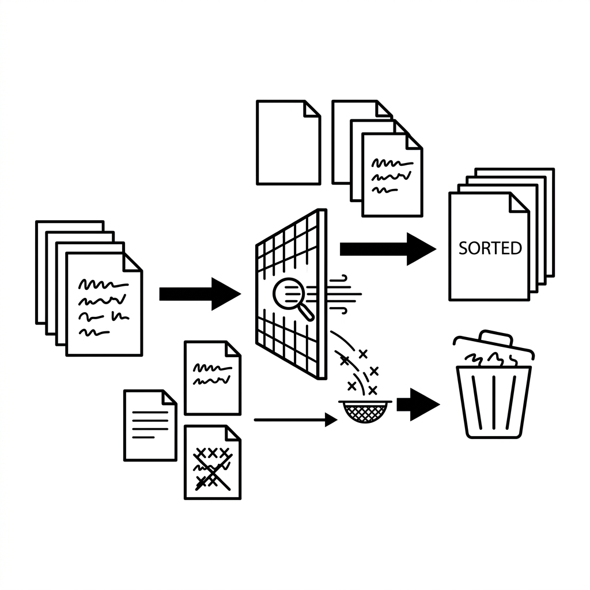

# Unit 17: NLP Preprocessing and TF-IDF


## 1. Understanding NLP Preprocessing and TF-IDF



The first step in getting computers to understand human language is **"cleaning up text and converting it into a list of numbers (vectors)."**

### 📌 Everyday analogy: classifying books in a library
Imagine you are a librarian deciding how to classify new books. You look at the **words** inside:
- Many occurrences of "apple," "orange," "banana" → "Fruit"
- "function," "variable," "compile" → "Programming"

But every book also contains "this," "that," "is," "are" (**stop words**) that do not characterize the book.
Also, "run," "ran," "running" refer to the same action (**stemming/lemmatization** extracts the root).

**NLP preprocessing** is the librarian's work of **removing noise and normalizing words** to capture what makes each text distinctive.

### 📝 Column: Japanese NLP preprocessing

English text is space-separated, so computers easily know word boundaries. Japanese does not: 「私は今日図書館に行きました」 has no spaces between words.

So the first step in Japanese NLP is **morphological analysis (tokenization / word segmentation)**—splitting text into minimal meaningful units (morphemes).

Example: 「私は今日図書館に行きました」 → 「私 / は / 今日 / 図書館 / に / 行き / まし / た」

Popular libraries include **MeCab** (fast, rich dictionaries) and **Janome** (pure Python, easy setup). With Janome, segmentation takes just a few lines:

```python
from janome.tokenizer import Tokenizer
t = Tokenizer()
tokens = [token.surface for token in t.tokenize("私は今日図書館に行きました")]
print(tokens)  # ['私', 'は', '今日', '図書館', 'に', '行き', 'まし', 'た']
```

Differences between English and Japanese preprocessing flows:

| Step | English | Japanese |
| :--- | :--- | :--- |
| **Word splitting** | Split on spaces | Morphological analysis (MeCab / Janome) |
| **Case normalization** | Needed (Apple → apple) | Not needed (no case distinction) |
| **Stop word removal** | the, is, at, etc. | は, が, の, です, ます, etc. |
| **Stem extraction** | Stemming / lemmatization | Base forms from morphological analysis |

> 💡 In the library analogy, English books arrive already space-separated; Japanese arrives like a scroll with every character packed together—the librarian must cut it into words first (morphological analysis).

### 📌 What is TF-IDF?
After preprocessing, **TF-IDF** (Term Frequency–Inverse Document Frequency) scores how important each word is.

| Component | Meaning | Library analogy | Computation intuition |
| :--- | :--- | :--- | :--- |
| **TF (term frequency)** | How often a word appears in one document | "The word AI appears a lot in this book!" | Higher frequency → higher score |
| **IDF (inverse document frequency)** | How rare the word is across all documents | "AI rarely appears in other books—a distinctive keyword!" | Rarer words → higher score |

**TF-IDF score = TF (frequent locally) × IDF (rare globally)**

Words that appear often in one book but rarely in the whole library become the keywords that best represent that book.

### 📐 Basic TF-IDF formulas

A bit more formally:

- **TF (Term Frequency)** = count of term t in document d ÷ total word count in document d
- **IDF (Inverse Document Frequency)** = log(total documents ÷ documents containing term t)

Example with three books:

| Book | Content (after preprocessing) |
| :--- | :--- |
| Book A | AI, learning, AI, data (4 words) |
| Book B | sports, game, data (3 words) |
| Book C | AI, program, function (3 words) |

Score for "**AI**" in Book A:
- TF(AI, Book A) = 2 ÷ 4 = **0.50**
- IDF(AI) = log(3 ÷ 2) ≈ **0.18**
- **TF-IDF = 0.50 × 0.18 ≈ 0.09**

Score for "**data**" in Book A:
- TF(data, Book A) = 1 ÷ 4 = **0.25**
- IDF(data) = log(3 ÷ 2) ≈ **0.18**
- **TF-IDF = 0.25 × 0.18 ≈ 0.05**

> 💡 In Book A, "AI" scores higher than "data" because local frequency matters—frequent words characterize the document.

### 💡 Concrete Business Use Cases
- **Automated customer support routing**: Extract distinctive keywords from inquiry emails and route to the right team (sales, technical support, returns).
- **News article recommendations**: Compare TF-IDF features of articles the user read with new articles to recommend relevant news.
- **Enterprise document search**: Score internal manuals and contracts against search keywords and rank the most relevant documents.

## 2. Implementation Example

Here you will use Python and `scikit-learn` to compute TF-IDF on simple news headlines and train a classifier.

### Code walkthrough
The code below follows this order:
1. **Prepare text**: Classification targets.
2. **Preprocess and extract features (TF-IDF)**: `TfidfVectorizer` converts text to numbers and removes English stop words (the, is, at, etc.).
3. **Train model**: Learn category labels from numeric features.
4. **Predict**: Classify new text.

```python
import numpy as np
from sklearn.feature_extraction.text import TfidfVectorizer
from sklearn.naive_bayes import MultinomialNB
from sklearn.pipeline import make_pipeline

# 1. データの準備（簡単なニュースのタイトル）
texts = [
    "Apple releases new iPhone with advanced camera",    # テクノロジー
    "Google announces new AI language model",            # テクノロジー
    "Real Madrid wins the Champions League final",       # スポーツ
    "NBA finals: Lakers defeat the Warriors",            # スポーツ
]
# ラベル（0: テクノロジー, 1: スポーツ）
labels = [0, 0, 1, 1]

# 2. TF-IDFを用いたベクトル化とモデル構築のパイプライン
# stop_words="english" で「the」「with」などの不要な単語を除外します
model = make_pipeline(
    TfidfVectorizer(stop_words="english"),
    MultinomialNB() # テキスト分類によく使われるナイーブベイズ分類器
)

# 3. モデルの学習
model.fit(texts, labels)
print("モデルの学習が完了しました！")

# 4. 新しいテキストで予測
new_texts = [
    "New smartphone features AI capabilities",
    "Who will win the basketball match tonight?"
]

# 予測を実行
predictions = model.predict(new_texts)

# 結果の表示
category_names = ["テクノロジー", "スポーツ"]
for text, pred in zip(new_texts, predictions):
    print(f"テキスト: '{text}' -> 予測カテゴリ: {category_names[pred]}")
```

### Key takeaways after running the code
`TfidfVectorizer` behind the scenes:
- Lowercases all text.
- Removes unimportant stop words like "the" and "with."
- Computes TF-IDF scores for remaining words (Apple, iPhone, wins, match, etc.).
Beginners can start with: **text cannot be computed directly—pass it through the TfidfVectorizer "magic box" to get numbers.**

## 3. Practice

Build your own spam email classifier.

**【Requirements】**
1. Use the dataset below.
2. Build a classifier with `TfidfVectorizer` and `MultinomialNB` (or `LogisticRegression`).
3. Predict whether each email in `test_emails` is spam or legitimate.

**【Dataset】**
```python
# 学習用データ
train_emails = [
    "Win a free iPhone right now! Click here",         # 1: スパム
    "Hey, are we still on for lunch tomorrow?",        # 0: 正常
    "Limited time offer! Buy one get one free",        # 1: スパム
    "Please find attached the meeting minutes",        # 0: 正常
    "Congratulations! You won a million dollars",      # 1: スパム
]
train_labels = [1, 0, 1, 0, 1]

# テスト用データ
test_emails = [
    "Click here to claim your free vacation",
    "Don't forget to submit your report by Friday"
]
```

**【Hints】**
- Use `TfidfVectorizer(stop_words="english")` to drop noise words.
- `make_pipeline` keeps code tidy, but separate steps are fine too.

## 4. Answer Key

<details>
<summary>View sample solution (click to expand)</summary>

```python
from sklearn.feature_extraction.text import TfidfVectorizer
from sklearn.linear_model import LogisticRegression
from sklearn.pipeline import make_pipeline

# 学習用データ
train_emails = [
    "Win a free iPhone right now! Click here",
    "Hey, are we still on for lunch tomorrow?",
    "Limited time offer! Buy one get one free",
    "Please find attached the meeting minutes",
    "Congratulations! You won a million dollars",
]
train_labels = [1, 0, 1, 0, 1]

# テスト用データ
test_emails = [
    "Click here to claim your free vacation",
    "Don't forget to submit your report by Friday"
]

# モデルの作成（今回はロジスティック回帰を使用）
model = make_pipeline(
    TfidfVectorizer(stop_words="english"),
    LogisticRegression()
)

# 学習
model.fit(train_emails, train_labels)

# 予測
predictions = model.predict(test_emails)

# 結果の表示
label_map = {0: "正常 (Ham)", 1: "スパム (Spam)"}
for email, pred in zip(test_emails, predictions):
    print(f"メール: '{email}'\n-> 判定結果: {label_map[pred]}\n")
```

**Solution explanation:**
Words like "free," "claim," and "won" appear often in spam (label 1), so TF-IDF assigns them high scores. New emails containing "free" are then correctly classified as likely spam.

</details>
