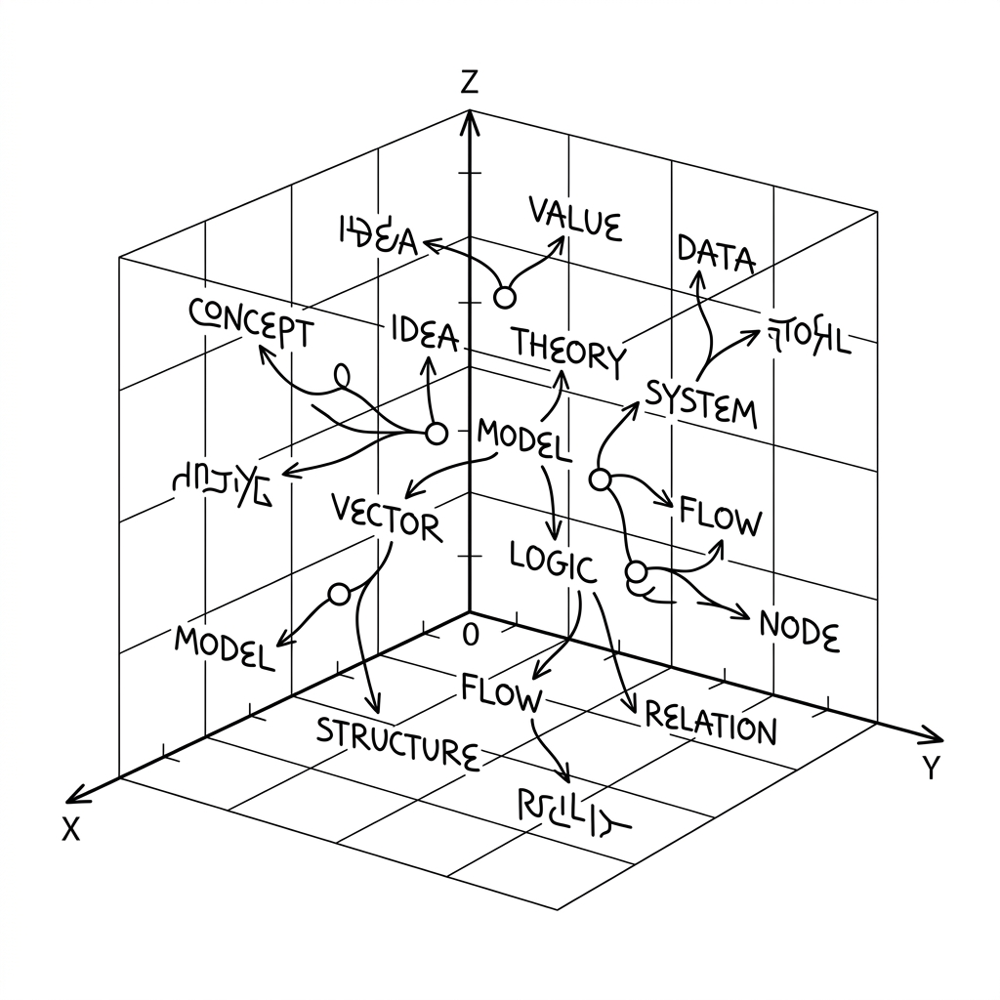

# Unit 18: Word Embeddings (Word2Vec)

## 1. Understanding Word Embeddings



TF-IDF from Unit 17 is powerful, but it has a major weakness: **it does not understand word meaning**.
For example, "dog" and "puppy" are similar in meaning, but TF-IDF treats them as completely different tokens.

**Word Embeddings** map words to **coordinates in space (vectors)**.

### 📌 Everyday analogy: a "personality test" for words
When classifying people, personality tests score traits like "extroverted vs introverted" or "logical vs emotional."
Word Embeddings are exactly **a personality test for words**.

For example, score "King," "Queen," and "Apple" on two axes:

| Word | Royalty (0–1) | Food (0–1) |
| :--- | :---: | :---: |
| King | 0.99 | 0.01 |
| Queen | 0.98 | 0.02 |
| Apple | 0.00 | 0.95 |

With numeric scores (vectors), two powerful things become possible:
1. **Similar words cluster nearby**: "King" and "Queen" sit close on the graph.
2. **Word arithmetic works**: The famous example `King - Man + Woman ≈ Queen`.

### 📌 What is Word2Vec?
**Word2Vec** is a representative algorithm for building word embeddings.
It assumes **"words used in similar contexts have similar meanings."**
(Example: "I eat bread" / "I eat rice" → bread and rice appear in similar contexts, so they are related.)

### 📌 Two Word2Vec training modes

Word2Vec has **two training approaches**—like two styles of personality assessment.

**① CBOW (Continuous Bag of Words)—guess the center from context**
Use surrounding words to **predict the middle word**.
Example: "I ___ drink" → from "I," "は," "を," "drink," guess the middle is "**coffee**."

**② Skip-gram—guess context from the center**
Use one center word to **predict surrounding words**.
Example: "**coffee**" → nearby words might be "I," "drink," "café."

| Comparison | CBOW | Skip-gram |
| :--- | :--- | :--- |
| Prediction direction | Context → center word | Center word → context |
| Best for | Large data, frequent words | Small data, rare words |
| Training speed | Faster | Slower (more thorough) |
| gensim setting | `sg=0` (default) | `sg=1` |

In gensim, `Word2Vec(sentences, sg=0)` is CBOW and `sg=1` is Skip-gram. The implementation example below uses the default (CBOW).

> 💡 **Important**: The "royalty" and "food" axes were for illustration—in real Word2Vec, **humans do not design axes; the model discovers hundreds of unnamed dimensions** from large corpora. Similar words still end up close—that is the magic.

### 💡 Concrete Business Use Cases
- **E-commerce related-product recommendations**: Treat user views/purchases like "words" and learn product similarity with Word2Vec.
- **Search that handles spelling variants**: "smartphone," "smart phone," and "iPhone" sit near each other in embedding space for meaning-aware search.
- **Chatbot intent understanding (synonyms)**: Match user questions to intents even when exact keywords differ, using embedding similarity.

## 2. Implementation Example

Here you will train a simple Word2Vec model with Python's `gensim` library and compute word similarity.

### Code walkthrough
1. **Prepare sentences**: Lists of tokenized words.
2. **Train model**: `Word2Vec` learns a vector ("coordinate") for each word.
3. **Find similar words**: Input "king" and find nearest neighbors in space.

```python
# gensimというライブラリを使用します（pip install gensim が必要です）
from gensim.models import Word2Vec

# 1. 文章データの準備
# 英語の短い文を単語ごとに区切ったリストを用意します
sentences = [
    ["the", "king", "is", "a", "strong", "man"],
    ["the", "queen", "is", "a", "wise", "woman"],
    ["a", "boy", "is", "a", "young", "man"],
    ["a", "girl", "is", "a", "young", "woman"],
    ["apple", "is", "a", "delicious", "fruit"],
    ["banana", "is", "a", "sweet", "fruit"]
]

# 2. Word2Vecモデルの学習
# vector_size: 単語をいくつのパラメータ（次元）で表すか
# min_count: 何回以上出現した単語を学習対象にするか（今回は1回でも出れば学習）
# window: 前後の単語をいくつまで見て文脈を判断するか
print("モデルの学習を開始します...")
model = Word2Vec(sentences, vector_size=10, min_count=1, window=2)
print("学習が完了しました！\n")

# 3. 類似単語の検索
# "king" に最も意味が近い単語トップ3を取得します
print("--- 'king' に似ている単語 ---")
similar_words = model.wv.most_similar("king", topn=3)
for word, score in similar_words:
    print(f"単語: {word}, 類似度スコア: {score:.3f}")

# 4. 単語のベクトル（座標）を見てみる
print("\n--- 'king' のベクトル表現（10次元の数値） ---")
print(model.wv["king"])
```

### Key takeaways after running the code
- `model.wv.most_similar("king")` returns contextually similar words (e.g., queen, man) with high scores.
- `model.wv["king"]` shows the word as an array of 10 numbers—the "personality test result."

## 3. Practice

Train Word2Vec on a slightly larger set of pet-related sentences.

**【Requirements】**
1. Use the `pet_sentences` dataset below.
2. Train a `Word2Vec` model (`vector_size=5, min_count=1, window=2`).
3. Find the single word most similar to `"dog"` and print it.
4. Compute similarity between `"cat"` and `"dog"` and print it.

**【Dataset】**
```python
pet_sentences = [
    ["i", "love", "my", "cute", "dog"],
    ["my", "dog", "barks", "loudly", "at", "strangers"],
    ["i", "love", "my", "cute", "cat"],
    ["my", "cat", "meows", "softly", "at", "night"],
    ["the", "dog", "chases", "the", "ball"],
    ["the", "cat", "chases", "the", "mouse"]
]
```

**【Hints】**
- Use `model.wv.similarity("word1", "word2")` for pairwise similarity.

## 4. Answer Key

<details>
<summary>View sample solution (click to expand)</summary>

```python
from gensim.models import Word2Vec

# データの準備
pet_sentences = [
    ["i", "love", "my", "cute", "dog"],
    ["my", "dog", "barks", "loudly", "at", "strangers"],
    ["i", "love", "my", "cute", "cat"],
    ["my", "cat", "meows", "softly", "at", "night"],
    ["the", "dog", "chases", "the", "ball"],
    ["the", "cat", "chases", "the", "mouse"]
]

# モデルの学習
model = Word2Vec(pet_sentences, vector_size=5, min_count=1, window=2)

# "dog" と最も似ている単語を取得 (topn=1 で1つだけ取得)
most_similar_to_dog = model.wv.most_similar("dog", topn=1)
print(f"'dog' に一番似ている単語: {most_similar_to_dog[0][0]} (類似度: {most_similar_to_dog[0][1]:.3f})")

# "cat" と "dog" の類似度を計算
cat_dog_similarity = model.wv.similarity("cat", "dog")
print(f"'cat' と 'dog' の類似度: {cat_dog_similarity:.3f}")
```

**Solution explanation:**
"dog" and "cat" share contexts like "i love my cute ___" and "the ___ chases the," so Word2Vec learns they are very similar and assigns a high similarity score.

</details>
