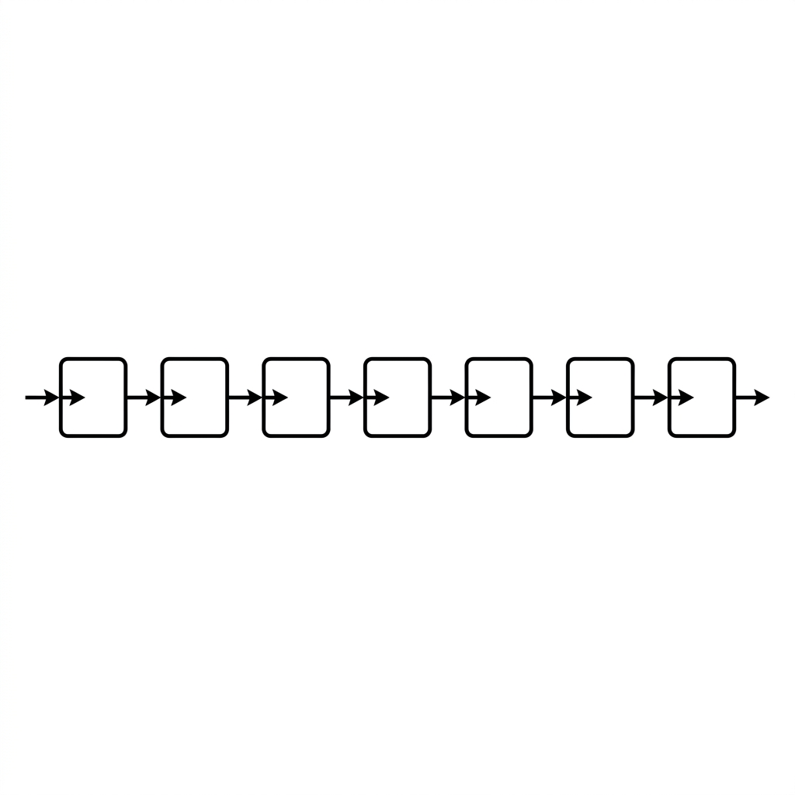

# Unit 19: RNNs and LSTMs

## 1. Understanding RNNs and LSTMs



Word Embeddings let AI understand word meaning, but something is still missing: **context (the flow of time)**.
For "I" "yesterday" "an apple" "_____", the next word is likely "ate" or "bought" because of prior context.

Mechanisms that remember the past while processing data in order are **RNN (Recurrent Neural Network)** and **LSTM (Long Short-Term Memory)**.

### 📌 Everyday analogy: "memory" while reading a book
Imagine reading a mystery novel.

**How a ordinary (non-recurrent) model reads:**
Reset memory every page.
Even after reading "The culprit is A," the next page starts with "Wait, who were we talking about?"

**How an RNN reads:**
Take **notes** from previous pages while reading.
Combine "notes from before" + "current page."
Weakness: **forgets old memories quickly (vanishing gradient problem)**—clues from 10 pages ago are lost.

**How an LSTM reads:**
An upgraded reader that **chooses what to remember**: "This goes in long-term notes" vs "This can be discarded."
That is how important clues from 100 pages ago can still matter.

| Model | Memory | Strengths | Weakness |
| :--- | :--- | :--- | :--- |
| **RNN** | Short-term only (recent words) | Short-sequence prediction | Forgets early content in long text |
| **LSTM** | Long-term + short-term | Long-context understanding | More complex and heavier to compute |

### 📌 LSTM's three gate mechanisms

LSTM's selective memory comes from **three gates** inside the cell.
In the mystery-reader analogy:

| Gate | Role | Mystery novel example |
| :--- | :--- | :--- |
| **Forget gate** | Decides **what to erase** | "Suspect B's alibi is confirmed—remove from notes." |
| **Input gate** | Decides **what new info to store** | "Witness C's testimony matters—write it in long-term notes." |
| **Output gate** | Decides **what memory to use for output** | "This page is about the weapon—pull weapon-related notes." |

These three gates cooperate each step so LSTM can forget noise, retain important facts, and output what is needed now—why it remembers clues from 100 pages back.

### 💡 Concrete Business Use Cases
- **Industrial failure prediction (anomaly detection)**: LSTM on sensor time series to alert "failure likely in a few hours based on past patterns."
- **Stock and sales forecasting**: Learn months or years of sales, weather, and calendar features to optimize inventory.
- **Voice recognition (smart speakers)**: Convert audio streams to text using context across sounds over time.

## 2. Implementation Example

Here you will use PyTorch to build a simple RNN/LSTM that **predicts the next character from one input character**, training on "hello."

### Code walkthrough
1. **Prepare data**: Map characters to numbers (h=0, e=1, l=2, o=3)—AI cannot read raw characters.
2. **Define model**: Use PyTorch `nn.LSTM` to remember past characters and predict the next.
3. **Train**: Repeat patterns h→e, e→l, l→l, l→o.
4. **Test prediction**: Input "h" and check whether continuation is correct.

```python
import torch
import torch.nn as nn

# 1. データの準備
# "hello" という文字列を学習させます
# 文字と数字（インデックス）の対応表を作ります
chars = ['h', 'e', 'l', 'o']
char_to_idx = {ch: i for i, ch in enumerate(chars)}
idx_to_char = {i: ch for i, ch in enumerate(chars)}

# "hello" の入力と正解ラベルの準備
# 入力: h, e, l, l
# 正解: e, l, l, o
x_data = [char_to_idx[c] for c in "hell"]
y_data = [char_to_idx[c] for c in "ello"]

# PyTorchのテンソル（多次元配列）に変換し、形を整えます
# 形: (系列長, バッチサイズ, 入力サイズ) = (4, 1, 1)
x_tensor = torch.tensor(x_data, dtype=torch.float32).view(4, 1, 1)
y_tensor = torch.tensor(y_data, dtype=torch.long)

# 2. モデルの定義 (LSTMを使った予測モデル)
class SimpleLSTM(nn.Module):
    def __init__(self, input_size, hidden_size, output_size):
        super(SimpleLSTM, self).__init__()
        self.hidden_size = hidden_size
        # LSTM層：過去の記憶を保持する
        self.lstm = nn.LSTM(input_size, hidden_size)
        # 出力層：記憶をもとに次の文字（4種類のどれか）を予測する
        self.fc = nn.Linear(hidden_size, output_size)

    def forward(self, x):
        # LSTMにデータを順番に流し込む（outには各ステップの出力が入る）
        out, _ = self.lstm(x)
        # 最後の層で、どの文字になるかのスコアを計算
        out = self.fc(out.view(-1, self.hidden_size))
        return out

input_size = 1
hidden_size = 8
output_size = len(chars) # 4種類 (h, e, l, o)
model = SimpleLSTM(input_size, hidden_size, output_size)

# 学習の設定
criterion = nn.CrossEntropyLoss()
optimizer = torch.optim.Adam(model.parameters(), lr=0.05)

# 3. 学習（トレーニング）
print("学習を開始します...")
for epoch in range(100):
    optimizer.zero_grad()
    # モデルに予測させる
    outputs = model(x_tensor)
    # 正解との誤差（Loss）を計算
    loss = criterion(outputs, y_tensor)
    # 誤差を元にモデルを賢くする（逆伝播）
    loss.backward()
    optimizer.step()
    
    if (epoch+1) % 20 == 0:
        print(f"Epoch: {epoch+1}/100, Loss: {loss.item():.4f}")
print("学習が完了しました！\n")

# 4. 予測テスト
print("--- 予測テスト ---")
# 学習したモデルに "hell" を入力して、次に来る文字を予測させます
with torch.no_grad():
    test_out = model(x_tensor)
    # 最もスコアが高い（確率が高い）文字のインデックスを取得
    _, predicted_indices = torch.max(test_out, 1)
    
    # 数字を文字に戻す
    predicted_chars = [idx_to_char[idx.item()] for idx in predicted_indices]
    print(f"入力: hell -> 予測結果: {''.join(predicted_chars)}")
```

### Key takeaways after running the code
- Initially predictions are random; after 100 epochs loss drops and "hell" correctly continues as "ello."
- LSTM passes "memory of previous characters" to the next step—ideal for sequential data.

## 3. Practice

Train an LSTM to predict the word "apple."

**【Requirements】**
1. Use character list `chars = ['a', 'p', 'l', 'e']`.
2. Input data `"appl"`, target data `"pple"`.
3. Create `SimpleLSTM` and train 100 epochs (same settings as the example).
4. After training, confirm input `"appl"` produces `"pple"`.

**【Hints】**
- `x_data` is indices for "appl"; `y_data` for "pple."
- Copy tensor conversion from the example and change strings only.

## 4. Answer Key

<details>
<summary>View sample solution (click to expand)</summary>

```python
import torch
import torch.nn as nn

# 1. データの準備
chars = ['a', 'p', 'l', 'e']
char_to_idx = {ch: i for i, ch in enumerate(chars)}
idx_to_char = {i: ch for i, ch in enumerate(chars)}

# "apple" の学習データ（入力: appl, 正解: pple）
x_data = [char_to_idx[c] for c in "appl"]
y_data = [char_to_idx[c] for c in "pple"]

x_tensor = torch.tensor(x_data, dtype=torch.float32).view(4, 1, 1)
y_tensor = torch.tensor(y_data, dtype=torch.long)

# 2. モデルの定義
class SimpleLSTM(nn.Module):
    def __init__(self, input_size, hidden_size, output_size):
        super(SimpleLSTM, self).__init__()
        self.hidden_size = hidden_size
        self.lstm = nn.LSTM(input_size, hidden_size)
        self.fc = nn.Linear(hidden_size, output_size)

    def forward(self, x):
        out, _ = self.lstm(x)
        out = self.fc(out.view(-1, self.hidden_size))
        return out

input_size = 1
hidden_size = 8
output_size = len(chars)
model = SimpleLSTM(input_size, hidden_size, output_size)

criterion = nn.CrossEntropyLoss()
optimizer = torch.optim.Adam(model.parameters(), lr=0.05)

# 3. 学習
print("学習を開始します...")
for epoch in range(100):
    optimizer.zero_grad()
    outputs = model(x_tensor)
    loss = criterion(outputs, y_tensor)
    loss.backward()
    optimizer.step()

# 4. 予測テスト
with torch.no_grad():
    test_out = model(x_tensor)
    _, predicted_indices = torch.max(test_out, 1)
    predicted_chars = [idx_to_char[idx.item()] for idx in predicted_indices]
    print(f"入力: appl -> 予測結果: {''.join(predicted_chars)}")
```

**Solution explanation:**
The sequence has "p" followed by "p" and also "p" followed by "l." With context memory, LSTM can tell which "p" is which and predict the next character correctly.

</details>
