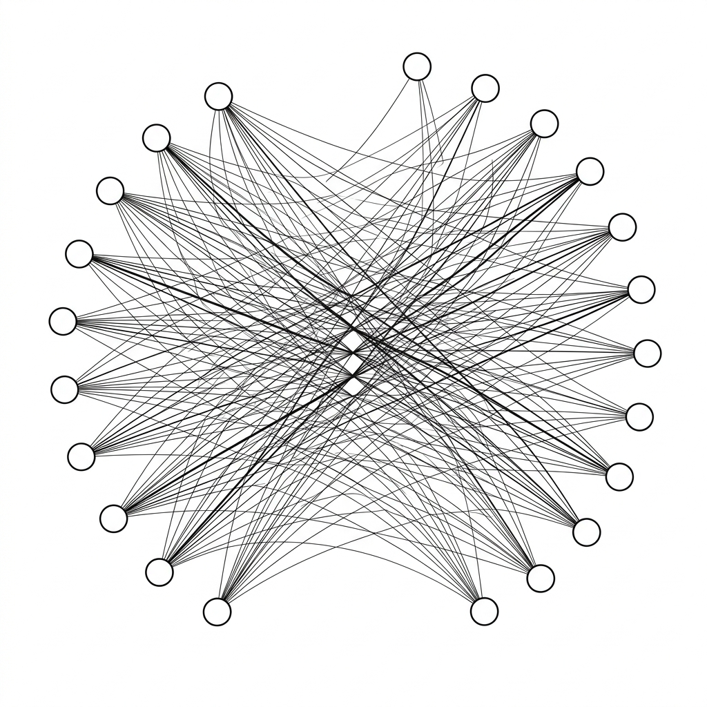

# Unit 20: Attention and Transformers

## 1. Understanding Attention and Transformers



RNNs and LSTMs pass memory like a relay baton—long texts still forget early content.
**Attention** and the **Transformer** architecture built on it solved this and became the core of modern AI (ChatGPT and similar models).

### 📌 Everyday analogy: "focus" in a meeting
You are taking minutes for a 10-person meeting.

**How an RNN listens:**
Try to memorize every word in order. Long meetings cause "what did someone say at the start…?" overload.

**How Attention listens:**
Focus on **keywords**.
"When 'revenue' appears, it strongly relates to 'target' the CEO said earlier!"—**directly compute relationships between distant words**.

**Self-Attention** in Transformers lets every word in a sentence simultaneously see how much it relates to every other word.

| Word | The | animal | didn't | cross | the | street | because | it | was | too | tired |
| :--- | :--- | :--- | :--- | :--- | :--- | :--- | :--- | :--- | :--- | :--- | :--- |

What does "it" refer to? Humans know "tired" applies to "animal," not "street."
Self-Attention gives **strong attention** to "animal" and "tired" when processing "it."

### 📌 What is a Transformer?
Instead of processing word by word like RNNs, read **all words at once** and compute relationships with Attention—enabling parallel, fast training and models as large as ChatGPT.

### 📌 Positional Encoding—keeping order information
RNNs processed one word at a time, naturally knowing **word order**.
Transformers read everything in parallel—fast, but **position information is lost**.

In the meeting analogy, you know every keyword but not **who spoke first vs who replied later**. "The cat chased the dog" vs "The dog chased the cat" differ completely without order.

**Positional Encoding** fixes this by adding a **special vector for "which position am I in?"** to each word's input—parallel speed with order preserved.

### 💡 Concrete Business Use Cases
- **High-quality machine translation**: Attention captures long-range dependencies for natural, context-aware translation (Google Translate, DeepL, etc.).
- **Complex enterprise Q&A chatbots**: LLM foundations that attend to the right passages in long internal policy documents.
- **Contract review automation**: Find payment or confidentiality clauses in long legal text and flag risky wording with context.

## 2. Implementation Example

Here you will experience the core Self-Attention computation in PyTorch—scoring which words attend to which.

### Code walkthrough
Self-Attention builds three vectors per word:
1. **Query (Q)**: What am I looking for? (e.g., "I am it—what do I refer to?")
2. **Key (K)**: What am I? (e.g., "I am animal" / "I am street")
3. **Value (V)**: My actual content/meaning

Steps:
- Dot `Q` and `K` to get **attention scores** (relatedness).
- Softmax scores to probabilities summing to 1.
- Weight `V` by those probabilities for the output.

```python
import torch
import torch.nn.functional as F

# 1. データの準備（簡単のため、3つの単語がそれぞれ4次元のベクトルを持っているとします）
# 例: [animal, street, it] という3単語を想定
x = torch.tensor([
    [1.0, 0.0, 1.0, 0.0],  # 単語1 (animal) の特徴
    [0.0, 1.0, 0.0, 1.0],  # 単語2 (street) の特徴
    [1.0, 0.0, 0.5, 0.0],  # 単語3 (it) の特徴。animalに似た特徴を持つ
])

# 2. Q, K, V の準備
# 実際のモデルではここに行列の掛け算（重み）が入りますが、今回は簡単のため x をそのまま使います
Q = x
K = x
V = x

# 3. Attention Scoreの計算 (Q と Kの転置を掛け算)
# これにより、各単語同士の類似度が計算されます
scores = torch.matmul(Q, K.transpose(0, 1))
print("--- Attention Scores (関連度スコア) ---")
print(scores)

# 4. Softmax関数で確率（0〜1の割合）に変換
# 注目度の合計が100% (1.0) になるように調整します
attention_weights = F.softmax(scores, dim=-1)
print("\n--- Attention Weights (注目度の割合) ---")
print(attention_weights)

# 5. 最終的な出力の計算 (注目度を使って V を混ぜ合わせる)
output = torch.matmul(attention_weights, V)
print("\n--- Self-Attentionの最終出力 ---")
print(output)
```

### Key takeaways after running the code
- In `scores`, word 3 (it) vs word 1 (animal) has a high score (similar features).
- `attention_weights` show "it" pulling more information from "animal" when building meaning—that is Attention.

## 3. Practice

Use PyTorch's built-in `nn.MultiheadAttention` layer to run Attention.

**【Requirements】**
1. Use the random `query`, `key`, `value` tensors below.
2. Create Attention with `nn.MultiheadAttention` (`embed_dim=8`, `num_heads=2`).
3. Pass `query`, `key`, `value` through and print `attn_output`.

**【Dataset】**
```python
import torch
import torch.nn as nn

# 系列長=5 (5つの単語), バッチサイズ=1, 埋め込み次元数(embed_dim)=8
# 全てランダムな数値で生成します
sequence_length = 5
batch_size = 1
embed_dim = 8

query = torch.rand(sequence_length, batch_size, embed_dim)
key = torch.rand(sequence_length, batch_size, embed_dim)
value = torch.rand(sequence_length, batch_size, embed_dim)
```

**【Hints】**
- Create layer: `attention_layer = nn.MultiheadAttention(embed_dim=8, num_heads=2)`
- Forward: `attn_output, attn_weights = attention_layer(query, key, value)`
- Built-in layers handle Q, K, V math in one line!

## 4. Answer Key

<details>
<summary>View sample solution (click to expand)</summary>

```python
import torch
import torch.nn as nn

# 1. データの準備
sequence_length = 5
batch_size = 1
embed_dim = 8

# Query, Key, Valueのテンソルを作成
query = torch.rand(sequence_length, batch_size, embed_dim)
key = torch.rand(sequence_length, batch_size, embed_dim)
value = torch.rand(sequence_length, batch_size, embed_dim)

# 2. MultiheadAttention層の定義
# embed_dim: 単語のベクトルの次元数
# num_heads: Attentionをいくつに分割して計算するか（マルチヘッド）
attention_layer = nn.MultiheadAttention(embed_dim=embed_dim, num_heads=2)

# 3. Attentionの計算を実行
print("Attention計算を実行します...")
attn_output, attn_weights = attention_layer(query, key, value)

# 4. 結果の確認
print("\n--- Attentionの出力 (attn_output) ---")
print(attn_output.shape) # 形が元のqueryと同じ (5, 1, 8) になることを確認
print(attn_output)

print("\n--- Attentionの重み (attn_weights) ---")
print(attn_weights.shape) # どの単語がどの単語に注目したかの割合 (1, 5, 5)
```

**Solution explanation:**
In real AI development you rarely write the math from scratch—you stack blocks like `nn.MultiheadAttention` and `nn.TransformerEncoderLayer`.
Stack many Attention layers, train on huge data, and you get the large language models (LLMs) you know well.

</details>
