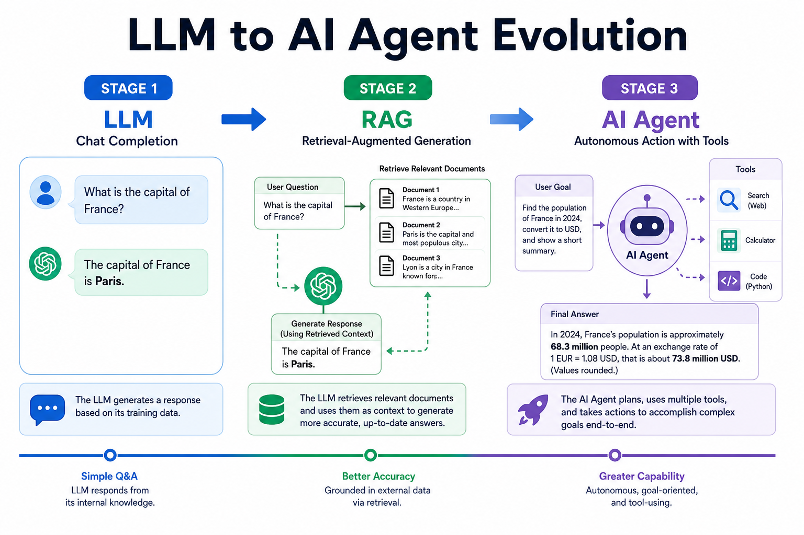
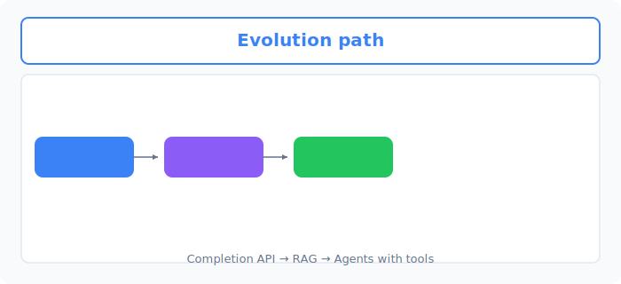
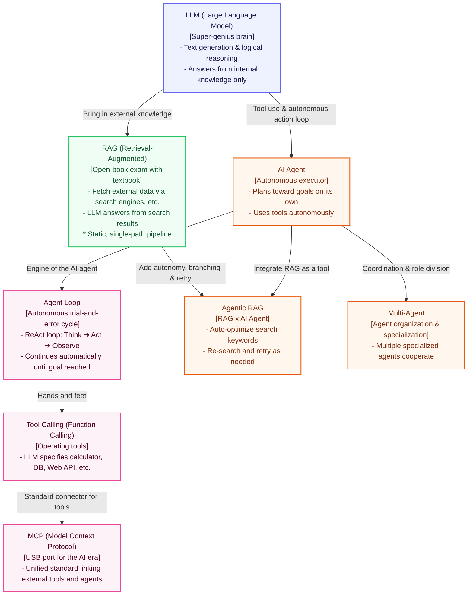
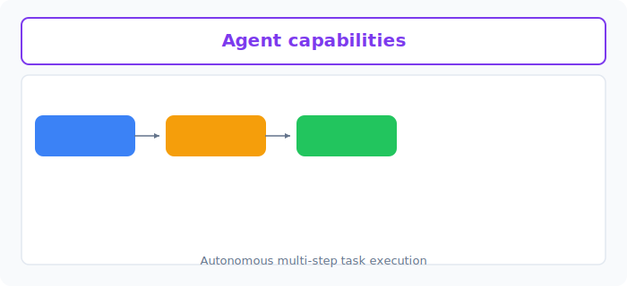

# Unit 22: Evolution from LLM to AI Agent

<p class="unit-hero">
  
</p>

> [!IMPORTANT]
> **Preparing your OpenAI API key**
> Chapter 4 requires an **OpenAI API key**. For how to obtain a key, billing notes, and secure environment-variable setup with Google Colab secrets, read [Appendix (Learning Environment and API Setup)](../appendix/index.md#🔑-3-openai-api-key-acquisition-and-secure-management-chapter-4) first.

---

## 1. Understanding the Evolution from LLM to AI Agent




Chapter 4 (LLM Applications and AI Agents) builds on deep learning and NLP fundamentals you have learned so far to teach **“building sophisticated, autonomous applications that use LLMs as components.”**

The technology scope is broad and evolving rapidly. First, let’s organize the big picture—including core concepts in this chapter (**LLM**, **RAG**, **AI Agent**, **Agentic RAG**) plus the agent essentials **Agent Loop** and **Tool Calling**, and newer extensions such as **MCP** and **Multi-Agent**.

### Technology evolution and relationship map



> [!NOTE]
> **Text alternative for the diagram**
> - **LLM (Large Language Model)**: The foundational “super-genius brain.” Strong at text generation and logical reasoning, but only knows knowledge from training.
> - **RAG (Retrieval-Augmented Generation)**: Connects external knowledge (internal databases, latest web info) to the LLM. Generates answers while “looking at the textbook” found by search.
> - **AI Agent**: Uses the LLM as a controller to achieve goals autonomously with external tools.
> - **Agent Loop**: The heart of the agent—repeats Think ➔ Act ➔ Observe until the goal is reached.
> - **Tool Calling (Function Calling)**: The “hands and feet”—the LLM specifies external tools (APIs, programs) for calculation and operations.
> - **MCP (Model Context Protocol)**: A standardized connection spec for linking agents with diverse data and tools in the AI era.
> - **Agentic RAG**: Fusion of RAG and AI agents—not just “search and answer,” but autonomously deciding e.g. “results are insufficient—let me change keywords and search again.”
> - **Multi-Agent**: Multiple agents with different roles solve larger, complex goals through conversation and collaboration.

### 💡 Understanding with everyday analogies

Let’s compare these using **“a chef and the kitchen.”**

1. **LLM (the genius chef’s brain)**
   - A top chef with thousands of recipes (knowledge) in memory.
   - But memory stops around “two years ago”—no latest trends outside the kitchen or what’s in your fridge (company data).

2. **RAG (open kitchen with recipe books)**
   - The chef cooks while looking at your fridge inventory and latest food magazines (external knowledge).
   - Ask “make great pasta with tomatoes and ground meat in the fridge (retrieved data),” and they combine knowledge and inventory perfectly.

3. **AI Agent (autonomous traveling chef)**
   - Given only a **broad goal**: “Host a healthy dinner party for 4 guests tonight. Budget: ¥10,000.”
   - The chef plans the menu, shops (tool use), calculates budget (calculator), cooks, tastes and adjusts seasoning (self-correction), and makes the party succeed.

4. **Agent Loop (taste-and-adjust loop)**
   - Not one-shot by recipe: “Make soup ➔ taste (observe) ➔ needs salt (think) ➔ add salt (act) ➔ taste again (observe)” until satisfied.

5. **Tool Calling (chef’s utensils)**
   - Can’t peel potatoes by hand—chef specifies “use the peeler (tool) at 45° blade angle (arguments).”

6. **MCP (universal kitchen outlet)**
   - Mixers, ovens—any brand plugs in and works via one unified connection port.

7. **Agentic RAG (concierge chef with autonomous information gathering)**
   - For guest preferences and allergies: “Check A’s order history,” “no data—email B about allergies,” “fish allergy found—search meat-focused recipes in specialist books,” **autonomously controlling the information-gathering process**.

8. **Multi-Agent (kitchen team specialization)**
   - “Prep specialist,” “grill specialist,” “plating specialist” agents coordinate over intercom to complete one course (hard goal) as a team.

---

In Chapter 4 you will implement all of these step by step.
In **Unit 22**, understand the overall map of **evolution from LLM to AI agent**, then run the most basic LLM API hello world.
In **Unit 23**, experience prompt engineering and sentiment-analysis PoC with the LLM API.
In **Unit 24**, build **RAG from scratch** with vector databases.
In **Units 25–26**, learn elegant RAG with modern frameworks (LangChain / LlamaIndex).
In **Units 27–28**, build prompt chaining and chatbots, then from **Unit 29** onward dive into **AI agents that use tools autonomously (MCP, smolagents, Agent SDK)**.

Exciting! Let’s take the first step in LLM app development.

---



## 2. Implementation Example

Start with the simplest **API hello world**—the departure point for all LLM application development.
Call OpenAI’s API from Python and have the AI greet you.

> ※ `OPENAI_API_KEY` must be set in environment variables before running.

```python
import os
from openai import OpenAI

# 1. Initialize API client
# API key is loaded automatically from environment variables
client = OpenAI()

# 2. Send a message to the LLM
# Uses gpt-4o-mini, a fast and inexpensive model
response = client.chat.completions.create(
    model="gpt-4o-mini",
    messages=[
        {"role": "user", "content": "Please reply in English with: Hello, AI World!"}
    ]
)

# 3. Display the response
print("Reply from AI:")
print(response.choices[0].message.content)
```

**🔍 Detailed code walkthrough**
1. **`client = OpenAI()`**: Creates the gateway (client) for OpenAI API communication. With no arguments, it automatically finds `OPENAI_API_KEY` on your machine and authenticates.
2. **`client.chat.completions.create(...)`**: Main API method to request text generation from the LLM. Pass conversation turns in the `messages` list—here, a simple user message.
3. **`response.choices[0].message.content`**: Extracts only the answer text from the large response object returned by the LLM.

---

## 3. Practice

After a successful API hello world, write a script that **sets a system prompt (role) and has the LLM summarize the historical evolution in its own words**.

**【Requirements】**
- Use the `gpt-4o-mini` model.
- Set persona **“You are a great historian”** in the `system` message.
- Set instruction **“Summarize the history of evolution from LLM to AI agent in a 3-line bullet list”** in the `user` message.
- Print only the summary text returned by the AI to the console.

**💡 Hint**
- Message structure: `messages=[{"role": "system", "content": "..."}, {"role": "user", "content": "..."}]` as a list of dictionaries.

---

## 4. Answer Key

<details>
<summary>View sample solution (click to expand)</summary>

```python
import os
from openai import OpenAI

def main():
    # Initialize client
    client = OpenAI()
    
    # Create system prompt and user instruction
    messages = [
        {
            "role": "system", 
            "content": "You are a great historian."
        },
        {
            "role": "user", 
            "content": "Summarize the history of evolution from LLM to AI agent in a 3-line bullet list."
        }
    ]
    
    # Execute API request
    response = client.chat.completions.create(
        model="gpt-4o-mini",
        messages=messages,
        temperature=0.7
    )
    
    # Display result
    print("Summary by the historian:")
    print(response.choices[0].message.content)

if __name__ == "__main__":
    main()
```
</details>
