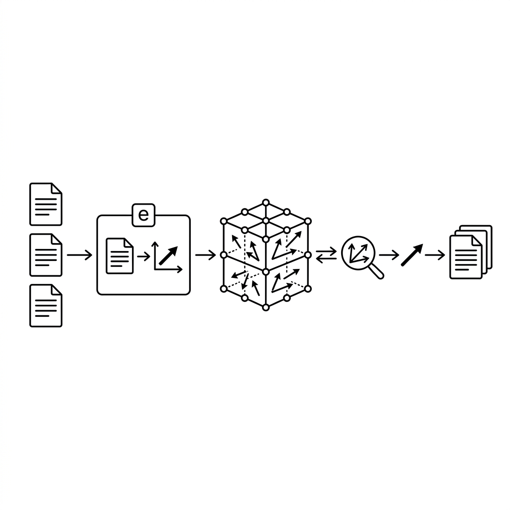

# Unit 24: Vector Databases and RAG From Scratch

> [!IMPORTANT]
> **OpenAI API key setup**
> This unit uses the OpenAI API. See [Appendix (Learning Environment and API Setup)](../appendix/index.md#🔑-3-openai-api-key-acquisition-and-secure-management-chapter-4) for secure key configuration.


## 1. Understanding Vector DBs & RAG From Scratch



### What is a Vector DB?
To help AI understand language, words must become **numeric sequences (vectors)**—called **embeddings**.
A Vector DB stores these sequences and specializes in finding “semantically similar” items instantly.

**💡 Everyday analogy: bookstore shelving**
- **Traditional DB (keyword search)**: Books in alphabetical order. Search “apple” finds only books containing “apple,” not “Apple.”
- **Vector DB (semantic search)**: Books shelved by meaning. Search “apple” and books about “fruit” or “Apple” nearby are found even without exact text match.

### What is RAG (Retrieval-Augmented Generation)?
LLMs like ChatGPT only know training data— they cannot answer about latest news or your company’s confidential rules.
**“Search materials first (Retrieval), then have the AI answer using them (Generation)”** is RAG.

**💡 Everyday analogy: open-book exam**
- **Plain LLM**: Student relying on memory alone (forgets or guesses wrong).
- **RAG**: Student opens the textbook (Vector DB) to relevant pages and writes answers from them (accurate, up-to-date).

| Process | Student analogy | RAG system |
| :--- | :--- | :--- |
| **1. Question input** | Read exam question | User asks “How do I take paid leave per company policy?” |
| **2. Retrieval** | Find relevant pages in textbook index | Vectorize question; search Vector DB for similar passages |
| **3. Augmentation** | Open pages on desk | Paste retrieved text into prompt |
| **4. Generation** | Write answer in own words while reading | Instruct LLM “answer from reference text”; get response |

### 💡 Concrete business use cases
- **Internal policy/manual search**: Vectorize huge document sets; employees ask “How do I …?” and get accurate answers from relevant rules—a help desk.
- **E-commerce semantic search**: User searches “cool clothes for the beach in summer”; recommend items by meaning (vector) even without keywords in product names.
- **Past troubleshooting search**: Engineer enters error/symptom; Vector DB finds similar incidents and fixes for faster incident response.

## 2. Implementation Example

Build RAG from zero using basic Python and simple vector libraries—no heavy RAG framework.

> ※ Install `pip install scikit-learn openai` first. (We use scikit-learn cosine similarity for clarity.)

```python
import os
from openai import OpenAI
from sklearn.metrics.pairwise import cosine_similarity
import numpy as np

client = OpenAI(api_key=os.environ.get("OPENAI_API_KEY"))

# =========================================
# 【準備編】Vector DBの代わりを作ろう
# =========================================

# 1. 知識となる文書リスト（これが社内マニュアルなどの代わりです）
documents = [
    "AIの学習には大量のデータが必要です。",
    "弊社の有給休暇は、入社半年後に10日付与されます。",
    "経費精算は月末までにシステムXから申請してください。",
    "PythonはAI開発に非常に適したプログラミング言語です。"
]

# 2. 文章を「ベクトル（数値の羅列）」に変換する関数
def get_embedding(text):
    response = client.embeddings.create(
        input=text,
        model="text-embedding-3-small" # OpenAIの埋め込みモデル
    )
    return response.data[0].embedding

# 3. すべての文書をベクトル化して保存（簡易的なVector DBの完成）
print("文書をベクトル化しています...")
doc_embeddings = [get_embedding(doc) for doc in documents]

# =========================================
# 【実行編】RAGパイプラインを動かそう
# =========================================

# 4. ユーザーからの質問
question = "有給休暇はいつもらえますか？"
print(f"質問: {question}")

# 5. 質問もベクトル化する
question_embedding = get_embedding(question)

# 6. 【Retrieval: 検索】質問のベクトルと、各文書のベクトルの「似ている度合い」を計算
# cosine_similarity（コサイン類似度）は1に近いほど意味が似ていることを示します
similarities = cosine_similarity([question_embedding], doc_embeddings)[0]

# 一番類似度が高かった（意味が近かった）文書のインデックスを取得
best_index = np.argmax(similarities)
best_document = documents[best_index]
print(f"見つかった参考資料: {best_document}")

# 7. 【Augmentation & Generation: 情報付与と生成】
# 見つけた資料をプロンプトに埋め込んで、LLMに回答させる
prompt = f"""
以下の【参考資料】のみに基づいて、ユーザーの【質問】に答えてください。

【参考資料】
{best_document}

【質問】
{question}
"""

response = client.chat.completions.create(
    model="gpt-4o-mini",
    messages=[{"role": "user", "content": prompt}],
    temperature=0.0
)

print("\nAIの最終回答:")
print(response.choices[0].message.content)
```

**🔍 Detailed code walkthrough**
1. **Setup (build database)**: Prepare the knowledge list to teach the AI.
2. **Vectorization (Embedding)**: Convert text to numeric arrays so the computer can measure “semantic nearness.”
3. **Retrieval**: Vectorize the user question; use **cosine similarity** to find the closest document—even without keyword match.
4. **Prompt creation (Augmentation)**: Build “answer from this material” instructions and insert retrieved text.
5. **Answer generation (Generation)**: Send the prompt to the LLM for an answer grounded in retrieved content.

## 3. Practice

Extend the example to retrieve **top 3 related documents** and embed all of them in the prompt.

**【Requirements】**
- Expand the document database to about 10 entries (AI topics, company rules, etc.).
- Instead of `np.argmax()` for one document, retrieve the **top 3** by similarity.
- Concatenate all three in the prompt’s 【参考資料】 section and have the AI answer.

**💡 Hint**
- `np.argsort()` returns sorted indices; reverse for descending similarity order.

## 4. Answer Key

<details>
<summary>View sample solution (click to expand)</summary>

```python
import os
from openai import OpenAI
from sklearn.metrics.pairwise import cosine_similarity
import numpy as np

client = OpenAI(api_key=os.environ.get("OPENAI_API_KEY"))

def get_embedding(text):
    response = client.embeddings.create(
        input=text, model="text-embedding-3-small"
    )
    return response.data[0].embedding

# 1. 知識となる文書リスト（データを増やしました）
documents = [
    "AIの学習には大量のデータが必要です。",
    "弊社の有給休暇は、入社半年後に10日付与されます。",
    "経費精算は月末までにシステムXから申請してください。",
    "PythonはAI開発に非常に適したプログラミング言語です。",
    "有給休暇を申請する場合は、1週間前までに上長に報告してください。",
    "システムXのログインパスワードは3ヶ月ごとに変更が必要です。",
    "特別休暇として、夏季休暇が3日間付与されます。",
    "機械学習には教師あり学習と教師なし学習があります。"
]

print("文書をベクトル化しています...")
doc_embeddings = [get_embedding(doc) for doc in documents]

question = "有給休暇を取るためのルールと付与日数を教えてください。"
question_embedding = get_embedding(question)

# 2. 類似度計算
similarities = cosine_similarity([question_embedding], doc_embeddings)[0]

# 3. 類似度の上位3つのインデックスを取得
# argsortは昇順なので、[::-1]で降順に反転させ、先頭3つ（[:3]）を取得
top_3_indices = np.argsort(similarities)[::-1][:3]

# 4. 上位3つの文書を取り出して結合する
retrieved_docs = []
for idx in top_3_indices:
    retrieved_docs.append(documents[idx])

# 文書を改行でつなげる
context_text = "\n- ".join(retrieved_docs)
print(f"【検索された資料】\n- {context_text}\n")

# 5. プロンプトに埋め込んで生成
prompt = f"""
以下の【参考資料】のみに基づいて、ユーザーの【質問】に答えてください。

【参考資料】
- {context_text}

【質問】
{question}
"""

response = client.chat.completions.create(
    model="gpt-4o-mini",
    messages=[{"role": "user", "content": prompt}],
    temperature=0.0
)

print("【AIの回答】")
print(response.choices[0].message.content)
```
</details>
