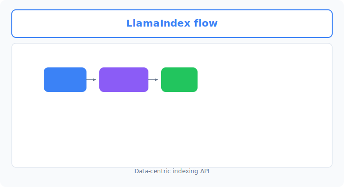
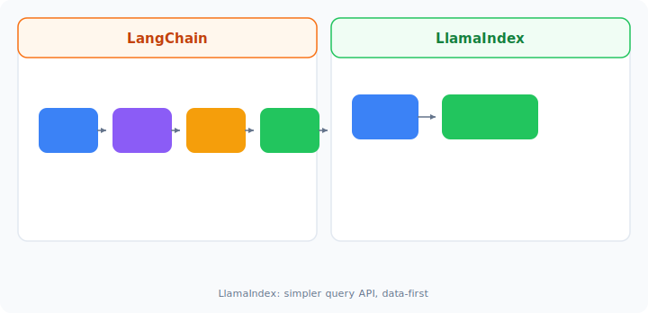

# Unit 26: LlamaIndex Basics and Retrieval-Augmented Generation

<p class="unit-hero">
  
</p>

> [!IMPORTANT]
> **Preparing your OpenAI API key**
> Chapter 4 requires an **OpenAI API key**. For how to obtain a key, billing notes, and secure environment-variable setup with Google Colab secrets, read [Appendix (Learning Environment and API Setup)](../appendix/index.md#🔑-3-openai-api-key-acquisition-and-secure-management-chapter-4) first.

## 1. Understanding RAG with LlamaIndex




In Unit 24 you built **hand-crafted RAG** with APIs and NumPy similarity alone, learning the mathematical foundation. In Unit 25 you learned more abstract, general RAG construction with LangChain.

Production RAG at scale faces parsing diverse formats (PDF, Word, Markdown), meaningful chunking, efficient index storage and updates, and advanced metadata search. **`LlamaIndex`** is the RAG-specialized framework that solves these professionally and fast.

### What is LlamaIndex? —The RAG-focused de facto standard
LangChain is a general AI application toolkit; LlamaIndex is strongly focused on connecting data with LLMs. Its data structures, semantic search, and index design can be convenient for RAG, but the right choice depends on requirements, versions, and maintenance cost.

| LlamaIndex core concept | Role analogy |
| :--- | :--- |
| **Documents / Nodes** | Raw loaded data (Document) and minimal chunks with metadata (Node)—like book pages vs. index cards. |
| **VectorStoreIndex** | Vectorizes chunks and holds a searchable index in memory or DB—the library catalog. |
| **QueryEngine** | Takes user questions, retrieves relevant Nodes, passes context to LLM, synthesizes answers—the librarian at the desk. |

---



## 2. Implementation Example

Use `LlamaIndex` to index text (`VectorStoreIndex`) and run a minimal RAG **QueryEngine** pipeline.

Run `pip install llama-index-core llama-index-readers-file llama-index-llms-openai llama-index-embeddings-openai` and set `OPENAI_API_KEY`.

```python
import os
from llama_index.core import Document, VectorStoreIndex, Settings
from llama_index.llms.openai import OpenAI
from llama_index.embeddings.openai import OpenAIEmbedding

# 1. Global LLM and embedding model settings (apply Settings)
Settings.llm = OpenAI(model="gpt-4o-mini", temperature=0.1)
Settings.embed_model = OpenAIEmbedding(model="text-embedding-3-small")

# 2. Prepare sample data (hotel information manual)
hotel_manual = """
The front desk at AI Lounge Hotel operates 24 hours a day.
Check-in is from 3:00 PM and check-out is by 10:00 AM.
Pets are not permitted in any guest room.
Breakfast is served buffet-style from 7:00 AM to 9:30 AM at the restaurant Sakura on the 1st floor (2,000 yen for adults).
Complimentary Wi-Fi (network name: AI_Lounge_Guest) is available throughout the hotel. No password is required.
"""

# Create document object
documents = [Document(text=hotel_manual)]

# 3. Build index
# Loading, chunking, vectorization, and index storage happen automatically in one line
index = VectorStoreIndex.from_documents(documents)

# 4. Create query engine and run a question
query_engine = index.as_query_engine()

print("--- LlamaIndex RAG execution ---")
question = "Can I bring a pet? And where is breakfast served?"
response = query_engine.query(question)

print(f"Question: {question}")
print(f"AI answer:\n{response}")
```

---

## 3. Practice — 🧠 Compare and Decide Your RAG System Design

As a systems architect, develop the ability to decide **whether to use a framework (LangChain / LlamaIndex) or scratch**, and **which framework**, from implementation cost and business requirements.

**【Requirements】**
Mentally compare Unit 24 scratch RAG (API + NumPy), Unit 25 LangChain RAG, and this unit’s LlamaIndex RAG, then design a RAG system for:

```python
# 1. Knowledge base for search
company_policies = [
    "Summer leave may be taken for a total of 5 days between July 1 and September 30 each year.",
    "Remote work is allowed up to 3 days per week with prior approval. Core hours are 11:00 AM to 3:00 PM.",
    "Expense reports must be submitted through the system by the 25th of each month. Receipt attachments are required."
]

# Treat this policy text as the knowledge source.
```

**【Your mission: compare three RAG approaches and decide production deployment】**

Decide which approach to adopt for the company **internal policy FAQ (RAG)** system:

1. **Approach A (Scratch RAG / NumPy + API)**
   * **Characteristics**: Minimal dependencies; simple code; full control and debug of similarity and chunking logic.
2. **Approach B (LangChain RAG)**
   * **Characteristics**: Rich ecosystem (Loaders, Splitters, VectorStore, Retriever); flexible pipelines as part of broader LLM apps.
3. **Approach C (LlamaIndex RAG)**
   * **Characteristics**: RAG-native design; index + query engine in few lines; fastest tuning for chunking, metadata, hierarchical search.

---

**【Design decision notes to record in code comments】**
1. **LlamaIndex policy FAQ implementation**:
   * Convert `company_policies` to `Document`, build `VectorStoreIndex`, and answer `"What are the core hours for remote work?"` accurately.
2. **Implementation cost and readability comparison**:
   * Compare pipeline length for index build and retrieval-QA across A, B, and C.
3. **Future scale and flexibility**:
   * If documents grow to 10k PDFs with production vector DB, or chat history and tool integration are needed—which approach adapts best?
4. **Final deployment decision**:
   * **Document your chosen production approach (scratch, LangChain, or LlamaIndex) and why.**

---

## 4. Answer Key — 💡 Professional RAG System Design Guidelines

<details>
<summary>View sample solution (click to expand)</summary>

### 💡 Criteria for choosing RAG frameworks as an AI engineer

Trade-offs among scratch, LangChain, and LlamaIndex:

#### Design decision matrix (production criteria)

| Evaluation axis | Approach A (Scratch RAG) | Approach B (LangChain RAG) | Approach C (LlamaIndex) | Design point |
| :--- | :--- | :--- | :--- | :--- |
| **Dev speed & maintainability** | **Very low**. Must build chunking and search yourself—more code, more bugs. | **High**. Modules exist but RAG needs explicit Loader/Splitter/VectorStore/Retriever assembly. | **Highest for RAG**. `VectorStoreIndex.from_documents` to query engine in few lines. | **LlamaIndex fastest for RAG**; LangChain better when embedding RAG in broader agent apps. |
| **Vector DB extensibility** | Learn each DB client manually—high migration cost. | **Very high**. Wrappers for Chroma, Pinecone, PGVector, etc.—easy swap. | **Very high**. Rich vector DB plugins; switch via index constructor args. | Both frameworks scale well for data volume and search quality. |
| **Customization & flexibility** | **Unlimited**. Any similarity algorithm or prompt merge logic. | **Very high**. LCEL and modules for fine pipeline control. | **High but RAG-focused**. Advanced retrieval built-in; deep customization needs internal knowledge. | **LangChain for agents and complex dialog graphs**; **LlamaIndex for RAG tuning and structured data search**. |
| **Internal transparency** | **Strongest**. 100% visibility for debugging. | **Medium**. LCEL traceable; module internals abstracted. | **Somewhat lower**. Highly abstracted—docs needed for custom behavior. | **Learn transparency in scratch (Unit 24); LangChain (Unit 25) for general apps; LlamaIndex (Unit 26) for RAG delivery speed**. |

---

### Reliable policy FAQ implementation with LlamaIndex

```python
from llama_index.core import Document, VectorStoreIndex, Settings
from llama_index.llms.openai import OpenAI
from llama_index.embeddings.openai import OpenAIEmbedding

# 1. Design decision:
# "For the internal policy FAQ system, prioritize RAG build speed and RAG-specific tuning; adopt LlamaIndex."
# "Far more maintainable than scratch RAG, and simpler and more robust than LangChain for RAG-focused construction."

Settings.llm = OpenAI(model="gpt-4o-mini", temperature=0.0) # temp=0.0 for consistent policy answers
Settings.embed_model = OpenAIEmbedding(model="text-embedding-3-small")

# Internal policy dataset
company_policies = [
    "Summer leave may be taken for a total of 5 days between July 1 and September 30 each year.",
    "Remote work is allowed up to 3 days per week with prior approval. Core hours are 11:00 AM to 3:00 PM.",
    "Expense reports must be submitted through the system by the 25th of each month. Receipt attachments are required."
]

# 2. Convert to Document objects
documents = [Document(text=policy) for policy in company_policies]

# 3. Build index
index = VectorStoreIndex.from_documents(documents)

# 4. Build query engine and run
query_engine = index.as_query_engine()

print("--- Internal Policy FAQ RAG System ---")
question = "What are the core hours for remote work?"
response = query_engine.query(question)

print(f"Question: {question}")
print(f"Answer:\n{response}")
```

### 💡 Final production decision as a professional

* **Final deployment decision**:
  * **“Adopt Approach C (LlamaIndex) for production.”**
  * **Rationale**:
    1. **Maximize dev efficiency and quality**: Cosine similarity, chunking, and Retriever assembly required in scratch (A) and LangChain (B) flow from `VectorStoreIndex.from_documents` to `as_query_engine` in LlamaIndex (C)—least code, lowest bug risk.
    2. **Fast integration of RAG-specific features**: Complex PDF tables or hierarchical search (Auto Merging Retriever, etc.) need only standard LlamaIndex receiver classes.
    3. **Infrastructure migration**: Moving to Pinecone or ChromaDB avoids full rewrite like scratch; LlamaIndex and LangChain switch with small config changes.
    * *Note*: If the system is primarily **autonomous multi-agent** or **complex graph dialog**, LangChain (Unit 25) as base with embedded RAG fits better; for **internal policy FAQ (RAG-only)**, LlamaIndex is optimal.
</details>
