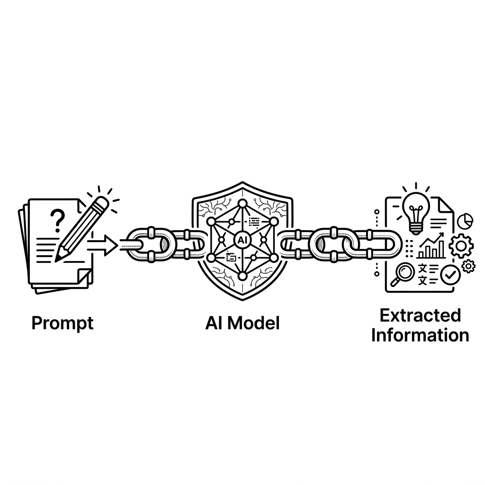

# Unit 26: LlamaIndex Basics and Retrieval-Augmented Generation

> [!IMPORTANT]
> **Preparing your OpenAI API key**
> Chapter 4 requires an **OpenAI API key**. For how to obtain a key, billing notes, and secure environment-variable setup with Google Colab secrets, read [Appendix (Learning Environment and API Setup)](../appendix/index.md#🔑-3-openai-api-key-acquisition-and-secure-management-chapter-4) first.

## 1. Understanding RAG with LlamaIndex



In Unit 24 you built **hand-crafted RAG** with APIs and NumPy similarity alone, learning the mathematical foundation. In Unit 25 you learned more abstract, general RAG construction with LangChain.

Production RAG at scale faces parsing diverse formats (PDF, Word, Markdown), meaningful chunking, efficient index storage and updates, and advanced metadata search. **`LlamaIndex`** is the RAG-specialized framework that solves these professionally and fast.

### What is LlamaIndex? —The RAG-focused de facto standard
LangChain is a general “do everything” AI app toolkit; LlamaIndex is **100% focused on connecting private data with LLMs**. Data structures, semantic search, and index design are simpler and more intuitive than LangChain for RAG.

| LlamaIndex core concept | Role analogy |
| :--- | :--- |
| **Documents / Nodes** | Raw loaded data (Document) and minimal chunks with metadata (Node)—like book pages vs. index cards. |
| **VectorStoreIndex** | Vectorizes chunks and holds a searchable index in memory or DB—the library catalog. |
| **QueryEngine** | Takes user questions, retrieves relevant Nodes, passes context to LLM, synthesizes answers—the librarian at the desk. |

---

## 2. Implementation Example

Use `LlamaIndex` to index text (`VectorStoreIndex`) and run a minimal RAG **QueryEngine** pipeline.

Run `pip install llama-index-core llama-index-readers-file llama-index-llms-openai llama-index-embeddings-openai` and set `OPENAI_API_KEY`.

```python
import os
from llama_index.core import Document, VectorStoreIndex, Settings
from llama_index.llms.openai import OpenAI
from llama_index.embeddings.openai import OpenAIEmbedding

# 1. LLM と埋め込みモデルのグローバル設定 (Settingsの適用)
Settings.llm = OpenAI(model="gpt-4o-mini", temperature=0.1)
Settings.embed_model = OpenAIEmbedding(model="text-embedding-3-small")

# 2. サンプルデータの準備（ホテルの案内マニュアル）
hotel_manual = """
当ホテル（AIラウンジホテル）のフロントデスクは24時間体制で稼働しております。
チェックイン時間は午後15:00から、チェックアウト時間は午前10:00となっております。
ペットの同伴はすべての客室で禁止されております。
朝食は午前7:00から9:30まで、1階のレストラン「サクラ」にてバイキング形式で提供されます（大人2,000円）。
全館で無料Wi-Fi（ネットワーク名: AI_Lounge_Guest）がご利用可能です。パスワードはございません。
"""

# ドキュメントオブジェクトの作成
documents = [Document(text=hotel_manual)]

# 3. インデックスの構築
# ドキュメントの読み込み、チャンク分割、ベクトル化、インデックス保存がこの1行で自動実行されます
index = VectorStoreIndex.from_documents(documents)

# 4. クエリエンジンの作成と質問の実行
query_engine = index.as_query_engine()

print("--- LlamaIndex RAG 実行 ---")
question = "ペットを連れて行くことはできますか？また朝食の場所はどこですか？"
response = query_engine.query(question)

print(f"質問: {question}")
print(f"AIの回答:\n{response}")
```

---

## 3. Practice — 🧠 Compare and Decide Your RAG System Design

As a systems architect, develop the ability to decide **whether to use a framework (LangChain / LlamaIndex) or scratch**, and **which framework**, from implementation cost and business requirements.

**【Requirements】**
Mentally compare Unit 24 scratch RAG (API + NumPy), Unit 25 LangChain RAG, and this unit’s LlamaIndex RAG, then design a RAG system for:

```python
# 1. 検索用ナレッジベース
company_policies = [
    "当社の夏季休暇は、毎年7月1日から9月30日までの期間内に、合計5日間取得することができます。",
    "リモートワークは週に最大3日まで認められており、事前の申請が必要です。コアタイムは11:00〜15:00です。",
    "経費精算は、毎月25日までにシステムから申請を行う必要があります。領収書の添付が必須です。"
]

# このポリシーテキストをナレッジソースとして扱います。
```

**【Your mission: compare three RAG approaches and decide production deployment】**

Decide which approach to adopt for the company **internal policy FAQ (RAG)** system:

1. **Approach A (Scratch RAG / NumPy + API)**
   * **Characteristics**: Minimal dependencies; simple code; full control and debug of similarity and chunking logic.
2. **Approach B (LangChain RAG)**
   * **Characteristics**: Rich ecosystem (Loaders, Splitters, VectorStore, Retriever); flexible pipelines as part of broader LLM apps.
3. **Approach C (LlamaIndex RAG)**
   * **Characteristics**: RAG-native design; index + query engine in few lines; fastest tuning for chunking, metadata, hierarchical search.

---

**【Design decision notes to record in code comments】**
1. **LlamaIndex policy FAQ implementation**:
   * Convert `company_policies` to `Document`, build `VectorStoreIndex`, and answer `"リモートワークのコアタイムは何時ですか？"` accurately.
2. **Implementation cost and readability comparison**:
   * Compare pipeline length for index build and retrieval-QA across A, B, and C.
3. **Future scale and flexibility**:
   * If documents grow to 10k PDFs with production vector DB, or chat history and tool integration are needed—which approach adapts best?
4. **Final deployment decision**:
   * **Document your chosen production approach (scratch, LangChain, or LlamaIndex) and why.**

---

## 4. Answer Key — 💡 Professional RAG System Design Guidelines

<details>
<summary>View sample solution (click to expand)</summary>

### 💡 Criteria for choosing RAG frameworks as an AI engineer

Trade-offs among scratch, LangChain, and LlamaIndex:

#### Design decision matrix (production criteria)

| Evaluation axis | Approach A (Scratch RAG) | Approach B (LangChain RAG) | Approach C (LlamaIndex) | Design point |
| :--- | :--- | :--- | :--- | :--- |
| **Dev speed & maintainability** | **Very low**. Must build chunking and search yourself—more code, more bugs. | **High**. Modules exist but RAG needs explicit Loader/Splitter/VectorStore/Retriever assembly. | **Highest for RAG**. `VectorStoreIndex.from_documents` to query engine in few lines. | **LlamaIndex fastest for RAG**; LangChain better when embedding RAG in broader agent apps. |
| **Vector DB extensibility** | Learn each DB client manually—high migration cost. | **Very high**. Wrappers for Chroma, Pinecone, PGVector, etc.—easy swap. | **Very high**. Rich vector DB plugins; switch via index constructor args. | Both frameworks scale well for data volume and search quality. |
| **Customization & flexibility** | **Unlimited**. Any similarity algorithm or prompt merge logic. | **Very high**. LCEL and modules for fine pipeline control. | **High but RAG-focused**. Advanced retrieval built-in; deep customization needs internal knowledge. | **LangChain for agents and complex dialog graphs**; **LlamaIndex for RAG tuning and structured data search**. |
| **Internal transparency** | **Strongest**. 100% visibility for debugging. | **Medium**. LCEL traceable; module internals abstracted. | **Somewhat lower**. Highly abstracted—docs needed for custom behavior. | **Learn transparency in scratch (Unit 24); LangChain (Unit 25) for general apps; LlamaIndex (Unit 26) for RAG delivery speed**. |

---

### Reliable policy FAQ implementation with LlamaIndex

```python
from llama_index.core import Document, VectorStoreIndex, Settings
from llama_index.llms.openai import OpenAI
from llama_index.embeddings.openai import OpenAIEmbedding

# 1. 意思決定:
# 「社内規定FAQシステムにおいて、RAGの構築スピードとRAG特化のチューニングを最優先し、LlamaIndexを採用。」
# 「手組みRAGに比べて圧倒的に保守性が高く、LangChainに比べてもRAG構築に特化しているためコードが最もシンプルで構成が頑健である。」

Settings.llm = OpenAI(model="gpt-4o-mini", temperature=0.0) # 規定回答のためブレを排しtemp=0.0
Settings.embed_model = OpenAIEmbedding(model="text-embedding-3-small")

# 社内ポリシーデータセット
company_policies = [
    "当社の夏季休暇は、毎年7月1日から9月30日までの期間内に、合計5日間取得することができます。",
    "リモートワークは週に最大3日まで認められており、事前の申請が必要です。コアタイムは11:00〜15:00です。",
    "経費精算は、毎月25日までにシステムから申請を行う必要があります。領収書の添付が必須です。"
]

# 2. Documentオブジェクトへの変換
documents = [Document(text=policy) for policy in company_policies]

# 3. インデックス化
index = VectorStoreIndex.from_documents(documents)

# 4. クエリエンジンの構築と実行
query_engine = index.as_query_engine()

print("--- 社内規定FAQ RAGシステム ---")
question = "リモートワークのコアタイムは何時ですか？"
response = query_engine.query(question)

print(f"質問: {question}")
print(f"回答:\n{response}")
```

### 💡 Final production decision as a professional

* **Final deployment decision**:
  * **“Adopt Approach C (LlamaIndex) for production.”**
  * **Rationale**:
    1. **Maximize dev efficiency and quality**: Cosine similarity, chunking, and Retriever assembly required in scratch (A) and LangChain (B) flow from `VectorStoreIndex.from_documents` to `as_query_engine` in LlamaIndex (C)—least code, lowest bug risk.
    2. **Fast integration of RAG-specific features**: Complex PDF tables or hierarchical search (Auto Merging Retriever, etc.) need only standard LlamaIndex receiver classes.
    3. **Infrastructure migration**: Moving to Pinecone or ChromaDB avoids full rewrite like scratch; LlamaIndex and LangChain switch with small config changes.
    * *Note*: If the system is primarily **autonomous multi-agent** or **complex graph dialog**, LangChain (Unit 25) as base with embedded RAG fits better; for **internal policy FAQ (RAG-only)**, LlamaIndex is optimal.
</details>
