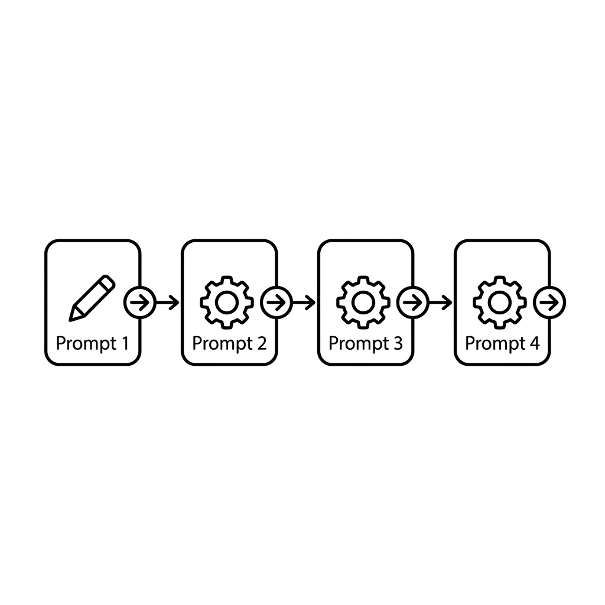

# Unit 27: Stepwise Reasoning Through Prompt Chaining

> [!IMPORTANT]
> **OpenAI API key setup**
> This unit uses the OpenAI API. See [Appendix (Learning Environment and API Setup)](../appendix/index.md#🔑-3-openai-api-key-acquisition-and-secure-management-chapter-4) for secure key configuration.


## 1. Understanding Prompt Chaining



### What is prompt chaining?
When asking the AI to do complex work, one big question often confuses it and fails.
**Split processing into small steps and pass each step’s output to the next**—that is prompt chaining.

**💡 Everyday analogy: factory assembly line**
Instead of one craftsperson doing everything:
1. **Worker A (AI-1)** peels apples.
2. **Worker B (AI-2)** receives peeled apples and dices them.
3. **Worker C (AI-3)** receives diced apples and cooks jam.
Each person’s output becomes the next person’s input—a relay.

### Building on Unit 25: chaining with LCEL
Unit 25 taught single chains as `prompt | model | parser`.

The essence of prompt chaining is **linking multiple independent chains with `|` for a data relay**.

Example: chain 1 (topic → catchphrase) and chain 2 (catchphrase → tweet):

| Step | Data flow image | LCEL expression |
| :--- | :--- | :--- |
| **Topic input** | User enters topic | `{"topic": "お題"}` |
| **First chain (Chain 1)** | Topic → catchphrase | `chain1 = prompt1 | llm | parser` |
| **Relay** | Map Chain 1 output to key `ad_copy` for next input | `{"ad_copy": chain1}` |
| **Second chain (Chain 2)** | Catchphrase → final tweet | `final_chain = {"ad_copy": chain1} | prompt2 | llm | parser` |

LangChain’s `|` is not just part wiring—it **treats whole chains as input sources** and streams them into the next chain.

### 💡 Concrete business use cases
- **Marketing content pipeline**: Target + appeal point → ① catchphrase → ② blog outline → ③ section drafts → ④ SNS promo copy.
- **Hierarchical long-report summarization**: ① chapter summaries → ② full summary → ③ three-bullet executive summary.
- **Customer feedback deep analysis**: ① sentiment → ② categorize negatives → ③ improvement plans per category.

## 2. Implementation Example

Build a two-step LCEL chain:
- **Step 1**: Generate a catchphrase from a given topic.
- **Step 2**: Write a promotional tweet using that catchphrase.

```python
import os
from langchain_openai import ChatOpenAI
from langchain_core.prompts import ChatPromptTemplate
from langchain_core.output_parsers import StrOutputParser

# 1. LLMの準備
llm = ChatOpenAI(model="gpt-4o-mini", temperature=0.7)
# 結果を単なる文字列（String）として綺麗に取り出すための便利ツール
output_parser = StrOutputParser()

# =========================================
# チェーン1：キャッチコピーを作る
# =========================================
prompt1 = ChatPromptTemplate.from_template(
    "お題「{topic}」の魅力的なキャッチコピーを1文で考えてください。"
)
# | (パイプ) を使って、プロンプト → LLM → 文字列抽出 と処理をつなぎます
chain1 = prompt1 | llm | output_parser

# =========================================
# チェーン2：ツイートを作る
# =========================================
prompt2 = ChatPromptTemplate.from_template(
    "以下のキャッチコピーを使って、SNS向けの宣伝ツイートを作成してください。ハッシュタグも含めてください。\n\nキャッチコピー：{catchphrase}"
)
chain2 = prompt2 | llm | output_parser

# =========================================
# 全体を結合する（プロンプトチェーン）
# =========================================
# 辞書型 {"catchphrase": chain1} とすることで、
# chain1の実行結果が自動的に "catchphrase" という変数に入り、chain2に渡されます
overall_chain = {"catchphrase": chain1} | chain2

# 実行
topic = "空飛ぶスニーカー"
print(f"お題: {topic}\n")

print("チェーン実行中...")
result = overall_chain.invoke({"topic": topic})

print("\n【最終結果：宣伝ツイート】")
print(result)
```

**🔍 Detailed code walkthrough**
1. **Parts**: LLM and `StrOutputParser` for clean text output.
2. **Chain 1**: `prompt1` takes `{topic}` and generates catchphrase via `|`.
3. **Chain 2**: `prompt2` takes `{catchphrase}` and generates tweet.
4. **Combine**: `{"catchphrase": chain1} | chain2` runs chain1 first and passes result as `catchphrase` to chain2.

## 3. Practice

Build a **three-step** prompt chain.

**【Topic: automated blog article pipeline】**
1. **Step 1**: From theme `{topic}`, generate a **blog title**.
2. **Step 2**: From title `{title}`, generate an **outline (table of contents)**.
3. **Step 3**: Using `{title}` and `{outline}`, write the **introduction (lead paragraph)**.

**💡 Hint**
- `RunnablePassthrough` can forward variables, but you can also wire with dictionaries.
- Final step may look like `{"title": chain1, "outline": chain2_that_uses_title}`—try LangChain’s powerful chaining syntax.

## 4. Answer Key

<details>
<summary>View sample solution (click to expand)</summary>

```python
import os
from langchain_openai import ChatOpenAI
from langchain_core.prompts import ChatPromptTemplate
from langchain_core.output_parsers import StrOutputParser
from langchain_core.runnables import RunnablePassthrough

llm = ChatOpenAI(model="gpt-4o-mini", temperature=0.7)
parser = StrOutputParser()

# 1. タイトル生成チェーン
prompt_title = ChatPromptTemplate.from_template("テーマ「{topic}」のブログ記事の惹きつけられるタイトルを1つ考えてください。")
chain_title = prompt_title | llm | parser

# 2. 目次生成チェーン
prompt_outline = ChatPromptTemplate.from_template("タイトル「{title}」のブログ記事の目次（3章構成）を作成してください。")
chain_outline = prompt_outline | llm | parser

# 3. 序文生成チェーン
prompt_intro = ChatPromptTemplate.from_template("""
以下のタイトルと目次を持つブログ記事の、魅力的な「序文（導入部分）」を200文字程度で書いてください。

タイトル：{title}
目次：\n{outline}
""")
chain_intro = prompt_intro | llm | parser

# =========================================
# 高度なチェーン結合 (RunnablePassthroughの活用)
# =========================================
# RunnablePassthrough.assign を使うと、既存の入力（ここではtitle）を保持したまま、
# 新しい変数（outline）を追加して次のステップに渡すことができます。

overall_chain = (
    # 最初に入力 {"topic": "..."} を受け取り、title変数を追加する
    {"title": chain_title} 
    # 今の辞書 {"title": "..."} を引き継ぎつつ、outline変数を追加する
    | RunnablePassthrough.assign(outline=chain_outline)
    # 辞書 {"title": "...", "outline": "..."} が chain_intro に渡される
    | chain_intro
)

# 実行
result = overall_chain.invoke({"topic": "初心者向けの観葉植物の育て方"})

print("【最終的に生成された序文】")
print(result)
```
</details>
