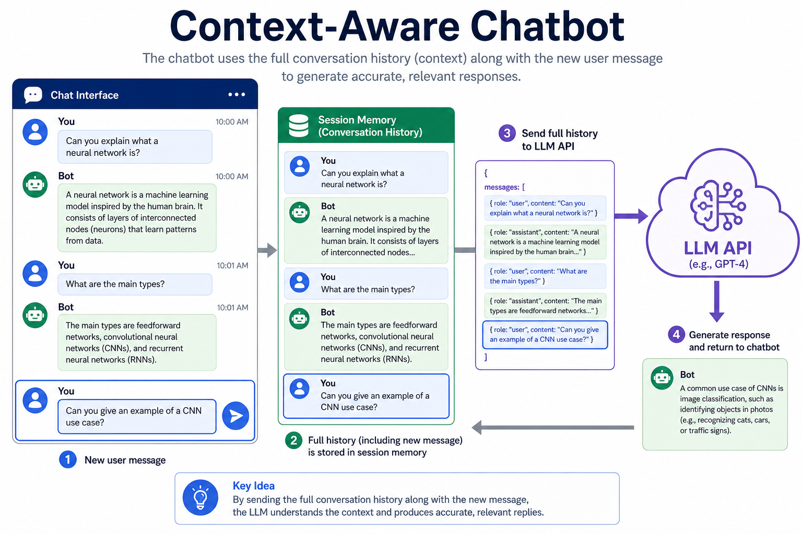
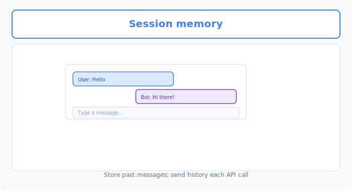
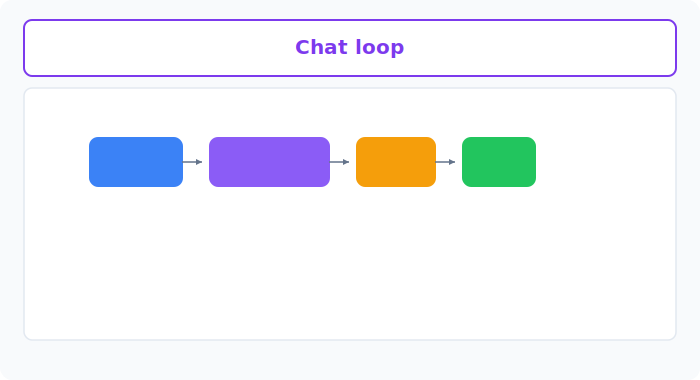

# Unit 28: Context-Aware Chatbot

<p class="unit-hero">
  
</p>

> [!IMPORTANT]
> **OpenAI API key setup**
> This unit uses the OpenAI API. See [Appendix (Learning Environment and API Setup)](../appendix/index.md#🔑-3-openai-api-key-acquisition-and-secure-management-chapter-4) for secure key configuration.


## 1. Understanding Context-Aware Chatbot




### Why memory matters
LLMs via API are basically **amnesiac**.
Teach “My name is Taro” in turn 1; ask “What is my name?” in turn 2—they say “I don’t know.” Each call is independent.

Context-aware chatbots need **memory**.

**💡 Everyday analogy: a forgetful waiter**
- **Memoryless AI**: Forgets who you are every time—“What would you like to order?” No context from “refill my water.”
- **Memory AI (Chatbot)**: Keeps conversation notes and **reads the full history before replying**.

### Memory in LangChain
LangChain can **automatically append conversation history** to prompts.

| Memory mechanism | Pros | Cons |
| :--- | :--- | :--- |
| **Remember all (Buffer Memory)** | Keeps the full history available from the start | Long chats → huge payloads → higher API cost; availability does not guarantee correct understanding |
| **Recent window (Window Memory)** | Only last N turns; saves tokens | Forgets older topics |

### 💡 Concrete business use cases
- **Personalized AI mentor/coaching**: Remember goals and daily progress—“Last week you struggled with X; how did it go?”
- **Long-term customer support (CRM chat)**: Reference purchase and inquiry history—“How is the product you bought last time?”
- **Game/entertainment NPCs**: Remember player actions and dialogue; attitude and lines change on next meeting.



## 2. Implementation Example

Use LangChain’s `RunnableWithMessageHistory` for a chatbot that remembers past conversation.

> ※ Newer LangChain recommends this over legacy `ConversationBufferMemory`.

```python
import os
from langchain_openai import ChatOpenAI
from langchain_core.prompts import ChatPromptTemplate, MessagesPlaceholder
from langchain_community.chat_message_histories import ChatMessageHistory
from langchain_core.runnables.history import RunnableWithMessageHistory

# 1. Prepare LLM
llm = ChatOpenAI(model="gpt-4o-mini", temperature=0.7)

# 2. Prepare prompt
# MessagesPlaceholder reserves a slot where past conversation history is inserted
prompt = ChatPromptTemplate.from_messages([
    ("system", "You are a chatbot that speaks casually, like a close friend."),
    MessagesPlaceholder(variable_name="chat_history"), # slot for conversation history
    ("user", "{input}")
])

# Create chain
chain = prompt | llm

# 3. Memory storage (stand-in for a database)
# Dictionary to store conversation history per user
store = {}

# Return conversation history for the given session ID (user ID)
def get_session_history(session_id: str):
    if session_id not in store:
        store[session_id] = ChatMessageHistory() # create a new notebook for new users
    return store[session_id]

# 4. Attach memory to the chain
# history_messages_key must match the variable name reserved in the prompt (chat_history)
with_message_history = RunnableWithMessageHistory(
    chain,
    get_session_history,
    input_messages_key="input",
    history_messages_key="chat_history",
)

# =========================================
# Chatbot conversation simulation
# =========================================
# Using the same session ID makes this a continuous conversation with one person
config = {"configurable": {"session_id": "user_123"}}

print("User: My name is Taro. I like apples.")
response1 = with_message_history.invoke(
    {"input": "My name is Taro. I like apples."},
    config=config
)
print("AI:", response1.content, "\n")

print("User: Do you remember my name? What was my favorite food?")
response2 = with_message_history.invoke(
    {"input": "Do you remember my name? What was my favorite food?"},
    config=config
)
print("AI:", response2.content)
```

**🔍 Detailed code walkthrough**
1. **Prompt trick**: `MessagesPlaceholder` reserves a slot where LangChain inserts full history before the latest user message.
2. **History store**: `store = {}` holds per-user history; production uses Redis or a database.
3. **Memory wrapper**: `RunnableWithMessageHistory` auto-reads and saves history.
4. **Session continuity**: Same `session_id` lets the AI recall Taro’s prior statements.

## 3. Practice

Create an **infinite-loop chatbot** you control from the terminal.

**【Requirements】**
- Use `while True:` and `input("You: ")` for user input.
- Exit on `exit` or `quit`.
- Use `with_message_history` to keep context across turns.

**💡 Hint**
- History accumulates—ask about several turns ago to verify memory.

## 4. Answer Key

<details>
<summary>View sample solution (click to expand)</summary>

```python
import os
from langchain_openai import ChatOpenAI
from langchain_core.prompts import ChatPromptTemplate, MessagesPlaceholder
from langchain_community.chat_message_histories import ChatMessageHistory
from langchain_core.runnables.history import RunnableWithMessageHistory

llm = ChatOpenAI(model="gpt-4o-mini", temperature=0.7)

prompt = ChatPromptTemplate.from_messages([
    ("system", "You are an excellent assistant. Respond naturally while keeping conversation context in mind."),
    MessagesPlaceholder(variable_name="chat_history"),
    ("user", "{input}")
])

chain = prompt | llm
store = {}

def get_session_history(session_id: str):
    if session_id not in store:
        store[session_id] = ChatMessageHistory()
    return store[session_id]

chatbot = RunnableWithMessageHistory(
    chain,
    get_session_history,
    input_messages_key="input",
    history_messages_key="chat_history",
)

config = {"configurable": {"session_id": "my_interactive_session"}}

print("=======================================")
print("Chatbot started.")
print("Type 'exit' or 'quit' to end the session.")
print("=======================================\n")

while True:
    # Receive user input
    user_input = input("You: ")
    
    # Check exit command
    if user_input.lower() in ["exit", "quit"]:
        print("AI: It was great talking with you. Goodbye!")
        break
        
    # Send to AI if input is not empty
    if user_input.strip() != "":
        response = chatbot.invoke(
            {"input": user_input},
            config=config
        )
        print(f"AI: {response.content}\n")
```
</details>
