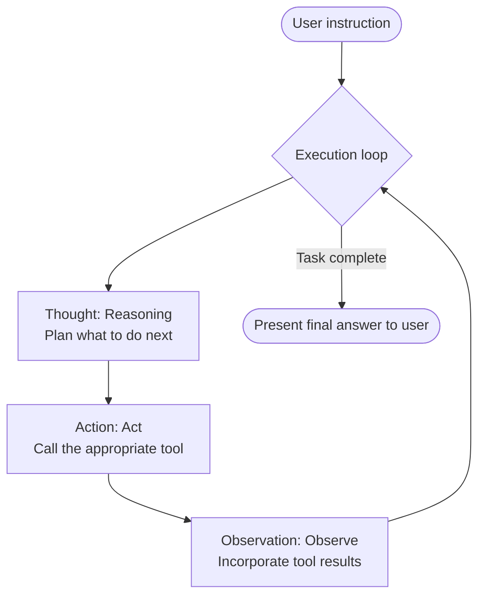

# Unit 29: AI Agent Fundamentals and Scratch ReAct Implementation

<p class="unit-hero">
  
</p>

> [!IMPORTANT]
> **Preparing your OpenAI API key**
> Chapter 4 requires an **OpenAI API key**. For how to obtain a key, billing notes, and secure environment-variable setup with Google Colab secrets, read [Appendix (Learning Environment and API Setup)](../appendix/index.md#🔑-3-openai-api-key-acquisition-and-secure-management-chapter-4) first.

## 1. Understanding AI Agents and Hand-Built ReAct Loops


As LLMs evolve, systems that **autonomously think to reach goals, choose and run external tools, observe results, and decide next actions**—**AI Agents**—are spreading fast.

Many developers build agents with LangChain, LlamaIndex, or smolagents, but without understanding the underlying **autonomous loop**, troubleshooting unexpected behavior and infinite loops is hard.

This unit implements the canonical **ReAct (Reasoning and Acting)** pipeline from scratch using only OpenAI **Tool Calling (Function Calling)** and a Python **while loop**—no framework—to master agent fundamentals.

### 1.1 What is ReAct (Reasoning and Acting)?
ReAct alternates **reasoning** and **acting** so the LLM solves complex tasks step by step via **Thought ➔ Action ➔ Observation** cycles.



#### Text alternative for system structure
1. **Thought**: LLM plans which tool to run next or whether enough information exists.
2. **Action**: LLM outputs tool name and arguments; host executes externally.
3. **Observation**: Tool results (errors, search hits, etc.) feed back into LLM context for “observation.”

### 1.2 How OpenAI Tool Calling works
Tool Calling passes **tool schema definitions (name, description, parameters)** to the LLM so it decides **which tool with which arguments** to invoke.
The LLM does not execute code—it outputs **JSON instructions**; the host program (Python) runs tools safely (**in-process cooperation**).

### 💡 Concrete business use cases
* **Autonomous customer support**: For “Tell me shipping status,” agent calls tracking DB tool, interprets delay, reports to user.
* **Internal data analysis assistant**: For “Graph top 5 products this month,” agent runs SQL and visualization tools sequentially and delivers a report.
* **IT monitoring and recovery**: On server alert, agent uses log tool, then restart or patch tool via approval hooks.

---


## 2. Implementation Example

Use OpenAI Tool Calling for a full scratch ReAct loop where the agent autonomously uses a calculator and inventory lookup.

Run `pip install openai` and set `OPENAI_API_KEY`.

### Sample implementation

```python
import os
import json
from openai import OpenAI

# 1. Initialize client
client = OpenAI(api_key=os.environ.get("OPENAI_API_KEY"))

# 2. Define external tools available to the agent
def get_product_price(product_name: str) -> str:
    """Mock tool to fetch product unit price from a database."""
    catalog = {
        "smartphone": 800,
        "laptop": 1200,
        "headphones": 150
    }
    price = catalog.get(product_name.lower())
    if price:
        return json.dumps({"product": product_name, "price_usd": price})
    return json.dumps({"error": f"Product '{product_name}' not found."})

def calculate_total_with_tax(price: float, quantity: int, tax_rate: float = 0.10) -> str:
    """Calculator tool to compute final payment including quantity and tax rate."""
    subtotal = price * quantity
    total = subtotal * (1 + tax_rate)
    return json.dumps({
        "subtotal": subtotal,
        "tax_rate": tax_rate,
        "total_amount": round(total, 2)
    })

# 3. Tool schema definitions for the OpenAI API (Tool Definition)
tools_schema = [
    {
        "type": "function",
        "function": {
            "name": "get_product_price",
            "description": "Fetch the current unit price of the specified product from the database.",
            "parameters": {
                "type": "object",
                "properties": {
                    "product_name": {
                        "type": "string",
                        "description": "Product name (e.g., smartphone, laptop)"
                    }
                },
                "required": ["product_name"]
            }
        }
    },
    {
        "type": "function",
        "function": {
            "name": "calculate_total_with_tax",
            "description": "Calculate the final payment total including sales tax from unit price, quantity, and tax rate (default 10%).",
            "parameters": {
                "type": "object",
                "properties": {
                    "price": {"type": "number", "description": "Unit price of the product"},
                    "quantity": {"type": "integer", "description": "Purchase quantity"},
                    "tax_rate": {"type": "number", "description": "Sales tax rate (e.g., 0.10)"}
                },
                "required": ["price", "quantity"]
            }
        }
    }
]

# 4. Tool mapping (name to function implementation)
available_functions = {
    "get_product_price": get_product_price,
    "calculate_total_with_tax": calculate_total_with_tax
}

# 5. Autonomous ReAct loop engine
def run_react_agent(user_prompt: str, max_iterations: int = 5):
    print(f"🤖 [Agent Core] Task received: '{user_prompt}'")
    
    # Initialize conversation context
    # System prompt instructs the agent to think (Thought) before calling tools
    messages = [
        {
            "role": "system", 
            "content": (
                "You are an excellent autonomous agent. Thoughtfully determine what information you need to reach the goal, "
                "then appropriately Action (execute) available tools. When you receive tool results (Observation), "
                "repeat further thinking and actions as needed. Once all required information is gathered, "
                "provide a polite final answer to the user and end the loop."
            )
        },
        {"role": "user", "content": user_prompt}
    ]
    
    step = 0
    while step < max_iterations:
        step += 1
        print(f"\n🌀 === Loop Iteration {step} ===")
        
        # Pass current history and available tools to the LLM for reasoning
        response = client.chat.completions.create(
            model="gpt-4o-mini",
            messages=messages,
            tools=tools_schema,
            tool_choice="auto"
        )
        
        response_message = response.choices[0].message
        messages.append(response_message)
        
        # Output reasoning content
        if response_message.content:
            print(f"💭 [Thought]: {response_message.content}")
        
        tool_calls = response_message.tool_calls
        
        # If no tool call (Action) is requested, task is complete; exit loop
        if not tool_calls:
            print("🎉 [Agent Core] All required information gathered. Generating answer.")
            return response_message.content
        
        # Process tool calls
        for tool_call in tool_calls:
            function_name = tool_call.function.name
            function_args = json.loads(tool_call.function.arguments)
            
            print(f"🛠️ [Action]: Executing tool '{function_name}'. Args: {function_args}")
            
            # Execute function
            function_to_call = available_functions.get(function_name)
            if function_to_call:
                # Get result (Observation)
                observation = function_to_call(**function_args)
                print(f"👁️ [Observation]: Result: {observation}")
                
                # Append observation to context
                messages.append({
                    "role": "tool",
                    "tool_call_id": tool_call.id,
                    "name": function_name,
                    "content": observation
                })
            else:
                print(f"❌ Error: Tool '{function_name}' is not defined.")
                
    print("⚠️ [Agent Core] Maximum loop iterations exceeded.")
    return "Sorry, I could not complete the task within the time limit."

# 6. Agent execution demo
if __name__ == "__main__":
    task = "I want 3 smartphones. What is the final total including 10% sales tax?"
    final_answer = run_react_agent(task)
    print(f"\n======== Final Answer ========\n{final_answer}")
```

---

## 3. Practice

### 🧠 Design and implement: autonomous returns and refund review agent

In production, agents combine **database checks** and **business rule judgment** for autonomous approve/reject decisions.

**【Requirements】**
You build an **automated returns and refund review agent** for an apparel e-commerce site.
Using the two mock tools below, **auto-approve and refund** requests within **30 days** of purchase; **auto-reject** (or respond for confirmation) for 31+ days or missing orders. Implement a **hand-built ReAct loop**.

### Mock database and API

```python
import json
from datetime import datetime
from typing import Tuple

def check_purchase_date(order_id: str) -> str:
    """Tool to fetch the purchase date (YYYY-MM-DD) for the given order ID from the database."""
    orders_db = {
        "order_101": "2026-05-15", # 14 days before today (2026-05-29) — eligible for approval
        "order_202": "2026-04-10", # 49 days before today — exceeds window, auto-reject
    }
    order_date = orders_db.get(order_id.lower())
    if order_date:
        return json.dumps({"order_id": order_id, "purchase_date": order_date})
    return json.dumps({"error": f"Order ID '{order_id}' does not exist in the database."})

def execute_refund(order_id: str, amount: int) -> str:
    """Payment integration tool to execute a refund transaction."""
    return json.dumps({
        "status": "REFUNDED",
        "order_id": order_id,
        "amount_refunded_jpy": amount,
        "timestamp": datetime.now().isoformat()
    })
```

**【Your mission】**
1. Register both functions as tool schemas for OpenAI Tool Calling.
2. Tell the agent accurately in the system prompt: **“Today’s system date is 2026-05-29.”**
3. Implement a ReAct while loop (max ~3 iterations) so the agent autonomously:
   * **Thought**: Look up purchase date for order `order_101`.
   * **Action**: Run `check_purchase_date`.
   * **Observation**: Compute 14 days from `2026-05-15` to `2026-05-29` (within 30 days).
   * **Action**: Run `execute_refund` for eligible refund.
   * **Final answer**: Report auto-approval and completed refund to the user.
4. For `order_202` (49 days ago), verify the agent skips refund and responds that return is rejected because 30 days exceeded.

---

## 4. Answer Key

<details>
<summary>View sample solution (click to expand)</summary>

Complete scratch implementation of the autonomous refund review ReAct agent with OpenAI API.

```python
import os
import json
from datetime import datetime
from openai import OpenAI

client = OpenAI(api_key=os.environ.get("OPENAI_API_KEY"))

# ==========================================
# 1. External API / database implementation functions
# ==========================================
def check_purchase_date(order_id: str) -> str:
    orders_db = {
        "order_101": "2026-05-15",
        "order_202": "2026-04-10",
    }
    order_date = orders_db.get(order_id.lower())
    if order_date:
        return json.dumps({"order_id": order_id, "purchase_date": order_date})
    return json.dumps({"error": f"Order ID '{order_id}' does not exist in the database."})

def execute_refund(order_id: str, amount: int) -> str:
    return json.dumps({
        "status": "REFUNDED",
        "order_id": order_id,
        "amount_refunded_jpy": amount,
        "timestamp": datetime.now().isoformat()
    })

# ==========================================
# 2. OpenAI tool schema definitions
# ==========================================
tools_schema = [
    {
        "type": "function",
        "function": {
            "name": "check_purchase_date",
            "description": "Search the database and return the purchase date (YYYY-MM-DD) for the specified order ID.",
            "parameters": {
                "type": "object",
                "properties": {
                    "order_id": {
                        "type": "string",
                        "description": "Order ID (e.g., order_101)"
                    }
                },
                "required": ["order_id"]
            }
        }
    },
    {
        "type": "function",
        "function": {
            "name": "execute_refund",
            "description": "Execute a refund for the specified amount (JPY) on an order that meets return conditions.",
            "parameters": {
                "type": "object",
                "properties": {
                    "order_id": {"type": "string", "description": "Target order ID"},
                    "amount": {"type": "integer", "description": "Refund amount (yen)"}
                },
                "required": ["order_id", "amount"]
            }
        }
    }
]

available_functions = {
    "check_purchase_date": check_purchase_date,
    "execute_refund": execute_refund
}

# ==========================================
# 3. Autonomous returns and refund review agent
# ==========================================
def run_refund_agent(user_prompt: str, max_iterations: int = 5) -> Tuple[bool, str]:
    print(f"\n🔍 [Refund Agent] Task started: '{user_prompt}'")
    
    # System prompt with strict business rules and today's system date
    messages = [
        {
            "role": "system", 
            "content": (
                "You are an autonomous returns review agent for an apparel e-commerce site.\n"
                "[Today's system date]: 2026-05-29\n"
                "[Business rules]:\n"
                "1. Use the check_purchase_date tool to confirm the purchase date for the order requesting a return.\n"
                "2. Calculate the elapsed days between today's system date (2026-05-29) and the purchase date.\n"
                "3. If within 30 days of purchase, run execute_refund to auto-approve and process the refund.\n"
                "4. If 31 or more days have elapsed, do not run a refund; promptly tell the user the return was rejected because it exceeds the 30-day return policy."
            )
        },
        {"role": "user", "content": user_prompt}
    ]
    
    step = 0
    while step < max_iterations:
        step += 1
        print(f"\n[Loop Step {step}] Thinking...")
        
        response = client.chat.completions.create(
            model="gpt-4o-mini",
            messages=messages,
            tools=tools_schema,
            tool_choice="auto"
        )
        
        response_message = response.choices[0].message
        messages.append(response_message)
        
        if response_message.content:
            print(f"💭 [Thought]: {response_message.content}")
        
        tool_calls = response_message.tool_calls
        if not tool_calls:
            print("🎉 [Refund Agent] Decision process complete. Presenting final judgment.")
            return True, response_message.content or ""
        
        for tool_call in tool_calls:
            function_name = tool_call.function.name
            function_args = json.loads(tool_call.function.arguments)
            
            print(f"🛠️ [Action]: {function_name} execution requested. Args: {function_args}")
            
            function_to_call = available_functions.get(function_name)
            if function_to_call:
                observation = function_to_call(**function_args)
                print(f"👁️ [Observation]: {observation}")
                
                messages.append({
                    "role": "tool",
                    "tool_call_id": tool_call.id,
                    "name": function_name,
                    "content": observation
                })
            else:
                print(f"❌ Error: Specified tool not found.")

    return False, "Processing timed out."

# ==========================================
# 4. Test both approval and rejection scenarios
# ==========================================
if __name__ == "__main__":
    # Scenario 1: approval case (order_101: 14 days ago)
    print("\n--- Scenario 1: Auto-approval case (order_101) ---")
    success1, ans1 = run_refund_agent("I want to return the sneakers from order_101 (15,000 yen) and request a refund.")
    print(f"\nFinal decision (success={success1}):\n{ans1}")
    
    # Scenario 2: rejection case (order_202: 49 days ago)
    print("\n--- Scenario 2: Auto-rejection case (order_202) ---")
    success2, ans2 = run_refund_agent("Please process a return and refund for the jacket from order_202 (25,000 yen).")
    print(f"\nFinal decision (success={success2}):\n{ans2}")
```
</details>
