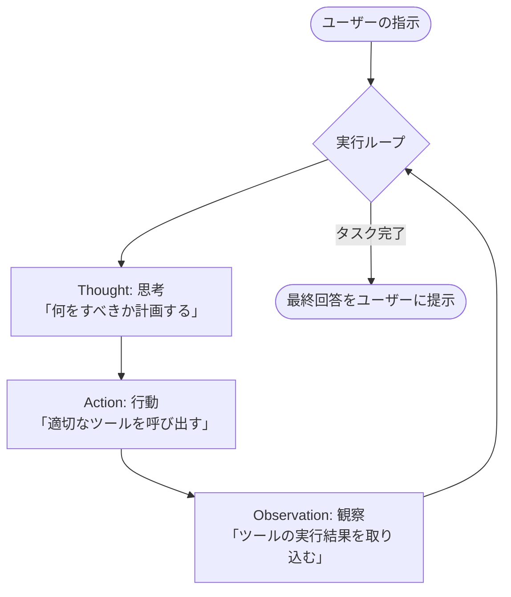

# Unit 29: AI Agent Fundamentals and Scratch ReAct Implementation

> [!IMPORTANT]
> **Preparing your OpenAI API key**
> Chapter 4 requires an **OpenAI API key**. For how to obtain a key, billing notes, and secure environment-variable setup with Google Colab secrets, read [Appendix (Learning Environment and API Setup)](../appendix/index.md#🔑-3-openai-api-key-acquisition-and-secure-management-chapter-4) first.

## 1. Understanding AI Agents and Hand-Built ReAct Loops

As LLMs evolve, systems that **autonomously think to reach goals, choose and run external tools, observe results, and decide next actions**—**AI Agents**—are spreading fast.

Many developers build agents with LangChain, LlamaIndex, or smolagents, but without understanding the underlying **autonomous loop**, troubleshooting unexpected behavior and infinite loops is hard.

This unit implements the canonical **ReAct (Reasoning and Acting)** pipeline from scratch using only OpenAI **Tool Calling (Function Calling)** and a Python **while loop**—no framework—to master agent fundamentals.

### 1.1 What is ReAct (Reasoning and Acting)?
ReAct alternates **reasoning** and **acting** so the LLM solves complex tasks step by step via **Thought ➔ Action ➔ Observation** cycles.



#### Text alternative for system structure
1. **Thought**: LLM plans which tool to run next or whether enough information exists.
2. **Action**: LLM outputs tool name and arguments; host executes externally.
3. **Observation**: Tool results (errors, search hits, etc.) feed back into LLM context for “observation.”

### 1.2 How OpenAI Tool Calling works
Tool Calling passes **tool schema definitions (name, description, parameters)** to the LLM so it decides **which tool with which arguments** to invoke.
The LLM does not execute code—it outputs **JSON instructions**; the host program (Python) runs tools safely (**in-process cooperation**).

### 💡 Concrete business use cases
* **Autonomous customer support**: For “Tell me shipping status,” agent calls tracking DB tool, interprets delay, reports to user.
* **Internal data analysis assistant**: For “Graph top 5 products this month,” agent runs SQL and visualization tools sequentially and delivers a report.
* **IT monitoring and recovery**: On server alert, agent uses log tool, then restart or patch tool via approval hooks.

---

## 2. Implementation Example

Use OpenAI Tool Calling for a full scratch ReAct loop where the agent autonomously uses a calculator and inventory lookup.

Run `pip install openai` and set `OPENAI_API_KEY`.

### Sample implementation

```python
import os
import json
from openai import OpenAI

# 1. クライアントの初期化
client = OpenAI(api_key=os.environ.get("OPENAI_API_KEY"))

# 2. エージェントが利用できる外部ツールの実体定義
def get_product_price(product_name: str) -> str:
    """データベースから製品の単価を取得する模擬ツール"""
    catalog = {
        "smartphone": 800,
        "laptop": 1200,
        "headphones": 150
    }
    price = catalog.get(product_name.lower())
    if price:
        return json.dumps({"product": product_name, "price_usd": price})
    return json.dumps({"error": f"製品 '{product_name}' は見つかりません。"})

def calculate_total_with_tax(price: float, quantity: int, tax_rate: float = 0.10) -> str:
    """数量と税率を加算して最終支払総額を計算する計算機ツール"""
    subtotal = price * quantity
    total = subtotal * (1 + tax_rate)
    return json.dumps({
        "subtotal": subtotal,
        "tax_rate": tax_rate,
        "total_amount": round(total, 2)
    })

# 3. OpenAI APIへ提示するツールのスキーマ定義 (Tool Definition)
tools_schema = [
    {
        "type": "function",
        "function": {
            "name": "get_product_price",
            "description": "データベースから指定された製品の現在の単価を取得します。",
            "parameters": {
                "type": "object",
                "properties": {
                    "product_name": {
                        "type": "string",
                        "description": "製品の名前 (例: smartphone, laptop)"
                    }
                },
                "required": ["product_name"]
            }
        }
    },
    {
        "type": "function",
        "function": {
            "name": "calculate_total_with_tax",
            "description": "商品の価格と個数、および税率（デフォルト10%）を入力して、消費税を加算した最終支払総額を算出します。",
            "parameters": {
                "type": "object",
                "properties": {
                    "price": {"type": "number", "description": "商品の単価"},
                    "quantity": {"type": "integer", "description": "購入個数"},
                    "tax_rate": {"type": "number", "description": "消費税率 (例: 0.10)"}
                },
                "required": ["price", "quantity"]
            }
        }
    }
]

# 4. ツールのマッピング定義 (名前から関数実体へのマッピング)
available_functions = {
    "get_product_price": get_product_price,
    "calculate_total_with_tax": calculate_total_with_tax
}

# 5. 自律 ReAct ループエンジンの実装
def run_react_agent(user_prompt: str, max_iterations: int = 5):
    print(f"🤖 [Agent Core] タスクを受信しました: '{user_prompt}'")
    
    # 会話履歴のコンテキスト初期化
    # システムプロンプトで「思考プロセス (Thought) を経てツールを呼ぶ」ように指示します
    messages = [
        {
            "role": "system", 
            "content": (
                "あなたは優秀な自律エージェントです。目標を達成するために必要な情報を Thought（思考）し、"
                "利用可能なツールを適切に Action（実行）してください。ツールの結果（Observation）を受け取ったら、"
                "さらに必要となる思考・行動を繰り返してください。すべての必要な情報が揃ったら、"
                "ユーザーに対して最終的な丁寧な回答を作成してループを終了してください。"
            )
        },
        {"role": "user", "content": user_prompt}
    ]
    
    step = 0
    while step < max_iterations:
        step += 1
        print(f"\n🌀 === Loop Iteration {step} ===")
        
        # LLMへ現在の履歴と利用可能ツールを渡して思考させる
        response = client.chat.completions.create(
            model="gpt-4o-mini",
            messages=messages,
            tools=tools_schema,
            tool_choice="auto"
        )
        
        response_message = response.choices[0].message
        messages.append(response_message)
        
        # 思考内容の出力
        if response_message.content:
            print(f"💭 [Thought]: {response_message.content}")
        
        tool_calls = response_message.tool_calls
        
        # ツール呼び出し（Action）の要求がない場合は、タスク完了とみなしてループを抜ける
        if not tool_calls:
            print("🎉 [Agent Core] 必要な情報が揃いました。回答を生成します。")
            return response_message.content
        
        # ツール呼び出しの処理
        for tool_call in tool_calls:
            function_name = tool_call.function.name
            function_args = json.loads(tool_call.function.arguments)
            
            print(f"🛠️ [Action]: ツール '{function_name}' を実行します。引数: {function_args}")
            
            # 関数の実行
            function_to_call = available_functions.get(function_name)
            if function_to_call:
                # 実行結果（Observation）の取得
                observation = function_to_call(**function_args)
                print(f"👁️ [Observation]: 実行結果: {observation}")
                
                # 観察結果をコンテキストへ追加
                messages.append({
                    "role": "tool",
                    "tool_call_id": tool_call.id,
                    "name": function_name,
                    "content": observation
                })
            else:
                print(f"❌ エラー: ツール '{function_name}' は定義されていません。")
                
    print("⚠️ [Agent Core] 最大実行ループ数を超過しました。")
    return "申し訳ありません、時間内にタスクを完了できませんでした。"

# 6. エージェントの実行デモ
if __name__ == "__main__":
    task = "smartphoneを3台欲しいです。最終的な消費税10%込みの支払総額はいくらになりますか？"
    final_answer = run_react_agent(task)
    print(f"\n======== 最終回答 ========\n{final_answer}")
```

---

## 3. Practice

### 🧠 Design and implement: autonomous returns and refund review agent

In production, agents combine **database checks** and **business rule judgment** for autonomous approve/reject decisions.

**【Requirements】**
You build an **automated returns and refund review agent** for an apparel e-commerce site.
Using the two mock tools below, **auto-approve and refund** requests within **30 days** of purchase; **auto-reject** (or respond for confirmation) for 31+ days or missing orders. Implement a **hand-built ReAct loop**.

### Mock database and API

```python
import json
from datetime import datetime

def check_purchase_date(order_id: str) -> str:
    """指定された注文IDの『購入日（YYYY-MM-DD）』をデータベースから取得するツール"""
    orders_db = {
        "order_101": "2026-05-15", # 本日の日付(2026-05-29)から14日前（承認対象）
        "order_202": "2026-04-10", # 本日の日付から49日前（期間超過のため自動却下対象）
    }
    order_date = orders_db.get(order_id.lower())
    if order_date:
        return json.dumps({"order_id": order_id, "purchase_date": order_date})
    return json.dumps({"error": f"注文ID '{order_id}' はデータベースに存在しません。"})

def execute_refund(order_id: str, amount: int) -> str:
    """払い戻し決済処理を実行する決済連携ツール"""
    return json.dumps({
        "status": "REFUNDED",
        "order_id": order_id,
        "amount_refunded_jpy": amount,
        "timestamp": datetime.now().isoformat()
    })
```

**【Your mission】**
1. Register both functions as tool schemas for OpenAI Tool Calling.
2. Tell the agent accurately in the system prompt: **“Today’s system date is 2026-05-29.”**
3. Implement a ReAct while loop (max ~3 iterations) so the agent autonomously:
   * **Thought**: Look up purchase date for order `order_101`.
   * **Action**: Run `check_purchase_date`.
   * **Observation**: Compute 14 days from `2026-05-15` to `2026-05-29` (within 30 days).
   * **Action**: Run `execute_refund` for eligible refund.
   * **Final answer**: Report auto-approval and completed refund to the user.
4. For `order_202` (49 days ago), verify the agent skips refund and responds that return is rejected because 30 days exceeded.

---

## 4. Answer Key

<details>
<summary>View sample solution (click to expand)</summary>

Complete scratch implementation of the autonomous refund review ReAct agent with OpenAI API.

```python
import os
import json
from datetime import datetime
from openai import OpenAI

client = OpenAI(api_key=os.environ.get("OPENAI_API_KEY"))

# ==========================================
# 1. 外部API・データベースの実体関数
# ==========================================
def check_purchase_date(order_id: str) -> str:
    orders_db = {
        "order_101": "2026-05-15",
        "order_202": "2026-04-10",
    }
    order_date = orders_db.get(order_id.lower())
    if order_date:
        return json.dumps({"order_id": order_id, "purchase_date": order_date})
    return json.dumps({"error": f"注文ID '{order_id}' はデータベースに存在しません。"})

def execute_refund(order_id: str, amount: int) -> str:
    return json.dumps({
        "status": "REFUNDED",
        "order_id": order_id,
        "amount_refunded_jpy": amount,
        "timestamp": datetime.now().isoformat()
    })

# ==========================================
# 2. OpenAI ツールスキーマ定義
# ==========================================
tools_schema = [
    {
        "type": "function",
        "function": {
            "name": "check_purchase_date",
            "description": "指定された注文IDの『購入日（YYYY-MM-DD）』をデータベースから検索して取得します。",
            "parameters": {
                "type": "object",
                "properties": {
                    "order_id": {
                        "type": "string",
                        "description": "注文のID (例: order_101)"
                    }
                },
                "required": ["order_id"]
            }
        }
    },
    {
        "type": "function",
        "function": {
            "name": "execute_refund",
            "description": "返品条件に適合した注文に対して、指定された金額（日本円）の払い戻し処理を実行します。",
            "parameters": {
                "type": "object",
                "properties": {
                    "order_id": {"type": "string", "description": "対象の注文ID"},
                    "amount": {"type": "integer", "description": "払い戻す金額 (円)"}
                },
                "required": ["order_id", "amount"]
            }
        }
    }
]

available_functions = {
    "check_purchase_date": check_purchase_date,
    "execute_refund": execute_refund
}

# ==========================================
# 3. 自律返品・払い戻しエージェントの実行
# ==========================================
def run_refund_agent(user_prompt: str, max_iterations: int = 5):
    print(f"\n🔍 [Refund Agent] タスク開始: '{user_prompt}'")
    
    # システムプロンプトでビジネスルールと本日のシステム日付を厳密に指示
    messages = [
        {
            "role": "system", 
            "content": (
                "あなたはアパレルECサイトの自律型返品審査エージェントです。\n"
                "【本日のシステム日付】: 2026-05-29\n"
                "【ビジネスルール】:\n"
                "1. 返品を希望する注文の『購入日』を check_purchase_date ツールで確認してください。\n"
                "2. 本日のシステム日付(2026-05-29)と購入日の差分（経過日数）を計算してください。\n"
                "3. 購入日から『30日以内』であれば、execute_refund ツールを実行して払い戻しを自動承認・実行してください。\n"
                "4. 購入日から『31日以上』経過している場合は、払い戻しを実行せず、速やかに『返品ポリシーの30日を超過しているため却下されました』という旨を最終回答としてユーザーに提示してください。"
            )
        },
        {"role": "user", "content": user_prompt}
    ]
    
    step = 0
    while step < max_iterations:
        step += 1
        print(f"\n[Loop Step {step}] 思考中...")
        
        response = client.chat.completions.create(
            model="gpt-4o-mini",
            messages=messages,
            tools=tools_schema,
            tool_choice="auto"
        )
        
        response_message = response.choices[0].message
        messages.append(response_message)
        
        if response_message.content:
            print(f"💭 [Thought]: {response_message.content}")
        
        tool_calls = response_message.tool_calls
        if not tool_calls:
            print("🎉 [Refund Agent] 意思決定プロセス完了。最終判断を提示します。")
            return response_message.content
        
        for tool_call in tool_calls:
            function_name = tool_call.function.name
            function_args = json.loads(tool_call.function.arguments)
            
            print(f"🛠️ [Action]: {function_name} 実行要求。引数: {function_args}")
            
            function_to_call = available_functions.get(function_name)
            if function_to_call:
                observation = function_to_call(**function_args)
                print(f"👁️ [Observation]: {observation}")
                
                messages.append({
                    "role": "tool",
                    "tool_call_id": tool_call.id,
                    "name": function_name,
                    "content": observation
                })
            else:
                print(f"❌ エラー: 指定されたツールが見つかりません。")

    return "処理がタイムアウトしました。"

# ==========================================
# 4. 承認と却下の両シナリオテスト
# ==========================================
if __name__ == "__main__":
    # シナリオ 1: 承認ケース (order_101: 14日前)
    print("\n--- シナリオ 1: 自動承認ケース (order_101) ---")
    ans1 = run_refund_agent("注文 order_101 のスニーカー（15,000円分）を返品したいので払い戻しをお願いします。")
    print(f"\n最終判定結果:\n{ans1}")
    
    # シナリオ 2: 却下ケース (order_202: 49日前)
    print("\n--- シナリオ 2: 自動却下ケース (order_202) ---")
    ans2 = run_refund_agent("注文 order_202 のジャケット（25,000円分）の返品・払い戻しをお願いします。")
    print(f"\n最終判定結果:\n{ans2}")
```
</details>
