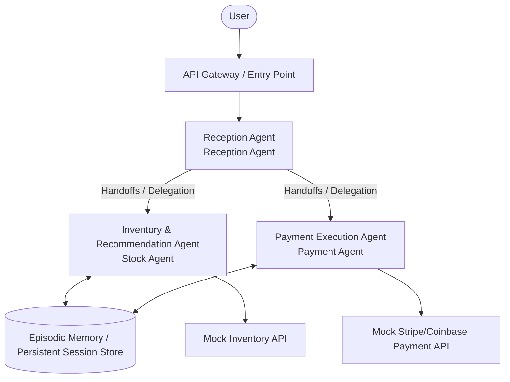

# Unit 32: Agent SDK — General Purpose & Business Automation

In Units 29–31, you learned autonomous agent fundamentals and tool integration using **open-source approaches** such as scratch ReAct, MCP, and smolagents. These are flexible and excellent for prototyping, but in enterprise environments, designing scalability, security, and state management yourself becomes a burden. This unit covers **enterprise agent construction with commercial Agent SDKs** designed to address those challenges.

In production AI systems, alongside OSS frameworks (LangGraph, smolagents, etc.), **commercial Agent SDKs** from major cloud/AI vendors are increasingly important.

This unit covers the architecture of commercial Agent SDKs built for enterprise requirements, persistent state management, and seamless integration with business capabilities.

---

## 1. Explanation Phase

### 1.1 Rise of Managed Agent SDKs and Differences from OSS
OSS agent frameworks offer high flexibility and suit rapid local prototyping, but production deployment requires you to design and operate scalability, security, and persistent state yourself.

In contrast, managed Agent SDKs from AI vendors integrate powerful enterprise features from the start:

1. **Fully managed infrastructure**: Serverless agent hosting and auto-scaling.
2. **Robust state persistence (Episodic Memory)**: Conversation sessions and context are automatically stored and restored in secure managed databases.
3. **Built-in safety**: Standard integration of guardrails (detecting and blocking inappropriate content and sensitive information).

### 1.2 Major Vendor Agent SDK Architectures

#### A. OpenAI Agents SDK
OpenAI's **Assistants API / Agents SDK** is a leading example of moving state management from in-process (application side) to remote cloud (OpenAI side).

- **Handoffs between agents**: Dynamically transfer control from one agent to a specialized agent while preserving conversation context.
- **Execution state persistence (Snapshotting / Thread Management)**: Conversation history (Threads) is stored on OpenAI servers; developers resume seamlessly by specifying a thread ID.

#### B. AWS Bedrock AgentCore SDK & Strands Agents
AWS **Bedrock AgentCore SDK** (`bedrock-agentcore-sdk-python`) is an agent development foundation deeply integrated with AWS enterprise infrastructure.

- **Episodic Memory**: Long-term memory mechanisms where agents recall past sessions and support decisions based on long-term context.
- **API gateway integration**: Register OpenAPI (Swagger) schemas and the system auto-generates mechanisms for agents to reach internal databases and APIs (order management, ERP, etc.) via AWS Lambda.

#### C. Meta Llama Stack / Llama Agents
Meta's **Llama Stack** emphasizes portability (architectural sovereignty) independent of a specific cloud vendor through standardized APIs.

- **Llama Guard 3**: Built-in security models for multi-layer evaluation and monitoring of input/output content safety.
- **Distributed agents (Llama Agents)**: Seamlessly port agents from local environments to multi-cloud using the same standard APIs.

### 1.3 Business Integration and Payments
Business automation agents are expected to go beyond search and summarization to **complete autonomous actions**.

This includes architectures that use **Episodic Memory (long-term context memory)** to remember "which products the user preferred in the past" while integrating with external payment APIs such as **Stripe or Coinbase** (or vendor explorations like `AgentCore Payments` agent-oriented autonomous wallet payments) to execute bookings and payments safely and automatically.

### 1.4 Architecture Selection Criteria

| Evaluation Axis | OSS Framework (LangGraph, etc.) | Commercial Managed SDK (Bedrock/OpenAI, etc.) |
|---|---|---|
| **Infrastructure management** | Self-hosted scaling required | Fully serverless, auto-scaling |
| **Security & authentication** | Implement and wire IAM/auth yourself | Strong integration via AWS IAM and vendor API keys |
| **Portability** | Very high (runs in any container) | Vendor lock-in risk (Llama Stack is an exception) |
| **Long-term memory** | Build your own DB (Redis/PostgreSQL) | Fully managed by SDK |

---

## 2. Practice

Here you implement a Python simulation to understand the core architecture of OpenAI Agents and AWS Bedrock AgentCore: **Episodic Memory (persistent sessions) and Handoffs (role delegation)**.

Build a pipeline where a reception agent recognizes the user and, depending on the task (inventory lookup, order and payment), hands state to specialist agents and autonomously completes payment processing via mock external APIs.

### Architecture Visualization



#### Text Alternative for System Architecture

1. **User request**: Reaches the API entry point.
2. **Reception Agent**: Loads the user's long-term memory (Episodic Memory) by session ID and interprets the request.
3. **Handoffs (delegation)**: For inventory checks, transfer to Stock Agent; for purchase/payment, transfer to Payment Agent while preserving context and state.
4. **External API execution**: Specialist agents call mock inventory or Stripe payment APIs, persist results, and respond.

### Sample Code Implementation

Copy and run the code below to observe cooperative agent behavior.

```python
import json
import uuid
from typing import Dict, Any, List, Tuple

# ==========================================
# 1. Persistent session store (Episodic Memory simulation)
# ==========================================
class EpisodicMemoryStore:
    def __init__(self):
        # In-memory pseudo database
        self.db: Dict[str, Dict[str, Any]] = {}

    def get_session(self, session_id: str) -> Dict[str, Any]:
        if session_id not in self.db:
            # Initial state
            self.db[session_id] = {
                "user_name": "ゲスト",
                "preferences": [],
                "cart": [],
                "purchase_history": [],
                "current_agent": "Reception"
            }
        return self.db[session_id]

    def save_session(self, session_id: str, data: Dict[str, Any]):
        self.db[session_id] = data
        print(f"[Memory Store] セッション {session_id} の状態を永続化しました。")

# ==========================================
# 2. External business APIs (mock inventory & payment)
# ==========================================
class MockBusinessAPI:
    @staticmethod
    def check_stock(item_name: str) -> Dict[str, Any]:
        # Mock inventory catalog
        catalog = {
            "laptop": {"price": 1200, "stock": 5},
            "smartphone": {"price": 800, "stock": 12},
            "headphones": {"price": 150, "stock": 0}  # Out of stock
        }
        return catalog.get(item_name.lower(), {"price": 0, "stock": 0})

    @staticmethod
    def execute_payment(session_id: str, amount: int, item: str) -> Tuple[bool, str]:
        # Stripe/Coinbase Payments API simulation
        if amount <= 0:
            return False, "決済金額が無効です。"
        tx_id = f"tx_{uuid.uuid4().hex[:8]}"
        return True, f"決済成功 (Stripe ID: {tx_id}) - 商品: {item}, 金額: ${amount}"

# ==========================================
# 3. Agent definitions & Handoffs architecture
# ==========================================
class Agent:
    def __init__(self, name: str):
        self.name = name

    def process(self, session_id: str, user_input: str, session_data: Dict[str, Any]) -> Tuple[str, Dict[str, Any]]:
        raise NotImplementedError

# Reception agent
class ReceptionAgent(Agent):
    def __init__(self):
        super().__init__("Reception")

    def process(self, session_id: str, user_input: str, session_data: Dict[str, Any]) -> Tuple[str, Dict[str, Any]]:
        print(f"\n[{self.name} Agent] ユーザー入力を解析中: '{user_input}'")
        
        # Save name if user introduces themselves
        if "私の名前は" in user_input:
            name = user_input.split("私の名前は")[-1].replace("です", "").strip()
            session_data["user_name"] = name
            return f"はじめまして、{name}様。ご用件を伺います（在庫検索、または購入決済）。", session_data
        
        # Intent: inventory search
        if "在庫" in user_input or "検索" in user_input or "ある？" in user_input:
            print(f"[{self.name} Agent] ──> 在庫照会エージェントへ制御を委譲 (Handoff)")
            session_data["current_agent"] = "Stock"
            return "在庫照会エージェントへお繋ぎします。", session_data

        # Intent: payment/purchase
        if "買う" in user_input or "購入" in user_input or "決済" in user_input:
            print(f"[{self.name} Agent] ──> 決済エージェントへ制御を委譲 (Handoff)")
            session_data["current_agent"] = "Payment"
            return "決済エージェントへお繋ぎします。", session_data

        return f"こんにちは、{session_data['user_name']}様。在庫検索、または商品の購入決済についてサポートできます。どちらをご希望ですか？", session_data

# Inventory specialist agent
class StockAgent(Agent):
    def __init__(self):
        super().__init__("Stock")

    def process(self, session_id: str, user_input: str, session_data: Dict[str, Any]) -> Tuple[str, Dict[str, Any]]:
        print(f"\n[{self.name} Agent] 在庫状況と価格を確認します...")
        
        # Simple keyword extraction for product name
        target_item = None
        for item in ["laptop", "smartphone", "headphones"]:
            if item in user_input.lower():
                target_item = item
                break
        
        if not target_item:
            return "どの商品の在庫をお探しですか？ (例: laptop, smartphone, headphones)", session_data
        
        # Call external API
        result = MockBusinessAPI.check_stock(target_item)
        if result["stock"] > 0:
            # Auto-save to cart (write to Episodic Memory)
            session_data["cart"].append({"item": target_item, "price": result["price"]})
            # Learn preference
            if target_item not in session_data["preferences"]:
                session_data["preferences"].append(target_item)
                
            # Implicit handoff back to reception
            session_data["current_agent"] = "Reception"
            return (
                f"{session_data['user_name']}様、{target_item}の在庫はあります！価格は ${result['price']} です。\n"
                f"商品をカートに追加しました。購入に進みますか？", 
                session_data
            )
        else:
            session_data["current_agent"] = "Reception"
            return f"申し訳ありません、{target_item}は現在在庫切れとなっております。", session_data

# Payment specialist agent
class PaymentAgent(Agent):
    def __init__(self):
        super().__init__("Payment")

    def process(self, session_id: str, user_input: str, session_data: Dict[str, Any]) -> Tuple[str, Dict[str, Any]]:
        print(f"\n[{self.name} Agent] カートと支払い情報を検証中...")
        
        cart = session_data.get("cart", [])
        if not cart:
            session_data["current_agent"] = "Reception"
            return "カートが空です。まずは在庫検索をして商品を追加してください。", session_data
        
        # Latest cart item
        target_purchase = cart[-1]
        item_name = target_purchase["item"]
        price = target_purchase["price"]
        
        # Execute payment (secure link to external Stripe, etc.)
        success, message = MockBusinessAPI.execute_payment(session_id, price, item_name)
        
        if success:
            # Update purchase history
            session_data["purchase_history"].append(item_name)
            # Clear cart
            session_data["cart"] = []
            
            # Return to reception
            session_data["current_agent"] = "Reception"
            return f"決済が成功しました！\n詳細: {message}\nまた何かお手伝いできることはありますか？", session_data
        else:
            return f"決済エラーが発生しました: {message}", session_data

# ==========================================
# 4. Agent orchestration engine
# ==========================================
class AgentOrchestrator:
    def __init__(self):
        self.memory = EpisodicMemoryStore()
        self.agents: Dict[str, Agent] = {
            "Reception": ReceptionAgent(),
            "Stock": StockAgent(),
            "Payment": PaymentAgent()
        }

    def handle_request(self, session_id: str, user_input: str) -> str:
        # 1. Load session state from persistent store
        session_data = self.memory.get_session(session_id)
        
        # 2. Identify currently active agent
        active_agent_name = session_data.get("current_agent", "Reception")
        agent = self.agents[active_agent_name]
        
        # 3. Business logic processing
        response, updated_session_data = agent.process(session_id, user_input, session_data)
        
        # 4. Check if handoff occurred
        next_agent_name = updated_session_data.get("current_agent", "Reception")
        if next_agent_name != active_agent_name:
            # Could re-process with delegated agent or wait for next user turn
            # Here we inform the user of the switch and wait for the next turn
            pass
            
        # 5. Persist updated session state
        self.memory.save_session(session_id, updated_session_data)
        
        return response

# ==========================================
# 5. Simulation test
# ==========================================
if __name__ == "__main__":
    orchestrator = AgentOrchestrator()
    my_session = "session_user_99"
    
    # Turn 1: Self-introduction and memory check
    print("\n=== TURN 1 ===")
    res1 = orchestrator.handle_request(my_session, "私の名前はアリスです。")
    print(f"Agent -> {res1}")
    
    # Turn 2: Inventory search (internal handoff, stock agent processes, returns to Reception)
    print("\n=== TURN 2 ===")
    res2 = orchestrator.handle_request(my_session, "laptop の在庫を検索してほしい")
    print(f"Agent -> {res2}")
    
    # Turn 3: Purchase request (transition to Payment agent and settle)
    print("\n=== TURN 3 ===")
    res3 = orchestrator.handle_request(my_session, "カートの商品を決済してください。")
    print(f"Agent -> {res3}")
```

---

## 3. Independent Implementation (Assignment)

### Assignment Requirements

Extend the cooperative agent simulation above with a more advanced customer service agent.

1. Define a new **Discount Agent (`DiscountAgent`)**.
2. When the user says things like "割引して" or "安くならない？", delegate control from `ReceptionAgent` to `DiscountAgent`.
3. `DiscountAgent` reads **purchase history (`purchase_history`)** from `EpisodicMemoryStore`.
   - If the user has **completed payment at least once before (repeat customer)**, apply a **10% repeat-customer discount** to the last item in the cart and update cart data.
   - For first-time users (empty purchase history), apply a flat **$10 new-registration discount**.
4. After applying the discount, automatically return control to `ReceptionAgent`, present the discounted price, and prompt the user to purchase.

---

## 4. Answer Key

<details>
<summary>View sample solution (click to expand)</summary>

Below is complete Python with `DiscountAgent` integrated, including repeat-customer logic and cart price updates.

```python
# Discount agent definition
class DiscountAgent(Agent):
    def __init__(self):
        super().__init__("Discount")

    def process(self, session_id: str, user_input: str, session_data: Dict[str, Any]) -> Tuple[str, Dict[str, Any]]:
        print(f"\n[{self.name} Agent] 割引の適用資格を審査中...")
        
        cart = session_data.get("cart", [])
        if not cart:
            session_data["current_agent"] = "Reception"
            return "カートが空のため、割引を適用できません。まずは商品をカートに追加してください。", session_data
        
        # Latest item eligible for discount
        target_purchase = cart[-1]
        original_price = target_purchase["price"]
        item_name = target_purchase["item"]
        
        # Check user history (repeat customer)
        purchase_history = session_data.get("purchase_history", [])
        
        if len(purchase_history) >= 1:
            # Repeat benefit: 10% OFF
            discounted_price = int(original_price * 0.9)
            discount_type = "リピーター特別10%割引"
        else:
            # First-time benefit: $10 OFF (avoid negative price)
            discounted_price = max(0, original_price - 10)
            discount_type = "新規登録記念 $10 割引"
        
        # Update cart (rewrite Episodic Memory)
        cart[-1]["price"] = discounted_price
        session_data["cart"] = cart
        
        # Return control to reception
        session_data["current_agent"] = "Reception"
        
        return (
            f"おめでとうございます！ {discount_type}が適用されました。\n"
            f"商品: {item_name}\n"
            f"価格: ${original_price} ──> ${discounted_price}\n"
            f"このまま購入に進みますか？ (はい/いいえ)", 
            session_data
        )

# Extended ReceptionAgent process method (discount request detection)
# (In production, extend ReceptionAgent conditions as follows)
"""
if "割引" in user_input or "安く" in user_input:
    print("[Reception Agent] ──> 割引提案エージェントへ制御を委譲 (Handoff)")
    session_data["current_agent"] = "Discount"
    return "割引の確認処理へお繋ぎします。", session_data
"""

# ==========================================
# Verification code (standalone test)
# ==========================================
if __name__ == "__main__":
    # Test simulation
    store = EpisodicMemoryStore()
    session_id = "test_user_45"
    
    # Setup: laptop $1200 in cart, past purchase of smartphone (repeat customer)
    session = store.get_session(session_id)
    session["user_name"] = "ボブ"
    session["cart"].append({"item": "laptop", "price": 1200})
    session["purchase_history"].append("smartphone")  # Make repeat customer
    store.save_session(session_id, session)
    
    # Apply discount agent
    discount_agent = DiscountAgent()
    response, updated_session = discount_agent.process(session_id, "安くして！", session)
    
    print("\n--- 割引エージェントからの応答 ---")
    print(response)
    print("更新後のカート内容:", updated_session["cart"])
```
</details>
