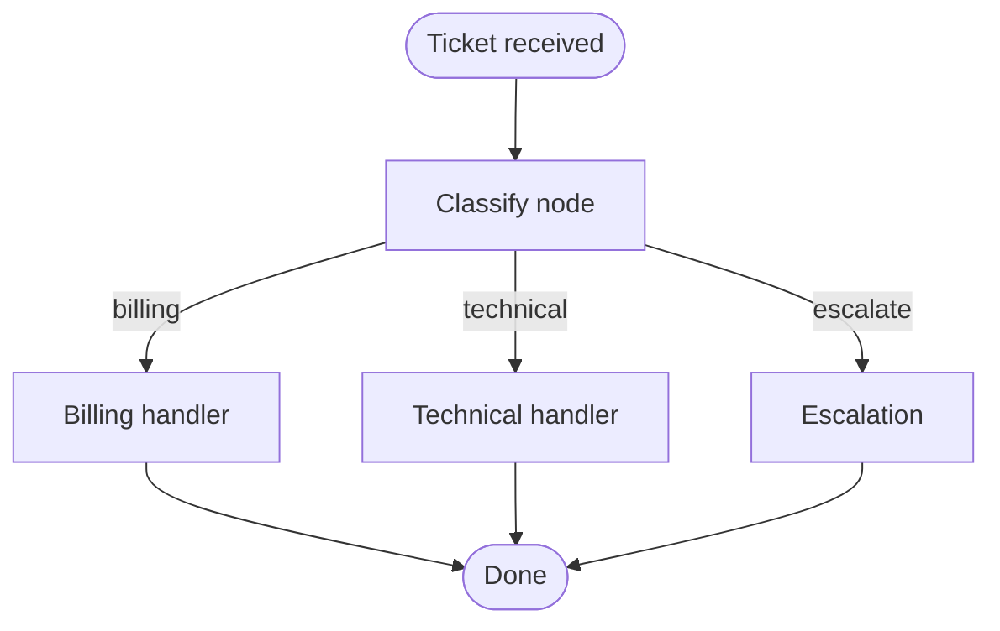

# Unit 32: LangGraph — Graph-Based Stateful Agents

<p class="unit-hero">
  
</p>

In Unit 31 you learned **code-generation agents (Code Agent)** with smolagents. This unit introduces a different paradigm: **graph-based workflow control**. LangGraph models agent logic as **nodes** and **edges**, passing **shared state** between steps so you can add conditional routing and **human-in-the-loop** approval gates explicitly.

---

## 1. Understanding LangGraph and Stateful Workflows


### 1.1 Why a graph?

Unit 29’s ReAct loop uses **implicit control flow inside a while loop**. Unit 31’s smolagents focuses on **executing LLM-written Python**. In production, you often need:

- **Explicit branching** based on classification results
- **Human approval** for high-risk or VIP cases
- **Durable state** so workflows can pause and resume

LangGraph expresses these requirements as a **directed graph**.

| Concept | Role | Everyday analogy |
| :--- | :--- | :--- |
| **State** | Shared data passed between nodes (dict / TypedDict) | A support “ticket record” |
| **Node** | A step that reads and updates state | “Classify”, “hand off to billing” |
| **Edge** | Transition to the next node | “If billing → Billing node” |

### 1.2 Comparison with smolagents (Code Agent)

| Axis | smolagents (Code Agent) | LangGraph (Graph Workflow) |
| :--- | :--- | :--- |
| **Visibility of control** | Hidden inside generated code | **Easy to visualize and audit** as a graph |
| **Branching** | `if` statements in code | **Edge functions** define routes explicitly |
| **Human-in-the-loop** | Possible but scattered | **Dedicated nodes** fit naturally |
| **Best fit** | One-shot calculation / data transforms | Routing, approvals, long-lived workflows |

### 1.3 Typical use cases

* **Support ticket routing**: billing / technical / escalate
* **Human-in-the-loop**: require approval for VIP or urgent tickets before auto-reply
* **Multi-step business flows**: search → summarize → approve → send



---


## 2. Implementation Example

This **local simulation** (no OpenAI API key required) reproduces LangGraph’s core ideas: **State / Nodes / conditional edges**. A simple keyword classifier routes support tickets through **classify ➔ billing / technical / escalate**.

```python
from typing import Literal, TypedDict


class TicketState(TypedDict):
    message: str
    category: str
    route: str
    response: str


def classify_node(state: TicketState) -> TicketState:
    text = state["message"].lower()
    if any(k in text for k in ("refund", "billing", "invoice")):
        state["category"] = "billing"
    elif any(k in text for k in ("error", "bug", "crash")):
        state["category"] = "technical"
    else:
        state["category"] = "escalate"
    return state


def route_ticket(state: TicketState) -> Literal["billing", "technical", "escalate"]:
    return state["category"]  # type: ignore[return-value]


def billing_node(state: TicketState) -> TicketState:
    state["route"] = "billing"
    state["response"] = "Billing will contact you within 24 hours."
    return state


def technical_node(state: TicketState) -> TicketState:
    state["route"] = "technical"
    state["response"] = "Technical support will review logs and ask for repro steps."
    return state


def escalate_node(state: TicketState) -> TicketState:
    state["route"] = "escalate"
    state["response"] = "A dedicated agent will prioritize your case."
    return state


NODE_MAP = {
    "billing": billing_node,
    "technical": technical_node,
    "escalate": escalate_node,
}


def run_support_graph(message: str) -> TicketState:
    state: TicketState = {
        "message": message,
        "category": "",
        "route": "",
        "response": "",
    }
    state = classify_node(state)
    next_node = route_ticket(state)
    state = NODE_MAP[next_node](state)
    return state


if __name__ == "__main__":
    samples = [
        "My invoice amount looks wrong. Can I get a refund?",
        "The app crashes right after launch.",
        "I have a general question about your service.",
    ]
    for msg in samples:
        result = run_support_graph(msg)
        print(f"[{result['route']}] {result['response']}")
```

> [!TIP]
> In production you register these nodes and edges with LangGraph’s `StateGraph`. This PoC focuses on **control-flow fundamentals** without an API key.

---

## 3. Practice

**Task:** Extend the routing graph with **human-in-the-loop**:

1. If the ticket contains `VIP` or `urgent`, pause at a **human approval node** before auto-reply
2. If approved, continue to billing / technical / escalate as before
3. If rejected, reply with “An agent will follow up later” and stop

**Comment in code:**

- Why a **dedicated graph node** is easier to maintain than scattered `if` checks
- Why LangGraph fits this task better than a Code Agent

---

## 4. Answer Key

<details>
<summary>Show solution (click to expand)</summary>

```python
from typing import Literal, TypedDict


class TicketState(TypedDict):
    message: str
    category: str
    route: str
    needs_human: bool
    approved: bool | None
    response: str


def classify_node(state: TicketState) -> TicketState:
    text = state["message"].lower()
    if any(k in text for k in ("refund", "billing", "invoice")):
        state["category"] = "billing"
    elif any(k in text for k in ("error", "bug", "crash")):
        state["category"] = "technical"
    else:
        state["category"] = "escalate"
    return state


def detect_human_gate(state: TicketState) -> TicketState:
    text = state["message"]
    state["needs_human"] = any(k in text for k in ("VIP", "urgent"))
    return state


def human_approval_node(state: TicketState) -> TicketState:
    print(f"[HUMAN REVIEW] {state['message']}")
    answer = input("Approve? (y/n): ").strip().lower()
    state["approved"] = answer in ("y", "yes")
    if not state["approved"]:
        state["response"] = "An agent will follow up later."
    return state


def billing_node(state: TicketState) -> TicketState:
    state["route"] = "billing"
    state["response"] = "Billing will contact you within 24 hours."
    return state


def technical_node(state: TicketState) -> TicketState:
    state["route"] = "technical"
    state["response"] = "Technical support will review logs and ask for repro steps."
    return state


def escalate_node(state: TicketState) -> TicketState:
    state["route"] = "escalate"
    state["response"] = "A dedicated agent will prioritize your case."
    return state


NODE_MAP = {
    "billing": billing_node,
    "technical": technical_node,
    "escalate": escalate_node,
}


def after_classify(state: TicketState) -> Literal["human", "route"]:
    return "human" if state["needs_human"] else "route"


def after_human(state: TicketState) -> Literal["route", "done"]:
    return "route" if state.get("approved") else "done"


def run_support_graph_with_hitl(message: str) -> TicketState:
    state: TicketState = {
        "message": message,
        "category": "",
        "route": "",
        "needs_human": False,
        "approved": None,
        "response": "",
    }
    state = classify_node(state)
    state = detect_human_gate(state)

    if after_classify(state) == "human":
        state = human_approval_node(state)
        if after_human(state) == "done":
            return state

    next_node = state["category"]
    return NODE_MAP[next_node](state)
```

### Design notes

* **Isolate approval in one node** so audit logs and UI hooks stay centralized.
* **Pick LangGraph** when routing and approval gates matter more than one-shot code execution.

</details>
