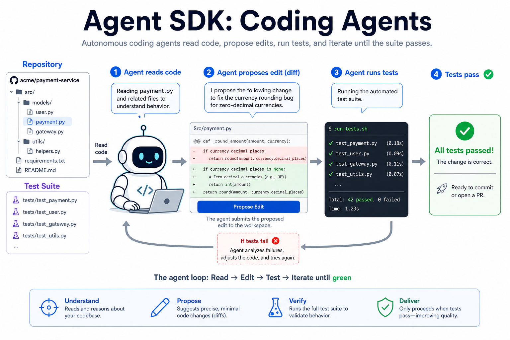
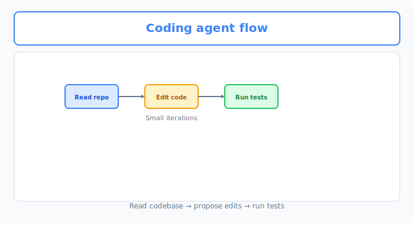
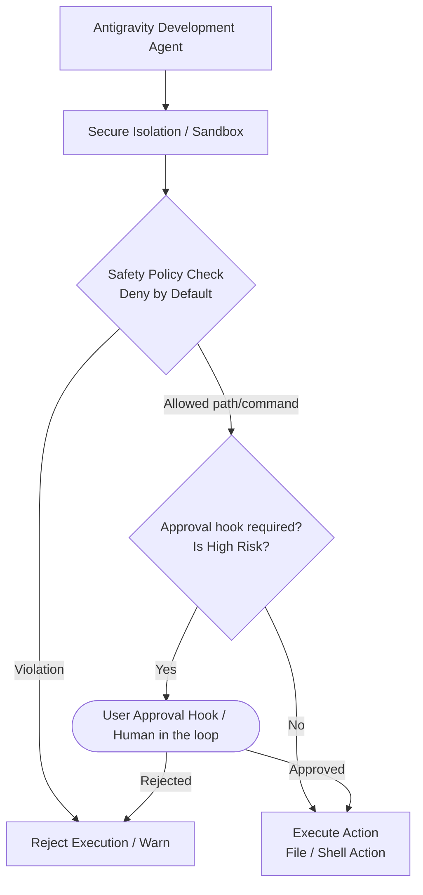
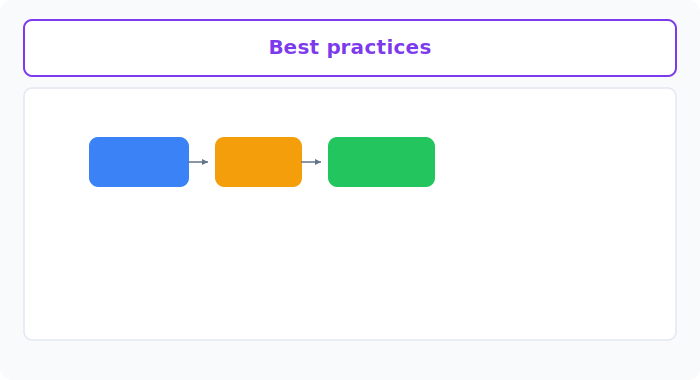

# Unit 34: Agent SDK — Coding & Autonomous Development

<p class="unit-hero">
  
</p>

In the previous unit (Unit 33), you learned **general-purpose business automation agents** (reception, inventory lookup, payment, etc.) using commercial Agent SDKs. This unit extends that with **Agent SDKs specialized for coding and autonomous development**. Unlike business automation agents, autonomous development agents have powerful permissions over the file system and shell, so stricter safety design is required.

In software development automation, **autonomous development agents (SWE Agents / Coding Agents)** that autonomously generate and modify code and execute commands are evolving rapidly.

Because they can perform destructive, irreversible operations on the system (files and terminal), they require **strict safety design and sandbox isolation** far beyond typical information-processing agents.

This unit covers architectures specific to autonomous development agents, safety policies (Deny by Default), and Human-in-the-loop (approval hook) implementation.

---

## 1. Explanation Phase




### 1.1 What Makes Autonomous Coding / Software Development Agents Different
While general business automation agents perform limited API integrations such as "send email" or "book calendar," autonomous development agents have powerful, broad tool bindings:

- **File system operations**: Read, create, overwrite, and delete project source code.
- **Shell/terminal execution**: Run build commands, unit tests, compilation, and external module installation.
- **Linter/LSP (Language Server Protocol) integration**: Real-time syntax checking and auto-fix.

These operations can cause severe damage from a single mistake—infinite loops exhausting resources, accidental deletion of critical source, or unintended malicious commands—so commercial development Agent SDKs include strong built-in protections.

### 1.2 Representative Autonomous Development Agent SDKs

#### A. OpenAI Codex SDK (Legacy / Current Assistants)
Evolving from the early Codex autonomous coding model, current Assistants API and inline coding tools specialize in understanding user source context and generating correction patches.

#### B. Google Antigravity SDK
Google's **Google Antigravity SDK (`google-antigravity`)** is a state-of-the-art framework for development agents designed to maximize development environment safety.

- **Deny by Default**: Policy design that automatically rejects all actions except those explicitly allowed.
- **Fine-Grained Sandbox**: Restrict agent activity to a specific project directory (Workspace) to protect the system.
- **Interactive approval hooks**: Lifecycle hooks that require explicit human approval before the agent modifies the file system or runs shell commands.

### 1.3 Critical Safety Design for Development Agents

When operating autonomous development agents in production or real environments, these three safety layers are mandatory:



#### Text Alternative for System Architecture

1. **Isolation (Sandbox)**: Agents must run inside isolation such as Docker containers; block direct host access.
2. **Deny by Default**: Block immediately at the validation layer anything outside allowed directory paths and command patterns.
3. **Human-in-the-loop (approval hooks)**: Even within allowed scope, high-risk operations (file writes, build commands) require human approval before execution.

---



## 2. Practice

Here you implement Python that simulates the core safety features of Google Antigravity SDK: **Deny by Default safety policy** and **Human-in-the-loop (approval hooks)**.

Build a pipeline where the system validates safety policy when the agent overwrites source files or runs test commands, and requests interactive approval when needed.

### Sample Code Implementation

Copy and run the code below to observe the safety control process.

```python
import os
import re
from typing import Dict, Any, List, Tuple, Callable

# ==========================================
# 1. Declarative safety policy (Deny by Default)
# ==========================================
class SafetyPolicy:
    def __init__(self, allowed_directory: str, allowed_commands: List[str]):
        # Normalize to absolute paths
        self.allowed_directory = os.path.abspath(allowed_directory)
        # List of allowed command regex patterns
        self.allowed_commands = allowed_commands

    def is_path_safe(self, target_path: str) -> bool:
        """Verify target path is within allowed directory (path traversal defense)"""
        abs_target = os.path.abspath(target_path)
        # Check path starts under allowed directory
        return abs_target.startswith(self.allowed_directory)

    def is_command_safe(self, command: str) -> bool:
        """Verify shell command matches allowed patterns"""
        for allowed_pattern in self.allowed_commands:
            if re.match(allowed_pattern, command):
                return True
        return False

# ==========================================
# 2. Mock Google Antigravity Agent environment
# ==========================================
class AntigravityAgentSandbox:
    def __init__(self, policy: SafetyPolicy):
        self.policy = policy
        # Approval callback hook
        self.pre_execute_hook: Callable[[str, str], bool] = self.default_approval_prompt
        # Mock file system
        self.virtual_files: Dict[str, str] = {}

    @staticmethod
    def default_approval_prompt(action_type: str, detail: str) -> bool:
        """Default Human-in-the-loop approval screen"""
        print(f"\n⚠️  [HUMAN-IN-THE-LOOP] Approval required:")
        print(f"   Action: {action_type}")
        print(f"   Detail: {detail}")
        user_choice = input("   Approve this action? (y/n): ").strip().lower()
        return user_choice == 'y'

    def write_file(self, file_path: str, content: str) -> Tuple[bool, str]:
        """Write file according to safety policy"""
        # 1. Deny by Default path check
        if not self.policy.is_path_safe(file_path):
            return False, f"[SECURITY ERROR] Write to unauthorized path rejected: {file_path}"
        
        # 2. Approval hook (Human-in-the-loop)
        # File writes are high-risk regardless of create vs overwrite
        is_overwrite = file_path in self.virtual_files
        action_name = "File overwrite" if is_overwrite else "New file creation"
        
        if self.pre_execute_hook(action_name, f"Path: {file_path}"):
            self.virtual_files[file_path] = content
            return True, f"File written successfully: {file_path}"
        else:
            return False, "[USER REJECTED] Write rejected by user."

    def execute_command(self, command: str) -> Tuple[bool, str]:
        """Execute shell command according to safety policy"""
        # 1. Deny by Default command check
        if not self.policy.is_command_safe(command):
            return False, f"[SECURITY ERROR] Command not allowed or dangerous: {command}"
        
        # 2. Approval hook (Human-in-the-loop)
        # Command execution always requires approval
        if self.pre_execute_hook("Shell command execution", f"Command: {command}"):
            # Simulated execution
            print(f"[Sandbox Console] Running: {command} ...")
            if "test" in command:
                return True, "Mock test result: 3/3 tests passed."
            return True, "Command executed successfully."
        else:
            return False, "[USER REJECTED] Command execution rejected by user."

# ==========================================
# 3. Test simulation
# ==========================================
if __name__ == "__main__":
    # Safety policy setup
    # - Workspace: only within current dummy working directory
    # - Commands: only pytest or python -m unittest style (rm/sudo auto-rejected)
    my_workspace = "./sandbox_workspace"
    my_policy = SafetyPolicy(
        allowed_directory=my_workspace,
        allowed_commands=[
            r"^pytest\s+[\w\.\-/]+$",        # pytest [file path]
            r"^python\s+-m\s+unittest\s+[\w\.]+$" # python -m unittest [module]
        ]
    )

    # Build sandbox
    sandbox = AntigravityAgentSandbox(my_policy)

    # ------------------------------------------
    # Scenario A: Write to allowed path (approve -> success)
    # ------------------------------------------
    print("\n=== Scenario A: Write to allowed path ===")
    safe_file_path = os.path.join(my_workspace, "app.py")
    success, msg = sandbox.write_file(safe_file_path, "def add(a, b): return a + b")
    print(f"Result: {success} | Message: {msg}")

    # ------------------------------------------
    # Scenario B: Write outside path (Deny by Default immediate error)
    # ------------------------------------------
    print("\n=== Scenario B: Write request to system area ===")
    dangerous_file_path = "/etc/hosts" # Dangerous external path
    success, msg = sandbox.write_file(dangerous_file_path, "127.0.0.1 dangerous.site")
    print(f"Result: {success} | Message: {msg}")

    # ------------------------------------------
    # Scenario C: Allowed test command (approve -> success)
    # ------------------------------------------
    print("\n=== Scenario C: Execute allowed command ===")
    success, msg = sandbox.execute_command("pytest test_app.py")
    print(f"Result: {success} | Message: {msg}")

    # ------------------------------------------
    # Scenario D: Dangerous command (Deny by Default immediate error)
    # ------------------------------------------
    print("\n=== Scenario D: Execute dangerous command ===")
    success, msg = sandbox.execute_command("rm -rf /") # Destructive command
    print(f"Result: {success} | Message: {msg}")
```

---

## 3. Independent Implementation (Assignment)

### Assignment Requirements

Based on the `AntigravityAgentSandbox` system above, implement an **autonomous agent** that performs more advanced autonomous development tasks.

1. Implement a **`DebuggerAgent` (Autonomous Debugger Agent)** class.
2. This agent runs the following multi-step autonomous workflow:
   - **Step 1 (Read and analyze file)**: Load Python code `app.py` in the workspace (mock string load is fine).
   - **Step 2 (Debug fix)**: When obvious errors are found (missing closing bracket, `ZeroDivisionError` risk, etc.), generate fixed code and write to `app.py` via `sandbox.write_file`.
   - **Step 3 (Verification test)**: Call `sandbox.execute_command` with `pytest test_app.py` to verify the fix.
3. During autonomous processing, verify on the console that **file writes and command execution complete safely through the approval hook without being blocked by safety policy**.

---

## 4. Answer Key

<details>
<summary>View sample solution (click to expand)</summary>

Below is a complete sample that implements the autonomous debugger agent and safely simulates "source fix → write → test run" within safety policy.

```python
# ==========================================
# Assignment solution: Autonomous debugger agent
# ==========================================
class DebuggerAgent:
    def __init__(self, sandbox: AntigravityAgentSandbox):
        self.sandbox = sandbox

    def run_auto_debug(self, workspace_dir: str):
        print(f"\n[DebuggerAgent] 🔧 Starting autonomous debug task.")
        
        target_file = os.path.join(workspace_dir, "app.py")
        
        # 1. Mock code analysis (buggy code)
        broken_code = "def divide(a, b):\n    return a / b  # Bug: no guard for b=0"
        print(f"[DebuggerAgent] Analyzing target file: {target_file}")
        
        # 2. Generate fixed code
        fixed_code = "def divide(a, b):\n    if b == 0:\n        return 0\n    return a / b"
        print(f"[DebuggerAgent] Bug detected. Applying fix.")
        
        # Write via sandbox (user approval required)
        success, msg = self.sandbox.write_file(target_file, fixed_code)
        if not success:
            print(f"[DebuggerAgent] ❌ Failed to write fixed file: {msg}")
            return
        
        print(f"[DebuggerAgent] ✅ {msg}")

        # 3. Verification via test command (user approval required)
        test_command = "pytest test_app.py"
        print(f"[DebuggerAgent] Running verification test: {test_command}")
        
        success, test_msg = self.sandbox.execute_command(test_command)
        if not success:
            print(f"[DebuggerAgent] ❌ Test execution rejected or failed: {test_msg}")
            return
            
        print(f"[DebuggerAgent] 🎉 Debug complete!: {test_msg}")

# ==========================================
# Safe autonomous agent test
# ==========================================
if __name__ == "__main__":
    # Policy setup
    workspace = "./sandbox_workspace"
    policy = SafetyPolicy(
        allowed_directory=workspace,
        allowed_commands=[r"^pytest\s+[\w\.\-/]+$"]
    )
    
    # Isolated sandbox
    sandbox_env = AntigravityAgentSandbox(policy)
    
    # Start debugger agent
    agent = DebuggerAgent(sandbox_env)
    
    # Run task
    agent.run_auto_debug(workspace)
```
</details>
