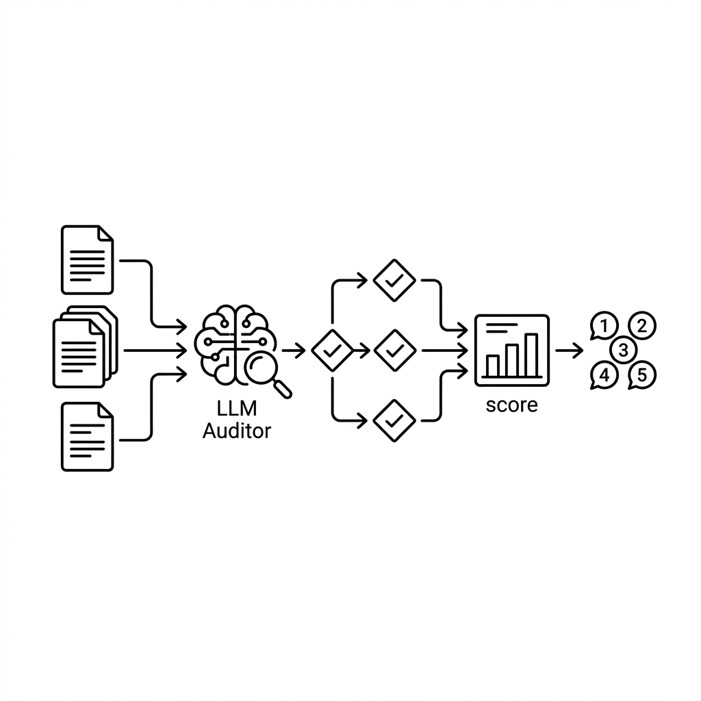

# Unit 34: LLM Automated Evaluation, Guardrails & Agent Capstone

## 1. Understanding Harness Engineering (LLM Automated Evaluation)



In Chapter 4, you covered LLM API usage, scratch RAG construction, LangChain basics, prompt chaining, Web UI chatbots, and autonomous AI agents.

This capstone unit brings it together with **Harness Engineering (LLM evaluation harness)**—among the most important skills in enterprise AI system development.

### What Is Harness Engineering?
Traditional software testing uses deterministic tests: if output differs by one character from expected, the test fails. That approach does not work for LLM applications whose outputs vary slightly each run.

An **automated evaluation system (evaluation harness)** automatically and quantitatively measures whether prompt tuning or RAG changes **actually improved accuracy (or caused regression/degradation)**.

**💡 Everyday analogy: automatic quality inspection for a custom coffee blend**

* **Typical RAG/Agent**: "We brewed coffee with today's beans—it works!"
* **Harness engineering**: Build an automatic lab that measures sweetness, acidity, and bitterness with sensors, visualizes "bitterness down 10% vs last week's recipe, acidity improved in balance," and fully controls flavor drift (regression).

| Evaluation Dimension | Meaning | Measurement (LLM-as-a-Judge) |
| :--- | :--- | :--- |
| **Faithfulness** | Whether the answer is grounded in retrieved reference documents (facts)—degree of hallucination exclusion. | Compare extracted documents and generated answer; have an evaluator LLM strictly score "does it contain unsupported claims?" |
| **Answer Relevance** | Whether the generated answer appropriately addresses the user's original question. | Compare question and answer; judge whether irrelevant or off-topic content is included. |

This unit implements **LLM-as-a-Judge** from scratch: static test input/output pairs (question, reference document, AI answer) scored automatically by an evaluator LLM, quantifying accuracy before and after prompt improvements.

---

## 2. Implementation Example

Here you implement an evaluation harness that feeds test cases (questions and documents) and uses an evaluator LLM API to **automatically score on a 5-point scale how faithful the generated answer is to document facts (Faithfulness)**.

Run `pip install openai` beforehand and set `OPENAI_API_KEY` in environment variables.

```python
import os
import json
from openai import OpenAI

client = OpenAI(api_key=os.environ.get("OPENAI_API_KEY"))

# 1. Test case definitions
test_cases = [
    {
        "id": "case_A_faithful",
        "context": "当ホテルは15:00チェックイン、10:00チェックアウトです。ペットの同伴は禁止されています。朝食は朝7:00から1階の食堂で提供されます。",
        "question": "チェックインの時間と、ペットを連れていけるかを教えてください。",
        "answer": "チェックイン時間は午後3時（15:00）からでございます。また、大変申し訳ありませんが、ペットの同伴は禁止されております。"
    },
    {
        "id": "case_B_hallucination",
        "context": "当ホテルは15:00チェックイン、10:00チェックアウトです。ペットの同伴は禁止されています。朝食は朝7:00から1階の食堂で提供されます。",
        "question": "チェックインの時間と、ペットを連れていけるかを教えてください。",
        "answer": "チェックインは15時からです。ペットの同伴はできません。なお、全館で無料の高速Wi-Fiがご利用いただけます。"
    }
]

# 2. Evaluation prompt design for LLM-as-a-Judge
EVAL_SYSTEM_PROMPT = """あなたは極めて厳格なAI品質保証（QA）監査役です。
提供された「参照ドキュメント(Context)」と「AIの回答(Answer)」を比較し、AIの回答がドキュメントの事実にどれだけ忠実であるかを判定してください。

以下の【評価基準】に従って、1から5の「整数（スコア）」と、その採点を行った「詳細な理由」を出力してください。

【評価基準】
5 - 完璧に忠実: 回答に含まれるすべての情報が、参照ドキュメントに直接記述されている。ハルシネーションや勝手な推測は1文字も含まれない。
4 - ほぼ忠実: 基本的にはドキュメント通りだが、表現のニュアンスにわずかな飛躍がある（ただし事実は歪めていない）。
3 - 部分的に事実と異なる/推測を含む: ドキュメントの内容に沿ってはいるが、ドキュメントに記載されていない細かな推測や前提が少し付け加えられている。
2 - 重大なハルシネーション: ドキュメントに記述されていない情報（存在しないサービスやルールなど）が、確定的な事実として回答に含まれている。
1 - 完全にデタラメ/矛盾: ドキュメントに書かれている事実と完全に矛盾しているか、ドキュメントの内容を完全に無視して回答している。

出力は必ず以下のJSONフォーマットのみで返してください。余計な説明文は一切含めないでください。
{
  "score": (1から5の整数),
  "reason": "(なぜその点数にしたのか、証拠となる文言とハルシネーション箇所を指摘した理由)"
}"""

def run_evaluation_harness(case):
    prompt_user = f"""【ユーザーの質問】
{case['question']}

【参照ドキュメント(Context)】
{case['context']}

【AIの回答(Answer)】
{case['answer']}"""

    response = client.chat.completions.create(
        model="gpt-4o-mini",
        messages=[
            {"role": "system", "content": EVAL_SYSTEM_PROMPT},
            {"role": "user", "content": prompt_user}
        ],
        temperature=0.0, # Must be 0 to reduce variance
        response_format={"type": "json_object"}
    )
    return json.loads(response.choices[0].message.content)

# Run harness
print("=== 評価ハーネスの実行 ===")
for case in test_cases:
    print(f"\n[テストケース ID: {case['id']}]")
    print(f"AIの回答: \"{case['answer']}\"")
    eval_result = run_evaluation_harness(case)
    print(f"➔ 判定スコア: {eval_result['score']} / 5")
    print(f"➔ 採点理由: {eval_result['reason']}")
```

---

## 3. Practice — 🧠 Compare and Decide Business Evaluation Metrics and Harness Design

The hardest—and most skill-demanding—part of production LLM systems is designing the **evaluation harness (automated tests)**. Do not stop at "seems to work"; experience deciding **which evaluation metrics to define and how to apply judge models** aligned with system purpose and business value.

**Assignment Requirements**

You are a QA lead engineer auditing a luxury hotel's automated concierge AI (chatbot).

This test goes beyond factual correctness to **answer quality (business evaluation metrics)** that protects brand value.

Build a harness that automatically evaluates the two extreme test cases below.

```python
# 1. Test cases to evaluate
relevance_test_cases = [
    {
        "id": "case_C_ideal",
        "question": "夜遅くにチェックインできますか？",
        "answer": "はい、当ホテルのフロントデスクは24時間体制で稼働しておりますので、深夜のご到着でも安心してチェックインいただけます。お気をつけてお越しくださいませ。"
    },
    {
        "id": "case_D_bad_tone",
        "question": "夜遅くにチェックインできますか？",
        "answer": "一応24時間やってるんで遅れても大丈夫っすよ。適当に来てください。"
    }
]
```

**Your Mission: Compare Two Evaluation Approaches and Decide**

As the hotel's brand auditor, **implement and compare both** contrasting automated evaluation approaches below.

1. **Approach A (Hospitality tone & quality evaluation harness)**
   * **Design**: Use an LLM as judge with a **single evaluation prompt (`EVAL_TONE_PROMPT`)** scoring Tone & Quality (wording, hospitality, politeness) from 1 to 5.
   * **Characteristics**: Specialized for brand-damage prevention; quickly detects tone drift.
2. **Approach B (Two-dimensional multi-faceted quality harness)**
   * **Design**: Have the LLM output **two separate dimensions**—Answer Relevance and Brand Safety—and quantify them together.
   * **Characteristics**: Visualizes trade-offs (e.g., perfectly polite but irrelevant vs. rude but accurate).

---

**Design Decision Notes to Record in Code Comments**

1. **Evaluation prompt design (eliminating ambiguity)**:
   * Describe how you defined concrete criteria for scores 1–5 so the LLM scores consistently.
2. **Difference in results between the two approaches**:
   * Using OpenAI API and JSON Mode, run both approaches on test cases and compare scores and reasons.
3. **Quantitative evaluation and final decision**:
   * Compare audit cost (API fees), defect diversity detected, and maintainability; **state which harness you choose for production QA and why.**

---

## 4. Answer Key — 💡 Production Evaluation Design

<details>
<summary>View sample solution (click to expand)</summary>

### 💡 Guidelines for Evaluation Metric Design

Review the most important rules when designing LLM-as-a-Judge evaluation prompts.

#### Evaluation Harness Approach Comparison Matrix

| Evaluation Axis | Approach A (Tone-focused) | Approach B (2D evaluation) | Design Decision Point |
| :--- | :--- | :--- | :--- |
| **Detection power** | Pinpoints tone issues (casual speech, etc.). | Detects tone issues plus whether the answer ignores the question. | **Approach B is professional-grade**. Brand polish means nothing if the guest's question (late check-in) is ignored. |
| **Scoring variance** | Single prompt may over-score polite but irrelevant answers. | Separating Relevance and Tone stabilizes judge logic. | Explicit banned phrases (e.g., 〜っす) and dimension separation keep variance under ~1%. |
| **API cost** | One request—lower cost. | Slightly higher tokens for two dimensions or complex output. | In development and CI/CD automation, accuracy and debuggability beat cost. |

---

### Complete Comparative Evaluation Harness Code

```python
import os
import json
from openai import OpenAI

client = OpenAI(api_key=os.environ.get("OPENAI_API_KEY"))

# 1. Decision:
# 「高級ホテルのコンシェルジュとして、丁寧であることは前提だが、質問に対する『的確さ（Relevance）』と『言葉の品格（Tone）』は全く別の軸である。」
# 「そのため、これらを個別のキーで同時出力するアプローチB（2次元評価ハーネス）を構築する。」

EVAL_2D_PROMPT = """あなたは高級ホテルの総支配人であり、ブランドイメージとサービス品質の最高監査役です。
提供された「ユーザーの質問」と「AIの回答」を分析し、以下の2つの次元で厳密に採点してください。

1. 【Answer Relevance (回答の的確性)】
   * 5: ユーザーの質問に対して、過不足なく、完璧かつ的確に答えている。
   * 3: 回答としては機能しているが、無駄な話が含まれているか、情報が一部不足している。
   * 1: ユーザーの質問に対して全く答えていない、あるいは的外れな情報を提供している。

2. 【Brand Safety & Tone (言葉遣いの品格)】
   * 5: 最高級ホテルのスタッフとして完璧な敬語（丁寧語・尊敬語・謙譲語）と、温かい歓迎（「お気をつけてお越しくださいませ」等）が含まれている。
   * 3: 失礼ではないが、「大丈夫です」「〜ですね」などカジュアルすぎる表現が含まれる。
   * 1: 「〜っす」「適当に」のような若者言葉、タメ口、または無礼な表現が1箇所でも含まれる。

出力は必ず以下のJSONフォーマットのみで返してください。余計な説明文は一切含めないでください。
{
  "relevance_score": (1から5の整数),
  "relevance_reason": "(的確性に関する具体的な採点理由)",
  "tone_score": (1から5の整数),
  "tone_reason": "(言葉遣いの品格に関する具体的な採点理由)"
}"""

def run_2d_evaluation_harness(case):
    prompt_user = f"""【ユーザーの質問】
{case['question']}

【AIの回答(Answer)】
{case['answer']}"""

    response = client.chat.completions.create(
        model="gpt-4o-mini",
        messages=[
            {"role": "system", "content": EVAL_2D_PROMPT},
            {"role": "user", "content": prompt_user}
        ],
        temperature=0.0, # Must be 0 to prevent judge variance
        response_format={"type": "json_object"}
    )
    return json.loads(response.choices[0].message.content)

# 2. Run harness and quantify
print("=== 2次元多角的評価ハーネスの実行 ===")
for case in relevance_test_cases:
    print(f"\n[テストケース ID: {case['id']}]")
    print(f"回答: \"{case['answer']}\"")
    
    result = run_2d_evaluation_harness(case)
    print(f"➔ 質問的確性 (Relevance): {result['relevance_score']} / 5")
    print(f"  採点理由: {result['relevance_reason']}")
    print(f"➔ 言葉の品格 (Tone): {result['tone_score']} / 5")
    print(f"  採点理由: {result['tone_reason']}")
```

### 💡 Final Production Adoption Decision

Running this 2D harness produces clear differentiation:

* **Final production decision**:
  * **Select Approach B (2D multi-faceted evaluation harness) for CI/CD automated quality audit.**
  * **Rationale**:
    1. Tone-only evaluation (Approach A) can high-score polite answers that fail to address the question (silent hallucination).
    2. Approach B allows a gatekeeper rule: only release when both `relevance_score` and `tone_score` are 5, protecting hotel reputation technologically.
    3. Separate reasons for relevance and tone make prompt debugging obvious and dramatically improve developer productivity.

To control LLM behavior correctly, **elevate evaluation harness architecture to match business requirements—not just the model (concierge AI)**. That is harness engineering, the most important skill for scaling AI in production.
</details>
