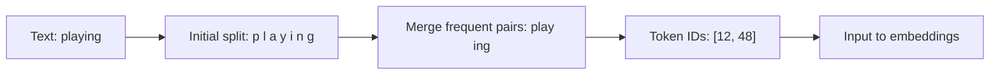

# Unit 35: Tokenizer and BPE Fundamentals

<p class="unit-hero">
  
</p>

> [!NOTE]
> This unit explains how an LLM converts text into tokens and token IDs. It uses small examples to make BPE understandable; it does not train a production-scale tokenizer.

## 1. Understanding Tokenizers and BPE

LLMs do not read raw text directly. They split text into small units called **tokens**, then convert those tokens into integer **token IDs**. Subword tokens help represent unknown words, Japanese, and source code without requiring every complete word to be in the vocabulary.

### The basic idea of BPE

Byte Pair Encoding (BPE) starts with characters or bytes and repeatedly merges frequent adjacent pairs to build a vocabulary. Production tokenizers differ in normalization, Unicode handling, special tokens, and training data, so this unit’s toy implementation is for learning—not a drop-in replacement.



Token count affects context length, API cost, and inference work. The same number of characters can produce different token counts across languages and formats, so applications should measure using the tokenizer for the actual model.

## 2. Implementation Example

The following is a small BPE-like implementation using only the Python standard library.

```python
from collections import Counter


def pair_counts(tokens):
    return Counter(zip(tokens, tokens[1:]))


def merge_pair(tokens, pair):
    merged = []
    i = 0
    while i < len(tokens):
        if i < len(tokens) - 1 and (tokens[i], tokens[i + 1]) == pair:
            merged.append(tokens[i] + tokens[i + 1])
            i += 2
        else:
            merged.append(tokens[i])
            i += 1
    return merged


def train_toy_bpe(words, merges=3):
    tokens = [list(word) + ["</w>"] for word in words]
    for _ in range(merges):
        counts = Counter()
        for word_tokens in tokens:
            counts.update(pair_counts(word_tokens))
        if not counts:
            break
        best_pair, frequency = counts.most_common(1)[0]
        if frequency < 2:
            break
        tokens = [merge_pair(word_tokens, best_pair) for word_tokens in tokens]
        print("merge:", best_pair, "frequency:", frequency)
    return tokens


corpus = ["playing", "played", "player", "playing"]
print(train_toy_bpe(corpus))
```

Real tokenizers also handle normalization, special tokens, Unicode, vocabulary persistence, and unknown inputs.

## 3. Practice

- Prepare three English sentences, three Japanese sentences, and three Python snippets.
- Change the number of toy-BPE merges and observe the resulting token groups.
- Use the `tiktoken` example in Unit 23 to measure the same inputs with a model tokenizer.
- Explain three reasons why the toy tokenizer and a production tokenizer produce different results.

## 4. Answer Key

<details>
<summary>View sample answer</summary>

- More merges tend to create longer tokens from frequent strings, which can reduce token count.
- Differences come from the training corpus, normalization, Unicode and whitespace handling, special tokens, and vocabulary size.
- Token count is not simply proportional to character count. Measure representative English, Japanese, and code inputs with the tokenizer used by the target model.

</details>
