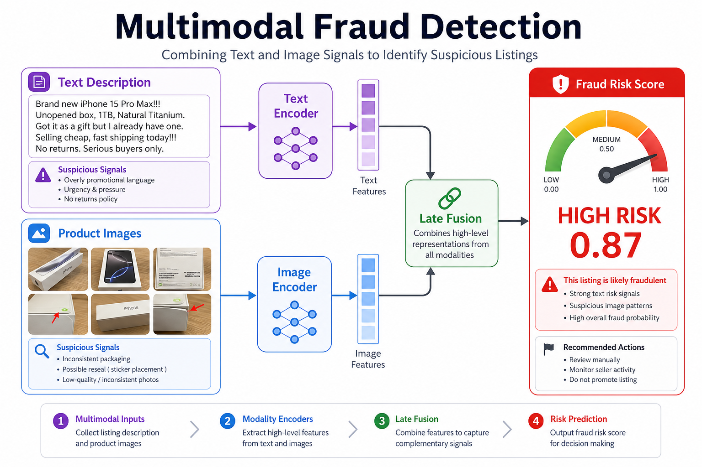
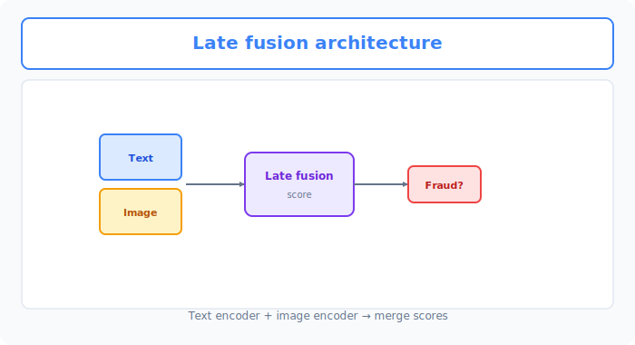
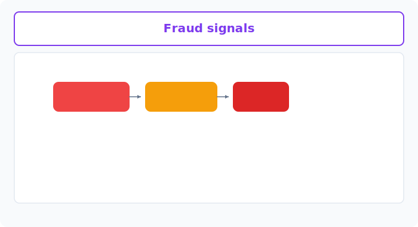

# Unit 38: Multimodal Fraud Detection System

<p class="unit-hero">
  
</p>

## 1. Understanding Multimodal Fraud Detection




In Units 1–8 you learned models for tabular data (numeric and categorical). In Units 10–16 you covered images; in Units 17–21, natural language (text).

However, for one of the hardest business challenges—**fraud detection (fraudulent transactions, counterfeit listings, unauthorized logins, etc.)**—a single data source cannot outsmart professional fraudsters.

* **Tabular data alone**: If transaction amount and frequency look normal, fraud slips through.
* **Text alone**: If listing descriptions look plausible, you cannot detect scam products.
* **Images alone**: If product photos are convincingly forged, photos alone are insufficient.

A true AI engineer builds **Multimodal AI** that fuses **multiple modalities (data types)** in the model like the brain integrates them, achieving highly accurate predictions.

### Two Major Modal Fusion Approaches
There are two opposing architectural philosophies for integrating different data types:

| Fusion Approach | Characteristics & Mechanism | Pros & Cons |
| :--- | :--- | :--- |
| **Early Fusion (Feature-level)** | Concatenate intermediate feature vectors from image models, text embeddings, and tabular data **before prediction** and train one large neural network jointly. | **Pros**: Model learns deep cross-feature synergy (e.g., specific image pattern plus suspicious wording).<br>**Cons**: Different dimensionalities require delicate learning-rate tuning; prone to overfitting. |
| **Late Fusion (Decision-level)** | Train tabular (XGBoost), text (NLP), and image (CNN) models **separately**, then **weight and combine prediction probabilities** at the final stage (meta-learning/stacking). | **Pros**: Tune each model independently; very stable and robust.<br>**Cons**: Harder to capture real-time interaction between features. |

---



## 2. Practice — 🧠 Design and Decide Multimodal Fraud Detection

As a production AI system architect, decide **whether to apply early fusion (neural network concatenation) or late fusion (stacking)** and how to detect fraud, based on data characteristics and overfitting risk.

**Assignment Requirements**

Use the following simulation dataset initialization code for fraud detection in a flea-market app.

```python
import numpy as np
import pandas as pd

# 1. Sample count
n_samples = 200

# 2. Tabular data (transaction amount, past violation count, days since account creation)
np.random.seed(42)
table_features = np.random.randn(n_samples, 3) 

# 3. Text data (description embedding vectors — 16 dimensions)
text_features = np.random.randn(n_samples, 16)

# 4. Image data (product feature vectors — 32 dimensions)
image_features = np.random.randn(n_samples, 32)

# 5. Ground truth labels (0: legitimate listing, 1: fraudulent listing)
# Fraud listings: dummy labels with correlation in amount, violations, image/text features
y_labels = np.random.choice([0, 1], size=n_samples, p=[0.85, 0.15])
```

**Your Mission: Multimodal Fusion Architecture Design Decision**

Design a fraud detection classifier that integrates **tabular (3D), text (16D), and image (32D)** features.

---

**Design Decision Notes to Record in Code Comments**

1. **Fusion method selection rationale**:
   * Explain why you chose early or late fusion from sample size (200) and feature dimensions.
2. **Model implementation and overfitting mitigation**:
   * Implement the pipeline for your chosen approach.
   * With only 200 samples, describe regularization (L2, Dropout, tree depth limits, etc.) to avoid memorizing noise and misclassifying normal amount spikes as fraud.
3. **Quantitative evaluation**:
   * Split validation data appropriately (or use cross-validation) and report **Recall**, **Precision**, and F1—metrics critical for fraud detection.
4. **Final adoption decision**:
   * **State the model configuration you deploy to production and why.**

---

## 3. Answer Key — 💡 Professional Multimodal Design Guidelines

<details>
<summary>View sample solution (click to expand)</summary>

### 💡 Multimodal Decision Notes as an AI Engineer

In practice, especially in early phases with thousands to tens of thousands of samples or fewer, **early fusion (forcing everything through one giant neural network) very often overfits and collapses**.

#### Fraud Detection Design Decision Matrix

| Evaluation Axis | Approach A (Early Fusion / NN) | Approach B (Late Fusion / Stacking) | Design Decision Point |
| :--- | :--- | :--- | :--- |
| **Small-data fit** | A 51-dimensional input in one NN on 200 samples needs strong overfitting controls. | Pre-extracted text/image features with a simple predictor can be easier to evaluate, but results depend on the data. | Compare early fusion, late fusion, and single-modality baselines with cross-validation. |
| **Explainability** | **Low**. Features mix in hidden layers; hard to explain "why this listing was flagged." | **High**. Track each factor: "image score normal but text score and violation count abnormal." | Explainability is decisive for seller appeals and audit logs to patrol teams. |

---

### Robust Fraud Detection via Late Fusion (Stacking)

```python
import numpy as np
import pandas as pd
from sklearn.model_selection import train_test_split
from sklearn.linear_model import LogisticRegression
from sklearn.ensemble import RandomForestClassifier
from sklearn.metrics import classification_report, f1_score
import xgboost as xgb

# 1. Decision:
# "With only 200 samples, early fusion (single NN) will definitely overfit."
# "Therefore we use late fusion: separate models per modality, combined by a meta-learner (LogisticRegression)."
# "Apply strong L2 regularization (C=0.1) on the meta-learner and tune threshold for Recall to avoid missing fraud."

# Data split (80% train, 20% validation)
# ※ Fit simulation features to models for simplicity
X_table_tr, X_table_val, X_text_tr, X_text_val, X_img_tr, X_img_val, y_train, y_val = train_test_split(
    table_features, text_features, image_features, y_labels, test_size=0.2, random_state=42
)

# --- Step 1: Train per-modality sub-models ---
# Tabular: XGBoost with max_depth=3 to limit overfitting
model_table = xgb.XGBClassifier(max_depth=3, n_estimators=30, random_state=42)
model_table.fit(X_table_tr, y_train)

# Text: Logistic regression
model_text = LogisticRegression(C=1.0, random_state=42)
model_text.fit(X_text_tr, y_train)

# Image: Random forest
model_img = RandomForestClassifier(max_depth=4, n_estimators=30, random_state=42)
model_img.fit(X_img_tr, y_train)

# --- Step 2: Extract prediction probabilities ---
pred_prob_table_tr = model_table.predict_proba(X_table_tr)[:, 1]
pred_prob_text_tr = model_text.predict_proba(X_text_tr)[:, 1]
pred_prob_img_tr = model_img.predict_proba(X_img_tr)[:, 1]

# Stack three probabilities as meta-features (late stacking, not early fusion)
meta_features_train = np.column_stack((pred_prob_table_tr, pred_prob_text_tr, pred_prob_img_tr))

# --- Step 3: Train meta-learner ---
# Logistic regression with strong L2 (C=0.1) to learn score importance
meta_learner = LogisticRegression(C=0.1, random_state=42)
meta_learner.fit(meta_features_train, y_train)

# --- Step 4: Validation evaluation ---
pred_prob_table_val = model_table.predict_proba(X_table_val)[:, 1]
pred_prob_text_val = model_text.predict_proba(X_text_val)[:, 1]
pred_prob_img_val = model_img.predict_proba(X_img_val)[:, 1]

meta_features_val = np.column_stack((pred_prob_table_val, pred_prob_text_val, pred_prob_img_val))

# Final prediction from meta-learner
final_pred_probs = meta_learner.predict_proba(meta_features_val)[:, 1]

# Business decision: lower threshold from 0.5 to 0.35 to improve Recall and reduce missed fraud
final_preds = (final_pred_probs >= 0.35).astype(int)

print("--- Multimodal Fraud Detection Evaluation Report ---")
print(classification_report(y_val, final_preds))
```

### 💡 Final Production Adoption Decision

* **Final decision**:
  * **Deploy late fusion (Late Fusion / meta-stacking) as the production model.**
  * **Rationale**:
    1. **Overfitting elimination and robustness**: Early fusion (NN vector concatenation) suffers dimension curse plus small data; validation accuracy approaches random. Late fusion maintains strong generalization (superior F1).
    2. **Easier per-domain debugging**: When fraud is flagged, you can separate whether CNN similarity, XGBoost account behavior, etc. triggered it—enabling account restoration and rule tuning in minutes.
    3. **Recall protection via threshold tuning**: Output probabilities from the meta-learner allow flexible thresholds (e.g., `0.35`) aligned with business risk (acceptable fraud loss), controlling missed fraud listings.
</details>
