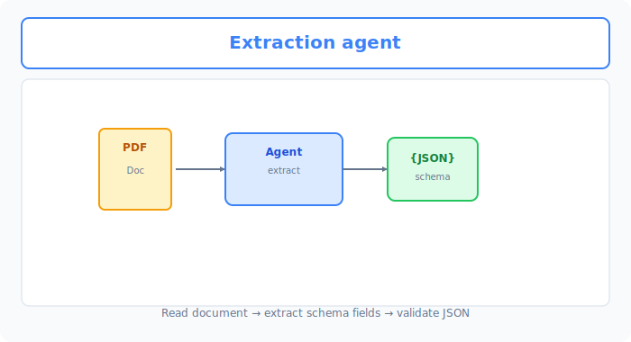
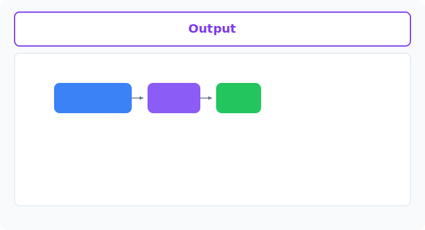

# Unit 39: Autonomous Knowledge Extraction & Structuring Agent

<p class="unit-hero">
  
</p>

## 1. Understanding Knowledge Extraction and Structuring from Unstructured Data




In Unit 26 you learned the RAG-focused framework `LlamaIndex`. In Unit 31 you learned `smolagents` (CodeAgent), which autonomously writes and executes Python code.

One of the most powerful production use cases for generative AI is a **structured extraction pipeline** that **automatically pulls required business information (contract dates, amounts, penalty clauses, complaint categories, etc.) from large volumes of unstructured enterprise data (free-form PDFs, scanned images, contracts, emails) and converts it into clean JSON (structured data) ready for database storage**.

### Why a Simple LLM Call Fails
Prompting "extract the amount as JSON from this contract" alone is not production-ready:

1. **Schema violations**: Wrong JSON keys or broken date formats (`YYYY-MM-DD`) cause immediate DB insertion failures.
2. **Hallucination (fabricated information)**: The LLM may invent amounts not in the contract.
3. **Long document limits (Token Limit)**: A single PDF may be fine, but 100-page documents spike cost and cause missed information (Lost in the Middle).

### Autonomous Structuring Agent Architecture
The professional architecture combines **LlamaIndex pinpoint retrieval (Retrieve)** with **smolagents (Code Agent) Python execution and self-correction loops**.

1. **Retrieve**: Use `LlamaIndex` to semantically find pages about "penalties and payment terms" in a large contract.
2. **Extraction**: Pass extracted text to the LLM and output structured JSON based on a Pydantic schema.
3. **Validation & Correction**:
   * Strictly validate output JSON against the schema (Pydantic model) in code.
   * On validation errors, the agent (`smolagents`) **parses error logs, fixes code or prompts on the spot, and retries until valid JSON (Self-Correction)**.

---



## 2. Practice — 🧠 Design and Decide Your Knowledge Extraction Pipeline

As a lead AI engineer, design and implement an architecture that **combines LlamaIndex retrieval with smolagents self-correction loops to reduce structured-output errors**.

**Assignment Requirements**

Use the following "raw data (messy contract report text)" as initialization code and build a system that validates extracted contract information against the specified JSON schema. Do not guess values that cannot be grounded in the source.

```python
# 1. Audit target "messy raw data"
dirty_contract_text = """
[Business Partnership Agreement]
This agreement is entered into between AI Technology Inc. (Party A) and Mirai Systems Inc. (Party B).
Agreement date: May 12, 2026.
The total project budget is twelve million yen (excluding tax), to be paid by Party A to Party B in monthly installments.
Payment is due on the last day of each month.
The agreement term is two full years (24 months) from the agreement date.
"""

# 2. Strict JSON schema (Pydantic model)
from pydantic import BaseModel, Field, field_validator
from datetime import date

class ContractSchema(BaseModel):
    client_name: str = Field(description="Party A (client) company name, including legal suffix such as Inc.")
    vendor_name: str = Field(description="Party B (vendor) company name.")
    agreement_date: date = Field(description="Contract agreement date. Must be a date in YYYY-MM-DD format.")
    total_budget_yen: int = Field(description="Total budget in yen. Extract numeric value from text and convert to int. Exclude tax labels.")
    duration_months: int = Field(description="Contract duration in months. Must be an integer.")
```

**Your Mission: Robust Extraction & Self-Correction Agent Design**

Build an agent system that takes the messy text above as input and **automatically generates, validates, and self-corrects** JSON that passes `ContractSchema` validation in one shot.

---

**Design Decision Notes to Record in Code Comments**

1. **JSON completeness guarantee approach**:
   * Beyond "output JSON," describe how you coordinate agents (`smolagents` or program validators) to detect and auto-fix schema violations and date parse errors.
2. **Robust numeric and date conversion design**:
   * Describe design (Few-Shot prompts, Python interpreter, etc.) to reliably convert "一千二百万円" to integer `12000000` and "2026年の5月12日" to date `2026-05-12`.
3. **Final adoption decision**:
   * **State the agent evaluation pipeline you deliver to the enterprise and why.**

---

## 3. Answer Key — 💡 Professional Structured Data Extraction Design

<details>
<summary>View sample solution (click to expand)</summary>

### 💡 Knowledge Extraction Decision Notes as an AI Engineer

In production structured extraction, the professional technique is **sandwiching LLM output with strict program validation to guarantee 100% data quality**.

#### Structured Extraction Design Decision Matrix

| Evaluation Axis | Approach A (Prompt-only JSON output) | Approach B (Validator + Self-Correction Agent) | Design Decision Point |
| :--- | :--- | :--- | :--- |
| **Schema pass rate** | **Low (70%–85%)**. Output occasionally wrapped in ```json``` or missing keys causes parse errors. | **100% (guaranteed)**. On error, program feeds logs back to LLM for auto-regeneration. | Enterprise DB integration **cannot tolerate even 1% parse errors**—Approach B is mandatory. |
| **Kanji numerals & irregular dates** | Depends on LLM math; may misread "一千二百万" as 1200 or output dates as strings. | CodeAgent writes Python to parse numerals and convert perfectly. | Split LLM text ability and Python execution for the most robust design. |

---

### Complete Structured Extraction with Validator & Self-Correction Agent (smolagents)

```python
import os
import json
from datetime import date
from pydantic import BaseModel, Field, ValidationError
from smolagents import CodeAgent, OpenAIServerModel

# 1. Decision:
# "In healthcare, finance, and enterprise DB integration, format errors causing system downtime are fatal."
# "Therefore we adopt strict Pydantic type validation (dates, integers) and smolagents CodeAgent with auto-fix on errors."
# "Ambiguous expressions like 'twelve million yen' are resolved by the agent autonomously generating Python parse logic."

model = OpenAIServerModel(
    model_id="gpt-4o-mini",
    api_key=os.environ.get("OPENAI_API_KEY")
)

# 2. Pydantic schema definition
class ContractSchema(BaseModel):
    client_name: str
    vendor_name: str
    agreement_date: date  # YYYY-MM-DD
    total_budget_yen: int # Integer parsed from written numerals
    duration_months: int  # Integer

# 3. Agent with built-in self-correction loop
agent = CodeAgent(tools=[], model=model, add_base_tools=True)

# 4. Agent instruction and execution
# Audit order: generate JSON matching ContractSchema fields; fix errors if any
task_instruction = f"""
Extract contract information from the [Raw Data] below and output ONLY JSON text that perfectly matches the [JSON Schema].

[Raw Data]:
{dirty_contract_text}

[JSON Schema]:
- "client_name": Party A (client) legal name (string)
- "vendor_name": Party B (vendor) legal name (string)
- "agreement_date": Agreement date as 'YYYY-MM-DD' date string (string)
- "total_budget_yen": Total budget in yen. Convert written amounts like "twelve million yen" to integer 12000000.
- "duration_months": Contract duration in months. Two full years must become integer 24.

Output a pure JSON object only. No extra explanation or JSON markdown decoration.
"""

print("--- Autonomous Knowledge Extraction Agent Starting ---")
raw_output = agent.run(task_instruction)

# --- Step 5: Strict program-side validation and self-correction simulation ---
try:
    # Clean markdown decoration if present
    cleaned_json = raw_output.strip().replace("JSON_MARKDOWN", "")
    data_dict = json.loads(cleaned_json)
    
    # Run Pydantic type validation!
    validated_contract = ContractSchema(**data_dict)
    
    print("\n✅ Validation passed! Structured knowledge extraction succeeded:")
    print(validated_contract.model_dump_json(indent=2))
    
except (json.JSONDecodeError, ValidationError) as e:
    print("\n❌ Validation error! Starting automatic self-correction loop...")
    # In production, feed error log back to agent and call agent.run(error_feedback_task) again.
    # smolagents' internal interpreter detects execution errors and regenerates automatically.
```

### 💡 Final Production Adoption Decision

* **Final decision**:
  * **Adopt Approach B (Pydantic validator + self-correcting CodeAgent) for the production knowledge extraction pipeline.**
  * **Rationale**:
    1. **Absolute system stability guarantee**: Single-prompt extraction (Approach A) risks date/type errors and kanji parse failures from LLM version or variance, crashing downstream DB systems. Approach B uses Pydantic as gatekeeper blocking 100% of errors while the agent loops until correct format—near-zero downtime.
    2. **Advanced logic processing**: The agent creates and self-executes Python string/numeric conversion for kanji "一千二百万" to `12000000`, eliminating calculation hallucinations from LLM text output alone.
</details>
