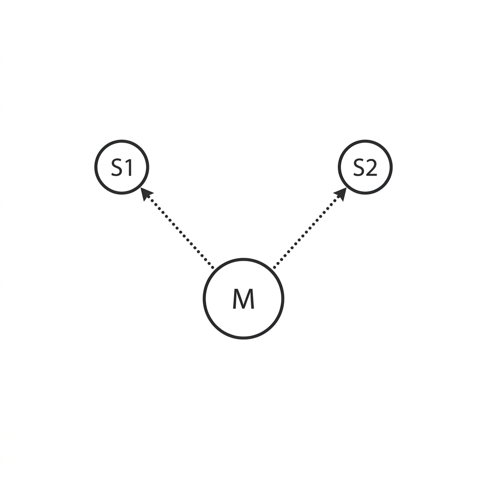

# Unit 39: Autonomous Multi-Agent Customer Support

## 1. Single-Agent Limits and Multi-Agent Coordination



In Unit 31 you learned the powerful autonomous AI agent (`smolagents` CodeAgent) that executes Python code on its own. Single agents are very capable, but in complex enterprise systems they quickly hit **capacity overload** and break down.

### 🚨 Three Major Single-Agent Bottlenecks

1. **Tool swamping**: Give an agent many tools—shipping lookup, payment inquiry, refunds, email, inventory—and the LLM gets lost, exponentially increasing wrong tool calls with bad arguments.
2. **Context bloat and cost**: Stuffing all history and tool definitions into one LLM explodes tokens per conversation, spiking API cost and slowing response.
3. **Security and permission collapse**: A customer support agent might run tools with direct access to "all customer payment DB," making security boundary separation hard.

---

### 🤝 Multi-Agent Systems as the Solution

The breakthrough is **Multi-Agent Systems (division of labor and governance)**.

Like company departments, create multiple **small child agents (Managed Agents)** with specific tools and expertise, overseen by a **parent agent (ManagerAgent)** that delegates work.

```
                    【Main Support Agent (ManagerAgent)】
                                      │
              ┌───────────────────────┴───────────────────────┐
              ▼                                               ▼
【Shipping Tracking Agent (Managed CodeAgent)】     【Payment Policy Agent (Managed CodeAgent)】
    - Tools: shipping DB lookup only                        - Tools: refund policy text search only
    - Permission: shipping info only                        - Permission: policy verification only
```

#### Overwhelming Benefits of Division of Labor:

* **High reliability**: Each child agent has only 3–4 limited tools, drastically reducing tool call mistakes and hallucinations.
* **Strong security boundaries**: Shipping agent gets shipping DB read only; payment agent gets payment execution only—full **Least Privilege**.
* **Easy debugging**: When trouble occurs, audit exactly "which agent's which reasoning step failed."

---

### 💡 Concrete Business Use Cases

* **Enterprise help desk**: Password reset, PC requests, paid leave—ManagerAgent parses intent and dynamically delegates to specialized internal bots.
* **Autonomous software development (Devin-style clones)**: Coder, Tester, and Writer agents coordinate under ManagerAgent for autonomous development.
* **Real estate/insurance quote automation**: Identity verification, risk review, and plan proposal agents collaborate in the background to generate quotes in seconds.

---

## 2. Implementation Example — Multi-Agent Coordination with smolagents

The code below uses Hugging Face's `smolagents` to build a **shipping tracking agent (Managed)** and **policy agent (Managed)**, orchestrated by a **main support agent (Manager)** that autonomously responds to an angry customer email.

```python
import os
from smolagents import CodeAgent, OpenAIServerModel, tool

# 0. LLM model setup
model = OpenAIServerModel(
    model_id="gpt-4o-mini",
    api_key=os.environ.get("OPENAI_API_KEY")
)

# --- 1. Shipping database lookup tool (for shipping agent) ---
@tool
def track_shipping_status(order_id: str) -> str:
    """
    指定された注文ID（Order ID）の配送ステータスと現在位置をデータベースから検索して取得します。
    
    Args:
        order_id: 'ORD-XXXX' 形式の注文ID文字列。
    """
    # Mock database lookup
    shipping_db = {
        "ORD-9999": "ステータス: 配送遅延。理由: 台風の影響による配送拠点の冠水。現在位置: 東京物流センター。お届け予定: 通常より3日遅れの見込み。",
        "ORD-1111": "ステータス: 配達完了。お届け日時: 2026-05-27 14:00。玄関前置き配で完了。"
    }
    return shipping_db.get(order_id, f"注文ID: {order_id} はデータベースに見つかりません。")

# --- 2. Refund policy search tool (for policy agent) ---
@tool
def search_refund_policy(item_condition: str) -> str:
    """
    商品の状態（未開封、開封済みなど）に基づいて、返金ポリシー（可否基準）を検索します。
    
    Args:
        item_condition: 商品の状態（'unopened' (未開封) または 'opened' (開封済み)）。
    """
    if item_condition == "unopened":
        return "ポリシー: 購入後14日以内かつ【未開封】の状態であれば、送料お客様負担にて全額返金対応可能です。"
    elif item_condition == "opened":
        return "ポリシー: 商品が【開封済み】の場合、お客様都合による返金は一切不可となります。ただし、初期不良または配送会社の過失による破損の場合は例外的に全額返金します。"
    return "該当するポリシーが見つかりません。個別にサポート窓口へエスカレーションしてください。"

# --- 3. Specialist child agents (Managed Agents) ---

# Shipping specialist (shipping tool only)
shipping_agent = CodeAgent(
    tools=[track_shipping_status],
    model=model,
    name="shipping_specialist",
    description="注文番号から商品の配送状況や配送遅延の理由を正確に調査する専門エージェント。"
)

# Refund policy specialist (policy tool only)
policy_agent = CodeAgent(
    tools=[search_refund_policy],
    model=model,
    name="policy_specialist",
    description="商品の状態（未開封・開封済み等）から、会社の規約に基づき返金が認められるかを厳密に判定する専門エージェント。"
)

# --- 4. Main manager agent (ManagerAgent) ---
# Register child agents as "tools" on ManagerAgent
manager_agent = CodeAgent(
    tools=[],
    model=model,
    managed_agents=[shipping_agent, policy_agent],
    add_base_tools=True
)

# --- 5. Test run (angry customer complaint) ---
unhappy_customer_email = """
【問い合わせ内容】:
注文ID「ORD-9999」の商品が届きません！楽しみにしていたのに非常に怒っています。
もし届かないのであれば、全額返金してほしいです。商品は届いていないので当然「未開封」です。
現在の配送状況と、返金が可能かどうかを調べて、私に丁寧な謝罪と解決策のメールを返信してください。
"""

print("--- 🤝 自律型マルチエージェントカスタマーサポート 起動 ---")
response = manager_agent.run(
    f"以下の【問い合わせ内容】に対し、専門エージェントを適切に活用して調査し、顧客への最終的な返信メール文面を作成してください。\n\n【問い合わせ内容】:\n{unhappy_customer_email}"
)

print("\n--- 📩 生成された最終顧客返信メール ---")
print(response)
```

---

## 3. Practice — 🧠 Design and Decide Multi-Agent Support

As lead AI systems developer, design and implement a **multi-agent coordination system that perfectly resolves a high-difficulty customer claim mixing cancellation fees, shipping DB, and point refund rules—without hallucination**.

**Assignment Requirements**

Use the initialization code below (complex complaint, order/shipping DB, point rules) and build a pipeline of **three autonomous agents with fully separated roles and permissions** plus a **main ManagerAgent**.

```python
# 1. "Ultra-difficult complaint" email from customer
complex_complaint = """
【ユーザーからのクレーム】:
注文「ORD-5555」をキャンセルしたいです。旅行用だったのですが、配送遅延で出発に間に合いませんでした。
ただ、購入時に使った「限定1000ポイント」が消滅するのではないかと心配しています。
私はプレミアム会員（Premium）です。キャンセルに伴う『キャンセル手数料』が発生するのか、また『限定ポイント』が元の通り全額返還されるのかを調べて、私への返信メールを作成してください。
"""

# 2. Order & shipping mock database (status and member tier)
orders_database = {
    "ORD-5555": {
        "status": "Delayed",
        "reason": "大雪による配送トラックの立ち往生",
        "member_tier": "Premium",
        "points_used": 1000,
        "point_type": "Limited-Time" # Limited-time points
    }
}

# 3. Business policy text
cancel_fee_policy = """
【キャンセル手数料規約】:
- 通常会員（Standard）: お客様都合によるキャンセルの場合、一律2,000円の手数料が発生します。
- プレミアム会員（Premium）: キャンセル手数料は常に【無料】です。
- 例外条項: 会員ランクに関わらず、配送側の過失または不可抗力（悪天候など）による「配送遅延」が原因のキャンセルの場合、キャンセル手数料は【免除（無料）】となります。
"""

point_refund_policy = """
【ポイント返還規約】:
- 通常ポイント: キャンセル完了後、24時間以内に全額がアカウントに返還されます。
- 期間限定ポイント（Limited-Time）:
  - 通常は、キャンセル時にポイントの有効期限が切れている場合は失効します。
  - ただし、配送遅延などの【会社側または天候過失による配送トラブルが原因のキャンセル】の場合は、有効期限に関わらず、特別救済措置として【有効期限を30日間延長した状態で全額返還】されます。
"""
```

**Your Mission: Multi-Agent Division Architecture Design Decision**

Automatically cross-search the intertwined policies and database above and build a multi-agent system that reaches the **100% correct conclusion**—**cancellation fee is free (Premium member plus shipping delay) and limited points are fully refunded with 30-day extension**—with zero hallucination.

---

**Design Decision Notes to Record in Code Comments**

1. **Agent split boundary (departmentalization) rationale**:
   - Explain why you split agents into that count and roles vs a single agent, regarding reliability and debuggability.
2. **Tool and permission separation per agent**:
   - Describe tools and system instructions that prevent mixing policies and wrong judgments.
3. **ManagerAgent (command center) instruction design**:
   - Describe how ManagerAgent avoids contradictions in the final customer email (e.g., "fee free but points forfeited").
4. **Final adoption decision**:
   - **State the multi-agent coordination flow you release to production enterprise support and why.**

---

## 4. Answer Key — 💡 Professional Multi-Agent System Design

<details>
<summary>View sample solution (click to expand)</summary>

### 💡 Multi-Agent Design Decision Notes as an AI Engineer

In customer support automation, **one monolithic prompt always misjudges when policies intertwine** (Premium rules vs shipping delay exceptions, etc.).

#### Multi-Agent Coordination Design Decision Matrix

| Evaluation Axis | Approach A (Monolithic prompt + RAG) | Approach B (Multi-agent division system) | Design Decision Point |
| :--- | :--- | :--- | :--- |
| **Complex policy misread rate** | **High (15%–25%)**. LLM confuses Premium vs delay rules when reading long policy text together. | **Very low (<1%)**. Separate "cancellation fee expert" and "points expert" each read only their short policy. | Complex branching rules **require agent splits with focused scope**. |
| **Security & PII protection** | **Weak**. Customer-facing LLM needs tools accessing full DB; prompt injection data leak risk. | **Strong**. Only ManagerAgent talks to users; DB tools run hidden in background child agents. | **Blocking direct tool access and permission separation** is the absolute defense line for public AI. |

---

### Multi-Agent Coordination with Full Permission Separation & Cross-Policy Search

```python
import os
import json
from smolagents import CodeAgent, OpenAIServerModel, tool

# 1. Decision:
# 「プレミアム会員のルールと、天候遅延特例のルールは、1つのLLMで同時に処理すると条件判定が交絡し、ハルシネーション（誤判定）を起こしやすい。」
# 「そのため、キャンセル料判定の専門家（fee_specialist）と、ポイント返還判定の専門家（point_specialist）に完全分離する。」
# 「さらに、顧客情報DBへの直接アクセスは配送状況調査の専門家（order_specialist）のみに限定し、セキュリティと確実性を保護する。」

model = OpenAIServerModel(
    model_id="gpt-4o-mini",
    api_key=os.environ.get("OPENAI_API_KEY")
)

# --- 2. Order/shipping DB lookup tool ---
@tool
def get_order_details(order_id: str) -> str:
    """
    指定された注文IDの詳細情報（ステータス、遅延理由、会員ランク、使用ポイント数、ポイント種別）をデータベースから取得します。
    
    Args:
        order_id: 'ORD-XXXX' 形式の注文ID。
    """
    # Order database (mock)
    orders_db = {
        "ORD-5555": {
            "status": "Delayed",
            "reason": "大雪による配送トラックの立ち往生",
            "member_tier": "Premium",
            "points_used": 1000,
            "point_type": "Limited-Time"
        }
    }
    order = orders_db.get(order_id)
    if order:
        return json.dumps(order, ensure_ascii=False)
    return f"注文ID: {order_id} が見つかりません。"

# --- 3. Policy text lookup tools ---
@tool
def get_cancel_fee_policy() -> str:
    """
    キャンセル手数料に関する社内規約テキストを返します。
    """
    return cancel_fee_policy

@tool
def get_point_refund_policy() -> str:
    """
    ポイント返還および救済措置に関する社内規約テキストを返します。
    """
    return point_refund_policy

# --- 4. Specialist child agents (Managed Agents) ---

# Order/shipping specialist
order_specialist = CodeAgent(
    tools=[get_order_details],
    model=model,
    name="order_specialist",
    description="注文データベースから、会員ランク、配送状況、使用されたポイント等の客観的事実を正確に取得する専門家。"
)

# Cancellation fee specialist
fee_specialist = CodeAgent(
    tools=[get_cancel_fee_policy],
    model=model,
    name="fee_specialist",
    description="キャンセル手数料規約に基づき、会員ランクや遅延理由を照らし合わせて、手数料が無料になるかを厳密に判定する専門家。"
)

# Point refund specialist
point_specialist = CodeAgent(
    tools=[get_point_refund_policy],
    model=model,
    name="point_specialist",
    description="ポイント返還規約に基づき、ポイントの種別や遅延理由から、ポイントが全額返還・延長されるかを厳密に判定する専門家。"
)

# --- 5. Main ManagerAgent ---
manager = CodeAgent(
    tools=[],
    model=model,
    managed_agents=[order_specialist, fee_specialist, point_specialist],
    add_base_tools=True
)

# --- 6. Cooperative execution ---
instruction = f"""
以下の【ユーザーからのクレーム】に対し、専門エージェントたちに個別に調査を依頼し、その客観的事実と社内規約を統合したうえで、
顧客への丁寧な謝罪と『手数料は無料になるか』『ポイントは全額返還・延長されるか』の結論を明記した返信メールを作成してください。

【ユーザーからのクレーム】:
{complex_complaint}
"""

print("--- 🤝 専門家エージェントチームによる自律審査プロセス 開始 ---")
final_mail = manager.run(instruction)

print("\n--- 📩 生成された最終顧客返信メール ---")
print(final_mail)
```

### 💡 Final Production Adoption Decision

* **Final decision**:
  * **Deploy role-specialized multi-agent system (Approach B) as the production customer support automation engine.**
  * **Rationale**:
    1. **Elimination of condition misreading (entanglement)**: Single-prompt RAG mixes Standard vs Premium and regular vs limited-time point rules, causing hallucinations like "limited points are forfeited." Approach B uses a points-only specialist—zero condition misrecognition.
    2. **Complete concealment of privileged access**: Only ManagerAgent receives raw customer prompts; only `order_specialist` holds `get_order_details`. Malicious SQL injection or tool abuse against Manager cannot reach the DB directly.
    3. **Reduced operations and audit cost**: If point refund logic misjudges, update only `point_specialist` policy text or prompt—no regression to shipping or cancellation fee agents—enabling safe, fast maintenance.
</details>
