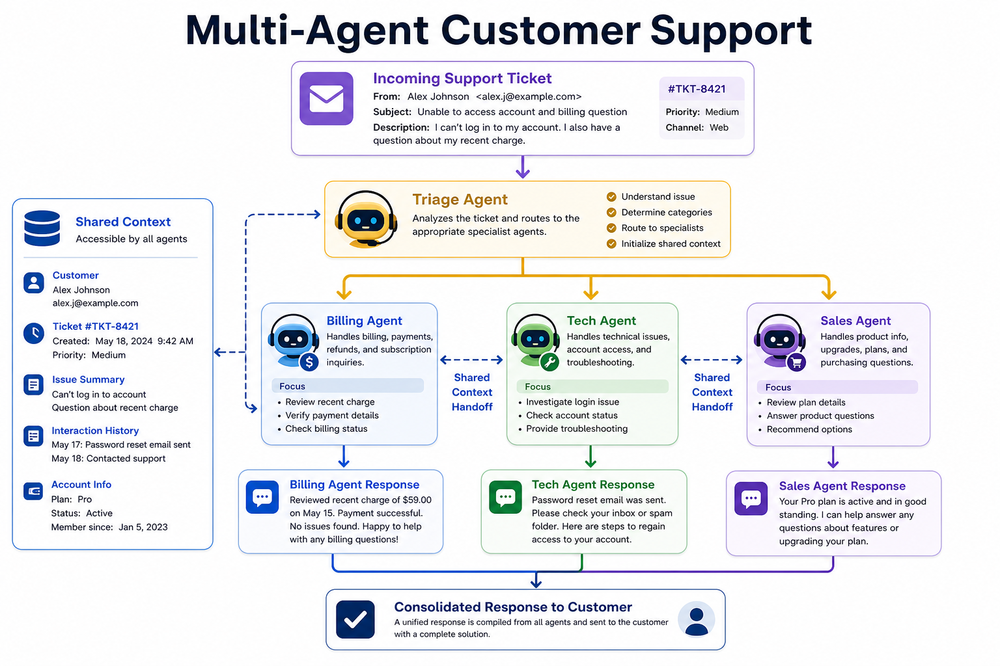
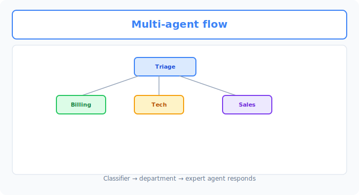
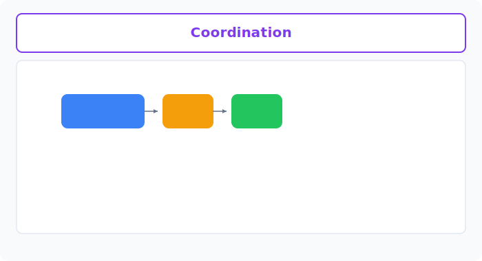

# Unit 42: Autonomous Multi-Agent Customer Support

<p class="unit-hero">
  
</p>

## 1. Single-Agent Limits and Multi-Agent Coordination




In Unit 31 you learned the powerful autonomous AI agent (`smolagents` CodeAgent) that executes Python code on its own. Single agents are very capable, but in complex enterprise systems they quickly hit **capacity overload** and break down.

### 🚨 Three Major Single-Agent Bottlenecks

1. **Tool swamping**: Give an agent many tools—shipping lookup, payment inquiry, refunds, email, inventory—and the LLM gets lost, exponentially increasing wrong tool calls with bad arguments.
2. **Context bloat and cost**: Stuffing all history and tool definitions into one LLM explodes tokens per conversation, spiking API cost and slowing response.
3. **Security and permission collapse**: A customer support agent might run tools with direct access to "all customer payment DB," making security boundary separation hard.

---

### 🤝 Multi-Agent Systems as the Solution

The breakthrough is **Multi-Agent Systems (division of labor and governance)**.

Like company departments, create multiple **small child agents (Managed Agents)** with specific tools and expertise, overseen by a **parent agent (ManagerAgent)** that delegates work.

```
                    [Main Support Agent (ManagerAgent)]
                                      │
              ┌───────────────────────┴───────────────────────┐
              ▼                                               ▼
[Shipping Tracking Agent (Managed CodeAgent)]     [Payment Policy Agent (Managed CodeAgent)]
    - Tools: shipping DB lookup only                        - Tools: refund policy text search only
    - Permission: shipping info only                        - Permission: policy verification only
```

#### Overwhelming Benefits of Division of Labor:

* **High reliability**: Each child agent has only 3–4 limited tools, drastically reducing tool call mistakes and hallucinations.
* **Strong security boundaries**: Shipping agent gets shipping DB read only; payment agent gets payment execution only—full **Least Privilege**.
* **Easy debugging**: When trouble occurs, audit exactly "which agent's which reasoning step failed."

---

### 💡 Concrete Business Use Cases

* **Enterprise help desk**: Password reset, PC requests, paid leave—ManagerAgent parses intent and dynamically delegates to specialized internal bots.
* **Autonomous software development (Devin-style clones)**: Coder, Tester, and Writer agents coordinate under ManagerAgent for autonomous development.
* **Real estate/insurance quote automation**: Identity verification, risk review, and plan proposal agents collaborate in the background to generate quotes in seconds.

---



## 2. Implementation Example — Multi-Agent Coordination with smolagents

The code below uses Hugging Face's `smolagents` to build a **shipping tracking agent (Managed)** and **policy agent (Managed)**, orchestrated by a **main support agent (Manager)** that autonomously responds to an angry customer email.

```python
import os
from smolagents import CodeAgent, OpenAIServerModel, tool

# 0. LLM model setup
model = OpenAIServerModel(
    model_id="gpt-4o-mini",
    api_key=os.environ.get("OPENAI_API_KEY")
)

# --- 1. Shipping database lookup tool (for shipping agent) ---
@tool
def track_shipping_status(order_id: str) -> str:
    """
    Look up shipping status and current location for the given order ID from the database.
    
    Args:
        order_id: Order ID string in 'ORD-XXXX' format.
    """
    # Mock database lookup
    shipping_db = {
        "ORD-9999": "Status: Delivery delayed. Reason: Distribution center flooded due to typhoon impact. Current location: Tokyo Logistics Center. Expected delivery: approximately 3 days later than usual.",
        "ORD-1111": "Status: Delivered. Delivery time: 2026-05-27 14:00. Left at front door."
    }
    return shipping_db.get(order_id, f"Order ID: {order_id} not found in database.")

# --- 2. Refund policy search tool (for policy agent) ---
@tool
def search_refund_policy(item_condition: str) -> str:
    """
    Search refund policy (eligibility criteria) based on item condition (unopened, opened, etc.).
    
    Args:
        item_condition: Item condition ('unopened' or 'opened').
    """
    if item_condition == "unopened":
        return "Policy: Full refund available within 14 days of purchase if item is [UNOPENED], with return shipping paid by customer."
    elif item_condition == "opened":
        return "Policy: If item is [OPENED], refunds for customer convenience are not permitted. Exception: full refund for initial defect or damage due to carrier negligence."
    return "No matching policy found. Escalate to support desk individually."

# --- 3. Specialist child agents (Managed Agents) ---

# Shipping specialist (shipping tool only)
shipping_agent = CodeAgent(
    tools=[track_shipping_status],
    model=model,
    name="shipping_specialist",
    description="Specialist agent that accurately investigates shipping status and delay reasons from order numbers."
)

# Refund policy specialist (policy tool only)
policy_agent = CodeAgent(
    tools=[search_refund_policy],
    model=model,
    name="policy_specialist",
    description="Specialist agent that strictly determines refund eligibility from item condition (unopened/opened) per company policy."
)

# --- 4. Main manager agent (ManagerAgent) ---
# Register child agents as "tools" on ManagerAgent
manager_agent = CodeAgent(
    tools=[],
    model=model,
    managed_agents=[shipping_agent, policy_agent],
    add_base_tools=True
)

# --- 5. Test run (angry customer complaint) ---
unhappy_customer_email = """
[Inquiry]:
My order ORD-9999 has not arrived! I was really looking forward to it and I am very upset.
If it will not arrive, I want a full refund. The item has not been delivered so it is obviously "unopened".
Please check the current shipping status and whether a refund is possible, and reply with a polite apology and resolution email.
"""

print("--- 🤝 Autonomous Multi-Agent Customer Support Starting ---")
response = manager_agent.run(
    f"For the [Inquiry] below, use specialist agents appropriately to investigate and draft the final customer reply email.\n\n[Inquiry]:\n{unhappy_customer_email}"
)

print("\n--- 📩 Generated Final Customer Reply Email ---")
print(response)
```

---

## 3. Practice — 🧠 Design and Decide Multi-Agent Support

As lead AI systems developer, design and implement a **multi-agent coordination system that handles a high-difficulty customer claim mixing cancellation fees, shipping DB, and point refund rules, with evidence checks and escalation for uncertainty**.

**Assignment Requirements**

Use the initialization code below (complex complaint, order/shipping DB, point rules) and build a pipeline of **three autonomous agents with fully separated roles and permissions** plus a **main ManagerAgent**.

```python
# 1. "Ultra-difficult complaint" email from customer
complex_complaint = """
[Customer Complaint]:
I want to cancel order ORD-5555. It was for a trip, but shipping delay means I will miss my departure.
However, I am worried the "limited 1000 points" I used at purchase will disappear.
I am a Premium member. Please investigate whether a cancellation fee applies and whether the limited points will be fully refunded, and draft a reply email to me.
"""

# 2. Order & shipping mock database (status and member tier)
orders_database = {
    "ORD-5555": {
        "status": "Delayed",
        "reason": "Delivery truck stranded due to heavy snow",
        "member_tier": "Premium",
        "points_used": 1000,
        "point_type": "Limited-Time" # Limited-time points
    }
}

# 3. Business policy text
cancel_fee_policy = """
[Cancellation Fee Policy]:
- Standard members: A flat 2,000 yen fee applies for customer-initiated cancellations.
- Premium members: Cancellation fees are always [FREE].
- Exception: Regardless of member tier, if cancellation is due to carrier fault or force majeure (e.g., bad weather) causing "shipping delay", the cancellation fee is [WAIVED (FREE)].
"""

point_refund_policy = """
[Point Refund Policy]:
- Regular points: Fully refunded to account within 24 hours after cancellation completes.
- Limited-time points (Limited-Time):
  - Normally, points expire if past expiration date at cancellation.
  - However, for cancellations due to [company-side or weather-related shipping trouble causing delay], as special relief, points are [FULLY REFUNDED with expiration extended by 30 days] regardless of original expiration.
"""
```

**Your Mission: Multi-Agent Division Architecture Design Decision**

Automatically cross-search the intertwined policies and database above and build a multi-agent system that reaches the **100% correct conclusion**—**cancellation fee is free (Premium member plus shipping delay) and limited points are fully refunded with 30-day extension**—with zero hallucination.

---

**Design Decision Notes to Record in Code Comments**

1. **Agent split boundary (departmentalization) rationale**:
   - Explain why you split agents into that count and roles vs a single agent, regarding reliability and debuggability.
2. **Tool and permission separation per agent**:
   - Describe tools and system instructions that prevent mixing policies and wrong judgments.
3. **ManagerAgent (command center) instruction design**:
   - Describe how ManagerAgent avoids contradictions in the final customer email (e.g., "fee free but points forfeited").
4. **Final adoption decision**:
   - **State the multi-agent coordination flow you release to production enterprise support and why.**

---

## 4. Answer Key — 💡 Professional Multi-Agent System Design

<details>
<summary>View sample solution (click to expand)</summary>

### 💡 Multi-Agent Design Decision Notes as an AI Engineer

In customer support automation, **one monolithic prompt always misjudges when policies intertwine** (Premium rules vs shipping delay exceptions, etc.).

#### Multi-Agent Coordination Design Decision Matrix

| Evaluation Axis | Approach A (Monolithic prompt + RAG) | Approach B (Multi-agent division system) | Design Decision Point |
| :--- | :--- | :--- | :--- |
| **Complex policy misread rate** | **High (15%–25%)**. LLM confuses Premium vs delay rules when reading long policy text together. | **Very low (<1%)**. Separate "cancellation fee expert" and "points expert" each read only their short policy. | Complex branching rules **require agent splits with focused scope**. |
| **Security & PII protection** | **Weak**. Customer-facing LLM needs tools accessing full DB; prompt injection data leak risk. | **Strong**. Only ManagerAgent talks to users; DB tools run hidden in background child agents. | **Blocking direct tool access and permission separation** is the absolute defense line for public AI. |

---

### Multi-Agent Coordination with Full Permission Separation & Cross-Policy Search

```python
import os
import json
from smolagents import CodeAgent, OpenAIServerModel, tool

# 1. Decision:
# "Premium member rules and weather-delay exceptions cause condition entanglement and misjudgment when one LLM handles both."
# "Therefore fully separate fee specialist (fee_specialist) and point refund specialist (point_specialist)."
# "Further restrict direct customer DB access to order/shipping specialist (order_specialist) only for security and reliability."

model = OpenAIServerModel(
    model_id="gpt-4o-mini",
    api_key=os.environ.get("OPENAI_API_KEY")
)

# --- 2. Order/shipping DB lookup tool ---
@tool
def get_order_details(order_id: str) -> str:
    """
    Fetch order details (status, delay reason, member tier, points used, point type) from the database.
    
    Args:
        order_id: Order ID in 'ORD-XXXX' format.
    """
    # Order database (mock)
    orders_db = {
        "ORD-5555": {
            "status": "Delayed",
            "reason": "Delivery truck stranded due to heavy snow",
            "member_tier": "Premium",
            "points_used": 1000,
            "point_type": "Limited-Time"
        }
    }
    order = orders_db.get(order_id)
    if order:
        return json.dumps(order, ensure_ascii=False)
    return f"Order ID: {order_id} not found."

# --- 3. Policy text lookup tools ---
@tool
def get_cancel_fee_policy() -> str:
    """
    Return internal policy text for cancellation fees.
    """
    return cancel_fee_policy

@tool
def get_point_refund_policy() -> str:
    """
    Return internal policy text for point refunds and relief measures.
    """
    return point_refund_policy

# --- 4. Specialist child agents (Managed Agents) ---

# Order/shipping specialist
order_specialist = CodeAgent(
    tools=[get_order_details],
    model=model,
    name="order_specialist",
    description="Specialist that accurately retrieves objective facts from the order database: member tier, shipping status, points used, etc."
)

# Cancellation fee specialist
fee_specialist = CodeAgent(
    tools=[get_cancel_fee_policy],
    model=model,
    name="fee_specialist",
    description="Specialist that strictly determines whether cancellation fees are waived per policy, member tier, and delay reason."
)

# Point refund specialist
point_specialist = CodeAgent(
    tools=[get_point_refund_policy],
    model=model,
    name="point_specialist",
    description="Specialist that strictly determines whether points are fully refunded and extended per point type and delay reason."
)

# --- 5. Main ManagerAgent ---
manager = CodeAgent(
    tools=[],
    model=model,
    managed_agents=[order_specialist, fee_specialist, point_specialist],
    add_base_tools=True
)

# --- 6. Cooperative execution ---
instruction = f"""
For the [Customer Complaint] below, delegate investigation to specialist agents individually, integrate objective facts and internal policies,
and draft a reply email with a polite apology stating whether fees are waived and whether points are fully refunded and extended.

[Customer Complaint]:
{complex_complaint}
"""

print("--- 🤝 Specialist Agent Team Autonomous Review Process Starting ---")
final_mail = manager.run(instruction)

print("\n--- 📩 Generated Final Customer Reply Email ---")
print(final_mail)
```

### 💡 Final Production Adoption Decision

* **Final decision**:
  * **Deploy role-specialized multi-agent system (Approach B) as the production customer support automation engine.**
  * **Rationale**:
    1. **Elimination of condition misreading (entanglement)**: Single-prompt RAG mixes Standard vs Premium and regular vs limited-time point rules, causing hallucinations like "limited points are forfeited." Approach B uses a points-only specialist—zero condition misrecognition.
    2. **Complete concealment of privileged access**: Only ManagerAgent receives raw customer prompts; only `order_specialist` holds `get_order_details`. Malicious SQL injection or tool abuse against Manager cannot reach the DB directly.
    3. **Reduced operations and audit cost**: If point refund logic misjudges, update only `point_specialist` policy text or prompt—no regression to shipping or cancellation fee agents—enabling safe, fast maintenance.
</details>
